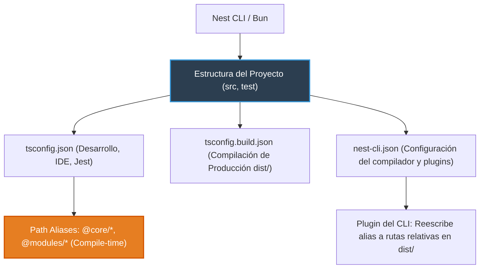

# 0.1 - Project Scaffolding & Anatomía de Archivos

> **Objetivo del módulo:** Comprender la estructura generada por el Nest CLI, los modos de compilación de TypeScript (`tsconfig` vs `tsconfig.build`), la configuración del build con `nest-cli.json` y la resolución de path aliases.

---

## 🧭 1. Posición en la Arquitectura

El scaffolding define la cadena de herramientas de compilación y ejecución del proyecto:



- **Frontera de ejecución**: Entorno de desarrollo y proceso de build antes de runtime.
- **Compilación dual**: `tsconfig.json` incluye suites de prueba para el IDE; `tsconfig.build.json` las excluye para que `dist/` contenga solo código de producción.

---

## 📜 2. El Contrato Esencial

```json
// tsconfig.json: base estricta y path aliases
{
  "compilerOptions": {
    "module": "commonjs",
    "target": "ES2021",
    "strict": true,
    "experimentalDecorators": true,
    "emitDecoratorMetadata": true,
    "baseUrl": "./",
    "paths": {
      "@core/*": ["src/core/*"],
      "@common/*": ["src/common/*"],
      "@modules/*": ["src/modules/*"]
    }
  }
}
```

- **Decoradores & Metadata**: `experimentalDecorators` y `emitDecoratorMetadata` son obligatorios para que el contenedor de IoC de Nest pueda inspeccionar tipos en runtime.
- **Mapeo mental rápido**: `nest-cli.json` equivale al `.csproj` en ASP.NET Core; los alias de path son idénticos a los paths de Angular o webpack.

---

## ⚠️ 3. Top Trampas Mortales & Antipatrones

| Antipatrón / Trampa Común                                                      | Causa Técnica / Under the Hood                                                                                       | Corrección Idiomática                                                                          |
| :----------------------------------------------------------------------------- | :------------------------------------------------------------------------------------------------------------------- | :--------------------------------------------------------------------------------------------- |
| Ejecutar scripts TS con `node` o `ts-node` crudo esperando que resuelvan alias | Los path aliases son virtuales en compile-time; Node en runtime no entiende `@core/*` sin registrar `tsconfig-paths` | Compilar siempre vía Nest CLI (`nest build`), que reescribe alias a rutas relativas en `dist/` |
| Bajar el rigor de TypeScript (`strict: false` o relajar flags)                 | Se pierde la garantía en metadatos de tipos emitidos (`emitDecoratorMetadata`), fallando en resolución de DI         | Mantener `strict: true` y no contradecirlo con flags permisivos posteriores                    |
| Modificar `tsconfig.build.json` para alias de path                             | Las herramientas de desarrollo e IDE solo leen `tsconfig.json` base                                                  | Centralizar toda la configuración de compilador y paths en `tsconfig.json` base                |

---

## 🎯 4. Reto Práctico (Hands-on Challenge)

### Requisitos & Contrato

- Inicializar el proyecto con Nest CLI y migrar el entorno a Bun.
- Activar modo estricto en `tsconfig.json`.
- Configurar path aliases limpios (`@core/*`, `@common/*`, `@modules/*`) y verificar soporte en `tsconfig.json` y Jest.

### Criterios de Aceptación (Definition of Done - DoD)

- [ ] Compilación exitosa con `bun run build`.
- [ ] Tests ejecutando y reconociendo imports con path aliases.
- [ ] Linter pasando sin advertencias.

---

## 🧠 5. Checklist de Active Recall

- [ ] ¿Por qué coexisten dos archivos `tsconfig` en un proyecto de NestJS?
- [ ] ¿Cómo sabe Node.js dónde buscar un archivo importado con `@modules/...` en producción?
- [ ] ¿Qué sucedería con la inyección de dependencias si desactivas `emitDecoratorMetadata`?
