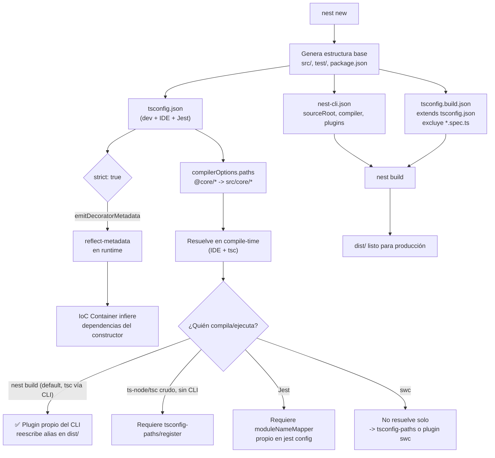

# 0.1 - Project Scaffolding & Anatomía de Archivos

> **Objetivo del módulo:** Comprender qué construye el Nest CLI al inicializar un proyecto, el rol de cada archivo de configuración generado, y establecer una base de TypeScript en modo estricto con alias de importación limpios.

---

## ▶️ Panorámica Rápida & Contexto
- `nest new` no es solo un scaffold de carpetas: instala un ecosistema completo (compilador, testing, linter, decoradores) preconfigurado para trabajar con metadata reflection.
- Existen **dos** configuraciones de TypeScript coexistiendo (`tsconfig.json` y `tsconfig.build.json`) porque el proyecto tiene dos "modos de compilación": desarrollo/testing vs build de producción.
- `nest-cli.json` es la fuente de verdad para cómo el CLI compila y sirve la app — no es un capricho de IDE, es config real de build.
- Los Path Aliases (`@core/*`, `@modules/*`) no son magia de Node: es un truco de mapeo en compile-time que exige runtime support aparte.

---

## 🔬 Under the Hood: Fundamentos & Mecánica Interna (Deep Dive)

**Qué genera `nest new`:**
- `src/main.ts`: punto de entrada, invoca `NestFactory.create(AppModule)`.
- `src/app.module.ts`, `app.controller.ts`, `app.service.ts`: el módulo raíz mínimo.
- `tsconfig.json`: config base para el compilador TS usado por el IDE, Jest y `ts-node` en dev.
- `tsconfig.build.json`: extiende `tsconfig.json` pero **excluye** archivos de test (`*.spec.ts`) y carpetas como `test/` — es la que usa `nest build` para producción, evitando compilar basura de test al output `dist/`.
- `nest-cli.json`: define el `sourceRoot` (normalmente `src`), el compilador a usar (`tsc` por default, o `webpack`/`swc` si se configura), y plugins del compilador de Nest (el que procesa metadata de Swagger, por ejemplo).

**Por qué TypeScript estricto importa aquí específicamente:**
NestJS depende masivamente de **decoradores** (`@Injectable()`, `@Controller()`, `@Module()`). Estos decoradores, combinados con `emitDecoratorMetadata: true` en el `tsconfig`, hacen que TypeScript emita metadata de tipos en runtime vía `reflect-metadata`. Esto es lo que permite al IoC Container inferir automáticamente qué inyectar en un constructor **sin que tú se lo digas explícitamente**. Sin `strict: true` (y en particular `strictPropertyInitialization`, `noImplicitAny`), pierdes la garantía de que esa metadata sea confiable — un `any` implícito rompe silenciosamente la inferencia de tipos para DI.

**Path Aliases — el truco de dos caras (verificado contra fuentes actuales, ago-2026):**
TypeScript resuelve `@core/*` a `src/core/*` **solo en compile-time**, vía `compilerOptions.paths` en `tsconfig.json`. Node.js en runtime no entiende alias por sí solo. La pieza que cierra ese hueco depende de **qué compilador use realmente `nest build`**:

- **Modo default (`nest build` con `tsc` vía Nest CLI)**: el CLI trae un **plugin propio** que reescribe los path aliases a rutas relativas en el `dist/` de salida automáticamente — **no** necesitas `tsc-alias` aquí. Este es el caso de este reto (proyecto single-app, compilador default).
- **`ts-node` / `tsc` crudo, sin pasar por el CLI** (ej. scripts sueltos, algunos setups de CLI commander): el alias **no** se resuelve — ahí sí necesitas `tsconfig-paths/register` en runtime.
- **Jest**: corre independiente del build del CLI, así que necesita su propio `moduleNameMapper` en la config de Jest replicando los mismos alias — si no, los tests fallan aunque `nest build` funcione perfecto.
- **`swc` como compilador**: NO resuelve alias automáticamente — hay que usar `tsconfig-paths` en runtime o un plugin de SWC aparte.
- **`webpack` (modo monorepo)**: bundlea todo en un solo archivo, resuelve las referencias cruzadas out-of-the-box.

Fuentes: [Trilon — Announcing NestJS Monorepos and new CLI commands](https://trilon.io/blog/announcing-nestjs-monorepos-and-new-commands), [nestjs/nest-cli#2858 — tsconfig-paths vs tsc-alias con ESM](https://github.com/nestjs/nest-cli/issues/2858), [Why NestJS Path Aliases Break in CLI Scripts](https://medium.com/@bloodturtle/why-nestjs-path-aliases-break-in-cli-scripts-and-how-to-fix-them-3c0e0665896f).

El trampantojo real no es "siempre necesitas tsc-alias" (dato desactualizado que circula mucho en blogs) — es que **cada herramienta de tu cadena (build, dev server, tests, scripts sueltos) resuelve alias por su cuenta**, y basta con que una se quede sin configurar para que "funcione en mi máquina" y truene en otro contexto.

---

## 🧠 Analogía & Mapeo Mental (C# / ASP.NET Core & Angular)

- `nest-cli.json` ≈ `.csproj` en C#: define qué se compila, con qué compilador y qué queda fuera del build.
- `tsconfig.json` vs `tsconfig.build.json` ≈ perfiles de build `Debug` vs `Release` en Visual Studio: mismo código fuente, distinto alcance de compilación.
- Path Aliases (`@core/*`) ≈ `RootNamespace` + carpetas en C#, o los alias de `tsconfig.json` que ya usaste en Angular (`@app/*`, `@env/*`) — la diferencia es que Angular CLI ya resuelve esto en su bundler (webpack/esbuild) de forma transparente; en Nest backend, **tú** eres responsable de la cadena completa de resolución en runtime.
- `emitDecoratorMetadata` + `reflect-metadata` ≈ Reflection en C# (`System.Reflection`) usado por contenedores IoC como el de ASP.NET Core (`AddScoped<IFoo, Foo>()` internamente inspecciona constructores igual que Nest).

---

## 📊 Diagrama de Arquitectura / Ciclo de Vida (Mermaid)

---

## 📑 Conceptos Clave & Trampas Mentales

| Concepto | Clave Práctica / Under the Hood | Antipatrón / Trampa Común |
| :--- | :--- | :--- |
| `tsconfig.json` vs `tsconfig.build.json` | El segundo extiende al primero y excluye tests | Editar solo uno de los dos y que build/test queden desincronizados |
| `strict: true` | Habilita `strictNullChecks`, `noImplicitAny`, etc. — necesario para DI confiable | Activar `strict` pero dejar `any` explícitos por pereza, anulando el beneficio |
| Path Aliases | Con `nest build` default (tsc + plugin del CLI) se resuelven solos en `dist/` | Asumir que TODO contexto (Jest, scripts sueltos, swc) hereda esa resolución gratis — cada uno necesita la suya |
| `nest-cli.json` | Controla qué compilador usa Nest (`tsc`, `webpack`, `swc`) | Asumir que es solo config de "linting" o IDE |
| `emitDecoratorMetadata` | Habilita que Nest lea tipos de constructor en runtime | Pensar que los decoradores son solo azúcar sintáctica sin efecto en runtime |

---

## 🎯 Reto Práctico (Hands-on Challenge)

1. Inicializar el proyecto con `bunx @nestjs/cli new . ` (o `nest new .` si tienes el CLI global) usando `bun` como package manager cuando el CLI lo pregunte.
2. Verificar/activar `strict: true` en `tsconfig.json` (revisa qué flags trae por default el CLI y confirma que estén las claves de modo estricto).
3. Configurar al menos dos alias de importación limpios, ej. `@core/*` → `src/core/*` y `@modules/*` → `src/modules/*`, en `compilerOptions.paths` de `tsconfig.json`.
4. Verificar que el proyecto compila sin errores (`bun run build`) y que un import de prueba usando uno de los alias resuelve correctamente tanto en dev (`bun run start:dev`) como en el build de `dist/`.

**Nota**: si el alias no resuelve en `dist/`, ese es exactamente el trampantojo del deep dive — investígalo antes de pedir la solución.

---

## ✅ Checklist de Active Recall & Autoevaluación
- [ ] ¿Puedo explicar por qué existen dos `tsconfig` distintos y no solo uno?
- [ ] ¿Puedo detallar qué pasa por dentro cuando `emitDecoratorMetadata` está activo y cómo se conecta con la inyección de dependencias?
- [ ] ¿Puedo identificar por qué un path alias que funciona en dev puede romperse en el build de producción, y qué antipatrón lo causa?
