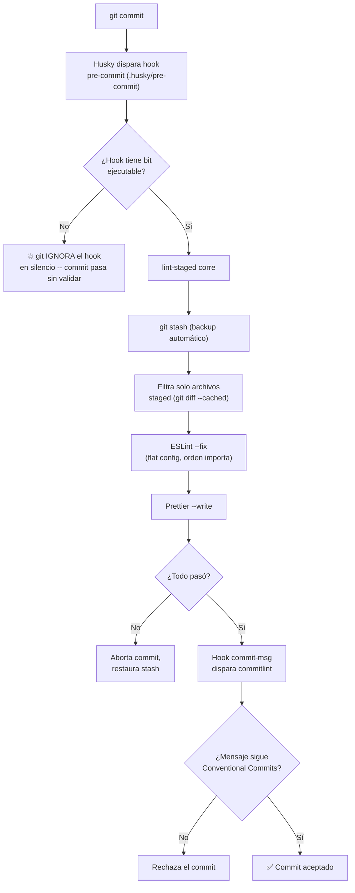

# 0.2 - Code Quality Tooling: ESLint, Prettier & Git Hooks

> **Objetivo del módulo:** Automatizar la calidad de código en equipo — que sea _imposible_ hacer commit de código mal formateado, con errores de lint, o con un mensaje que no siga Conventional Commits.

---

## ▶️ Panorámica Rápida & Contexto

- ESLint 9+ usa **flat config** (`eslint.config.mjs`, ya generado por el CLI de Nest) — reemplazó el viejo `.eslintrc`. Es un array de objetos de configuración, no un objeto anidado con `extends`.
- Prettier no es un linter — no detecta bugs, solo reformatea. Corre **después** de ESLint (o vía `eslint-config-prettier` para que ESLint no pelee con las reglas de formato de Prettier).
- Husky + lint-staged + commitlint son 3 piezas independientes que se encadenan: Husky dispara el hook de git, lint-staged filtra a solo archivos _staged_, commitlint valida el mensaje del commit.
- El objetivo real no es "tener linter" — es **cerrar la puerta**: que un commit mal formado sea físicamente imposible, no solo "no recomendado".

---

## 🔬 Under the Hood: Fundamentos & Mecánica Interna (Deep Dive)

**ESLint Flat Config (verificado, ago-2026):**
`eslint.config.mjs` exporta un **array** de objetos; cada objeto puede tener `files` (glob), `rules`, `languageOptions`, etc. ESLint procesa los objetos **en orden** — si dos objetos matchean el mismo archivo y ambos tocan la misma regla, **gana el último**. Esto es clave: el orden en el array no es cosmético, es precedencia real. `typescript-eslint` expone `tseslint.configs.recommended` como un array ya armado (parser + reglas) que se hace _spread_ dentro de tu config.

**Por qué `eslint-config-prettier` y no un plugin de Prettier corriendo dentro de ESLint:**
Hay dos escuelas: correr Prettier _como regla de ESLint_ (`eslint-plugin-prettier`, reporta diffs de formato como errores de lint) vs correr Prettier _aparte_ y solo usar `eslint-config-prettier` para **desactivar** las reglas de ESLint que chocarían con el formato de Prettier (indentación, comillas, etc.). El scaffold de Nest trae ambos instalados — la decisión de cuál combinar es tuya.

**Husky — mecánica del hook:**
Husky no reinventa git hooks — usa los hooks nativos (`.git/hooks/pre-commit`, etc.) pero los configura para invocar un script versionado en `.husky/` (que sí vive en el repo y se comparte con el equipo, a diferencia de `.git/hooks/` que es local y no se versiona). Se instala vía un script `"prepare": "husky"` en `package.json`, que corre automáticamente después de `bun install` (equivalente al `postinstall` de npm, con matices — bun corre `prepare` en el proyecto raíz, pero conviene **verificar en la práctica** que el hook realmente quedó instalado tras el install, no asumirlo).

**Gotchas reales documentados (no solo teoría):**

- El archivo de hook (`.husky/pre-commit`) necesita el bit ejecutable (`chmod +x`) — si se clona en Windows o se pierde el permiso, git **ignora silenciosamente** el hook sin avisar.
- Si en CI/producción solo se instalan `dependencies` (sin `devDependencies`), el script `prepare` puede fallar porque Husky ni siquiera está instalado — hay que aislar ese caso.
- lint-staged, por default, hace un `git stash` del estado antes de correr las tareas, como red de seguridad ante fallos a mitad de camino.

**commitlint:**
Lee el mensaje del commit (vía hook `commit-msg`, no `pre-commit`) y lo valida contra un set de reglas — típicamente `@commitlint/config-conventional`, que exige el formato `tipo(scope?): descripción` con tipos cerrados (`feat`, `fix`, `docs`, etc. — los mismos que ya definiste en AGENTS.md §10).

Fuentes: [typescript-eslint — Getting Started](https://typescript-eslint.io/getting-started/), [lint-staged — GitHub](https://github.com/lint-staged/lint-staged), [Husky — Troubleshoot](https://typicode.github.io/husky/troubleshoot.html), [Husky — How To](https://typicode.github.io/husky/how-to.html).

---

## 📊 Diagrama de Arquitectura / Ciclo de Vida (Mermaid)

---

## 📑 Conceptos Clave & Trampas Mentales

| Concepto                   | Clave Práctica / Under the Hood                                        | Antipatrón / Trampa Común                                                       |
| :------------------------- | :--------------------------------------------------------------------- | :------------------------------------------------------------------------------ |
| ESLint Flat Config         | Array de objetos, orden = precedencia (el último gana)                 | Copiar config vieja `.eslintrc` con `extends` anidado, formato incompatible     |
| `eslint-config-prettier`   | Desactiva reglas de ESLint que chocan con formato de Prettier          | Tener ESLint y Prettier peleando por la misma regla de formato                  |
| `.husky/` vs `.git/hooks/` | `.husky/` se versiona y comparte con el equipo; `.git/hooks/` es local | Asumir que un hook "funciona en mi máquina" = funciona para todo el equipo      |
| Bit ejecutable del hook    | Git ignora hooks sin `chmod +x`, sin error visible                     | Clonar en Windows o CI y que el hook "desaparezca" sin ningún mensaje           |
| lint-staged                | Solo toca archivos _staged_, no el repo completo                       | Configurar mal el glob y que corra sobre archivos no relacionados con el commit |
| commitlint                 | Hook `commit-msg`, valida el mensaje, no el código                     | Confundirlo con `pre-commit` — son hooks distintos con propósitos distintos     |

---

## 🎯 Reto Práctico (Hands-on Challenge)

1. Configurar ESLint con reglas estrictas: sin `any` implícito, promesas no manejadas marcadas como error (revisa `@typescript-eslint/no-floating-promises` o similar).
2. Configurar Prettier y decidir (con justificación) si lo combinas como plugin de ESLint o lo corres aparte con `eslint-config-prettier`.
3. Instalar y configurar Husky + lint-staged para que en `pre-commit` se corra lint + format solo sobre archivos staged.
4. Instalar y configurar `commitlint` con `@commitlint/config-conventional` en el hook `commit-msg`, alineado a los tipos de AGENTS.md §10 (`feat`, `fix`, `refactor`, `test`, `docs`, `chore`).
5. **Prueba real del DoD**: intenta hacer un commit con código mal formateado y otro con un mensaje que no siga Conventional Commits — ambos deben ser rechazados. Documenta qué viste en consola.

---

## ✅ Checklist de Active Recall & Autoevaluación

- [ ] ¿Puedo explicar por qué el orden de los objetos en `eslint.config.mjs` importa?
- [ ] ¿Puedo detallar qué diferencia hay entre `.husky/` y `.git/hooks/`, y por qué esa diferencia es la razón de ser de Husky?
- [ ] ¿Puedo identificar el antipatrón del bit ejecutable faltante y por qué es peligroso que falle en silencio?
