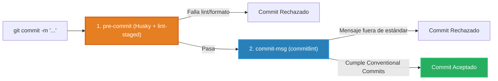

# 0.2 - Code Quality & Tooling: ESLint, Prettier & Git Hooks

> **Objetivo del módulo:** Implementar un pipeline defensivo de calidad de código: diferenciar correctitud de formato, configurar linters estrictos y blindar el flujo de commits mediante Git Hooks con Husky y Conventional Commits.

---

## 🧭 1. Posición en la Arquitectura

Los Git Hooks actúan como aduana previa a la persistencia del historial en el repositorio:



- **Frontera de ejecución**: Entorno local antes de registrar el commit.
- **División de responsabilidades**: `ESLint` evalúa correctitud y calidad lógica; `Prettier` gobierna el estilo visual; `commitlint` asegura la semántica de la historia de Git.

---

## 📜 2. El Contrato Esencial

```json
// package.json: lint-staged para ejecutar solo en archivos modificados
{
  "lint-staged": {
    "*.ts": [
      "eslint --fix",
      "prettier --write"
    ]
  }
}

// .commitlintrc.json: estándar de commits
{
  "extends": ["@commitlint/config-conventional"]
}
```

- **Hooks en `.husky/`**:
  - `pre-commit`: ejecuta `bunx lint-staged`.
  - `commit-msg`: ejecuta `bunx --no -- commitlint --edit "${1}"`.
- **Mapeo mental rápido**: Idéntico a los analizadores Roslyn + EditorConfig en C# .NET o pre-commit hooks de CI/CD.

---

## ⚠️ 3. Top Trampas Mortales & Antipatrones

| Antipatrón / Trampa Común                            | Causa Técnica / Under the Hood                                                                     | Corrección Idiomática                                                           |
| :--------------------------------------------------- | :------------------------------------------------------------------------------------------------- | :------------------------------------------------------------------------------ |
| Usar un solo hook para validar código y mensaje      | Viola el Single Responsibility Principle (SRP); falla antes de evaluar el mensaje o mezcla errores | Separar `pre-commit` (inspección de código) de `commit-msg` (formato del texto) |
| Reglas de ESLint compitiendo con Prettier            | Genera conflictos de tabulaciones y saltos de línea infinitos en el auto-fix                       | Usar `eslint-config-prettier` para desactivar reglas de formato en ESLint       |
| Silenciar errores con `eslint-disable` o tipos `any` | Destruye la seguridad del tipado y oculta fallos lógicos en tiempo de compilación                  | Resolver la causa raíz del error de tipos o lint sin parches cosméticos         |

---

## 🎯 4. Reto Práctico (Hands-on Challenge)

### Requisitos & Contrato

- Configurar ESLint con reglas estrictas contra el uso de `any` y variables no utilizadas.
- Integrar Prettier con `eslint-config-prettier`.
- Configurar Husky con `pre-commit` (ejecutando `lint-staged`) y `commit-msg` (validando Conventional Commits con `@commitlint/config-conventional`).

### Pruebas de Verificación

```bash
# 1. Probar que commit sin formato convencional sea rechazado
git commit -m "bad message" # Debe fallar

# 2. Probar que código con error de lint rechace el commit
# Debe bloquear hasta corregir
```

### Criterios de Aceptación (Definition of Done - DoD)

- [ ] Mensajes no conformes con Conventional Commits son rechazados.
- [ ] Archivos staged son formateados y validados automáticamente antes de commitear.
- [ ] Cero dependencias rotas en el pipeline de hooks.

---

## 🧠 5. Checklist de Active Recall

- [ ] ¿Cuál es la diferencia fundamental de responsabilidad entre ESLint y Prettier?
- [ ] ¿Por qué `lint-staged` es preferible frente a ejecutar `eslint .` en cada commit?
- [ ] ¿En qué momento exacto del ciclo de git actúa el hook `commit-msg`?
