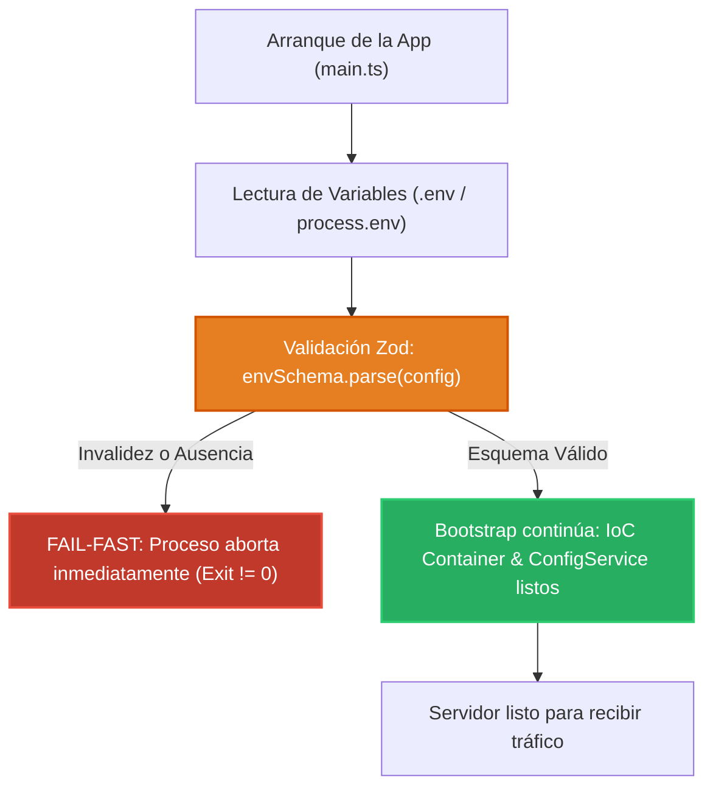

# 0.3 - Configuración de Entorno & Validación Fail-Fast con Zod

> **Objetivo del módulo:** Implementar el principio arquitectónico _Fail-Fast_ en variables de entorno: validar el esquema completo con Zod en el arranque del proceso, abortar el bootstrap si falta configuración crítica e inyectar `ConfigService` con seguridad de tipos.

---

## 🧭 1. Posición en la Arquitectura

La validación ocurre en el punto más temprano del bootstrap de la aplicación:



- **Frontera de ejecución**: Tiempo de inicio antes de abrir puertos de red.
- **Fail-Fast**: Evita caídas perezosas en pleno vuelo (en medio de una petición a base de datos por un string de conexión ausente).

---

## 📜 2. El Contrato Esencial

```typescript
// Esquema de validación con Zod
import { z } from 'zod';

export const envSchema = z.object({
  PORT: z.coerce.number().default(3000),
  NODE_ENV: z
    .enum(['development', 'production', 'test'])
    .default('development'),
  API_KEY: z.string().min(16),
});

export type EnvConfig = z.infer<typeof envSchema>;

// Conexión en AppModule
@Module({
  imports: [
    ConfigModule.forRoot({
      isGlobal: true,
      validate: (config: Record<string, unknown>) => envSchema.parse(config),
    }),
  ],
})
export class AppModule {}
```

- **Mapeo mental rápido**: Equivalente a `IOptions<T>` con `ValidateOnStart()` en ASP.NET Core.

---

## ⚠️ 3. Top Trampas Mortales & Antipatrones

| Antipatrón / Trampa Común                            | Causa Técnica / Under the Hood                                                               | Corrección Idiomática                                                                  |
| :--------------------------------------------------- | :------------------------------------------------------------------------------------------- | :------------------------------------------------------------------------------------- |
| Acceder a `process.env.MI_VAR` disperso en servicios | Rompe el encapsulamiento, anula el tipado y dificulta el testing unitario                    | Inyectar `ConfigService` donde se necesite leer configuración                          |
| Validación tardía o diferida (_lazy validation_)     | La aplicación levanta con variables corruptas y explota horas después al invocar un servicio | Validar todo el esquema síncronamente en el arranque (_Fail-Fast_)                     |
| Poner opciones de enum o listas en `.env.example`    | `.env.example` debe contener valores de ejemplo válidos para clonar y ejecutar               | Colocar valores de muestra reales en `.env.example` y documentar opciones en el README |

---

## 🎯 4. Reto Práctico (Hands-on Challenge)

### Requisitos & Contrato

- Instalar `@nestjs/config` y `zod`.
- Crear `env.schema.ts` definiendo tipos y defaults seguros para `PORT`, `NODE_ENV` y `API_KEY`.
- Registrar `ConfigModule.forRoot()` en `AppModule` con función `validate`.
- Crear `.env` y `.env.example` coherentes con el contrato.

### Pruebas de Verificación

```bash
# 1. Iniciar con variable inválida o ausente
# Debe abortar el proceso con log claro de error de Zod antes de levantar el server
```

### Criterios de Aceptación (Definition of Done - DoD)

- [ ] La aplicación se apaga de inmediato si falta una variable requerida.
- [ ] Variables numéricas (`PORT`) son transformadas automáticamente con `z.coerce.number()`.
- [ ] `ConfigService` inyectable globalmente en la aplicación.

---

## 🧠 5. Checklist de Active Recall

- [ ] ¿Qué ventaja arquitectónica ofrece el patrón Fail-Fast frente al manejo perezoso de variables?
- [ ] ¿Por qué se utiliza `z.coerce.number()` en lugar de `z.number()` al leer variables de entorno?
- [ ] ¿Qué componente de `@nestjs/config` permite omitir la importación repetitiva del módulo en cada feature?
