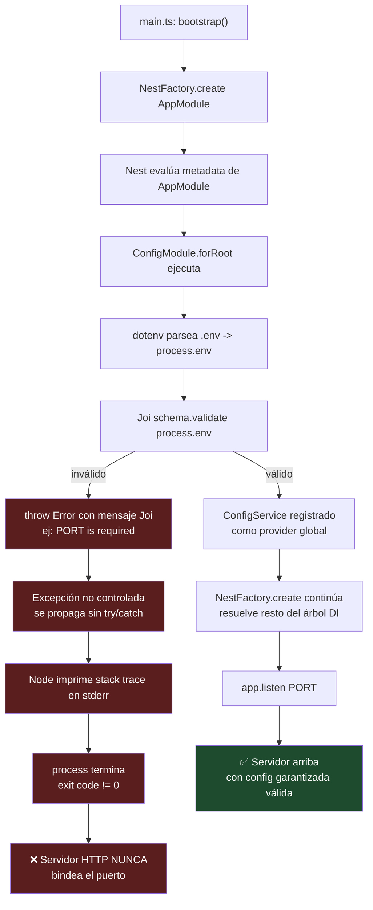

# 0.3 - Environment Management & Fail-Fast Schema Validation

> **Objetivo del módulo:** Comprender el principio 12-Factor de "config en el entorno, no en el código", cómo `@nestjs/config` la carga y expone vía DI, y por qué validar esa configuración con un esquema estricto en el arranque (_fail-fast_) es la única forma segura de garantizar que la app nunca corra con configuración inválida.

---

## ▶️ Panorámica Rápida & Contexto

- El [Factor III de 12-Factor App](https://12factor.net/config) exige: la configuración vive en variables de entorno, nunca hardcodeada ni en archivos versionados junto al código — así el mismo build corre en dev/staging/prod solo cambiando el entorno.
- `@nestjs/config` es un wrapper delgado sobre `dotenv` que parsea `.env` a `process.env` y lo expone tipado vía `ConfigService`, integrado al IoC Container de Nest.
- Cargar variables sin validarlas es una bomba de tiempo: un typo en `PORT` o un `DATABASE_URL` ausente no explota al arrancar, sino en el peor momento — en producción, en medio de una petición real.
- _Fail-fast_ invierte esa lógica: si la config es inválida, la app **no debe levantar el servidor HTTP en absoluto** — debe morir inmediatamente con un mensaje explícito, no arrancar "a medias" y fallar después de forma críptica.

---

## 🔬 Under the Hood: Fundamentos & Mecánica Interna (Deep Dive)

**Cómo `@nestjs/config` lee `.env`:**
`ConfigModule.forRoot()` internamente usa `dotenv` (y opcionalmente `dotenv-expand` para interpolación de variables) para parsear el archivo `.env` del `cwd` del proceso y volcarlo a `process.env`. Luego construye un `ConfigService` interno con esos valores (más los ya presentes en `process.env` del sistema operativo, que **tienen prioridad** sobre el `.env` por defecto) y lo registra como provider global si pasas `isGlobal: true` — de lo contrario tenés que importar `ConfigModule` explícitamente en cada módulo consumidor, como cualquier otro módulo de Nest.

**El mecanismo real de validación — `validationSchema` (Joi):**
`@nestjs/config` soporta de forma **oficial y nativa** la opción `validationSchema`, que recibe un `Joi.ObjectSchema`. Cuando pasás esta opción, el módulo ejecuta `schema.validate(process.env, validationOptions)` **de forma síncrona durante el registro del módulo** — es decir, durante la evaluación de `ConfigModule.forRoot({...})` dentro de `AppModule`, **antes** de que `NestFactory.create()` termine de construir el árbol de dependencias y mucho antes de que se abra cualquier puerto HTTP. Si `Joi` devuelve un `error`, `@nestjs/config` lanza (`throw`) un `Error` de JavaScript nativo con el mensaje de validación de Joi (ej. `"DATABASE_URL" is required`).

Ese `throw` no está envuelto en ningún `try/catch` interno de Nest — se propaga como una excepción no controlada hacia arriba en la cadena de imports de módulos, hasta `main.ts`. Como nada la captura, Node.js la trata como una excepción no manejada: imprime el **stack trace completo** en `stderr` y termina el proceso con código de salida distinto de cero. El servidor HTTP **nunca llega a bindear el puerto** — no hay "arranque parcial", no hay ventana donde la app responda con configuración corrupta. Esto es fail-fast en su forma más literal: el proceso muere antes de poder hacer daño.

**El patrón alternativo — función `validate` custom (la vía para Zod):**
`@nestjs/config` no tiene una opción `validationSchema` equivalente para Zod (no hay soporte first-party dedicado, a diferencia de Joi). En su lugar expone la opción genérica `validate`, una función `(config: Record<string, unknown>) => Record<string, unknown>` que vos escribís. El patrón estándar con Zod es definir un `z.object({...})` y dentro de `validate` llamar a `schema.parse(config)` — si el `parse` falla, Zod lanza su propio `ZodError`, que se propaga exactamente por el mismo camino que el error de Joi (excepción no controlada → stack trace → proceso muere antes de levantar el server). La ventaja de este camino es que `schema.parse()` devuelve el objeto validado con **inferencia de tipos estática** (`z.infer<typeof schema>`), algo que Joi no da gratis en TypeScript.

Fuentes: comportamiento de `validationSchema`/`validate` y su ejecución en el registro del módulo confirmado contra [dev.to — Easy Steps to Generate a Config Module in NestJS](https://dev.to/rubenoalvarado/easy-steps-to-generate-a-config-module-in-nestjs-246n) y el hilo de issues [nestjs/config#544 — "ConfigModule.forRoot Joi validation executed too early"](https://dev.to/rrgt19/ways-to-validate-environment-configuration-in-a-forfeature-config-in-nestjs-2ehp), que documenta justamente que la validación corre en el momento de evaluación del módulo, no en el bootstrap de la request. El patrón `validate` + Zod (sin soporte `validationSchema` dedicado) está confirmado contra [nestjs-config-zod-validation (npm)](https://www.npmjs.com/package/nestjs-config-zod-validation) y el paquete comunitario [@proventuslabs/nestjs-zod (npm)](https://www.npmjs.com/package/@proventuslabs/nestjs-zod), ambos construidos precisamente porque Zod no tiene integración nativa como Joi la tiene — corrige cualquier expectativa de que exista un `validationSchema` "modo Zod" out-of-the-box: a agosto 2026 sigue sin existir, la vía oficial soportada es `validate` custom.

**Detalle importante — `forFeature()` no valida:**
Si usás configuraciones namespaced con `ConfigModule.forFeature()` (útil en Fase 3 con `registerAs`), esa API **no** acepta `validationSchema` ni `validate` — la validación de esquema completo solo aplica en el `forRoot()` raíz. Es una limitación real documentada, no un olvido tuyo si no la encontrás en `forFeature()`.

---

## 📊 Diagrama de Arquitectura / Ciclo de Vida (Mermaid)

---

## ⚖️ Tradeoffs & Análisis de Decisiones Arquitectónicas

- **Joi (`validationSchema` nativo)**:
  - **A favor**: cero código propio — pasás el schema y `@nestjs/config` hace todo (parseo, defaults, coerción de tipos como `Joi.number()` sobre un `process.env.PORT` que siempre es `string`, mensajes de error legibles). Es el camino documentado oficialmente y el que vas a encontrar en la mayoría de proyectos NestJS existentes.
  - **En contra**: Joi no fue diseñado para TypeScript — no obtenés inferencia de tipos automática del schema hacia tu `ConfigService` sin trabajo extra (interfaces manuales o `@types/joi` parcial). Es una dependencia más, pensada originalmente para Hapi.
- **Zod (función `validate` custom)**:
  - **A favor**: TS-first — `z.infer<typeof envSchema>` te da el tipo exacto del objeto de config validado, sin duplicar una interfaz a mano. Ecosistema más activo en 2026, más liviano, API más moderna (`.parse()`, `.safeParse()`, transforms declarativos).
  - **En contra**: no tiene integración dedicada en `@nestjs/config` — vos escribís la función `validate`, decidís el manejo de errores y la coerción de tipos (`z.coerce.number()` para `PORT`, porque `process.env` siempre entrega strings). Más control, pero más código propio que mantener.
- **Cuándo usar cada uno**: si el equipo ya usa Zod en DTOs/contratos de API, seguir con Zod en config da consistencia de una sola librería de validación en todo el proyecto. Si el proyecto es NestJS "de manual" sin opinión previa, Joi vía `validationSchema` es el camino de menor fricción y el que documenta oficialmente Nest.
- **Impacto en Mantenibilidad**: cualquiera de los dos caminos es preferible a _no validar_ — la alternativa real no es "Joi vs Zod", es "schema explícito vs `ConfigService.get('PORT')` como `string | undefined` propagándose sin control por todo el código, revientándose recién en un `NaN` en producción".

---

## 📑 Conceptos Clave & Trampas Mentales

| Concepto             | Clave Práctica / Under the Hood                                                                                               | Antipatrón / Trampa Común                                                                                                                                    |
| :------------------- | :---------------------------------------------------------------------------------------------------------------------------- | :----------------------------------------------------------------------------------------------------------------------------------------------------------- |
| Fail-fast            | El `throw` ocurre en el registro del módulo, antes de `app.listen()` — el puerto nunca se abre con config inválida            | Usar `ConfigService.get('X', 'default')` como "válvula de escape" en vez de declarar `X` requerida en el schema — enmascara el error en vez de fallar rápido |
| `isGlobal: true`     | Sin esto, cada módulo que use `ConfigService` debe importar `ConfigModule` explícitamente (como cualquier módulo Nest normal) | Asumir que `ConfigService` es mágicamente global por defecto — no lo es                                                                                      |
| Coerción de tipos    | `process.env` siempre entrega `string` — `Joi.number()` / `z.coerce.number()` hacen la conversión explícita                   | Comparar `process.env.PORT === 3000` (string vs number, siempre `false`) sin pasar por el schema                                                             |
| Prioridad de fuentes | Variables ya presentes en `process.env` del SO tienen prioridad sobre las del `.env`                                          | Pensar que `.env` sobreescribe variables de entorno reales del sistema/CI — es al revés                                                                      |
| `forFeature()`       | No soporta `validationSchema` ni `validate` — la validación de esquema completo va en el `forRoot()` raíz                     | Buscar cómo validar un `registerAs()` namespaced con `validationSchema` y no encontrarlo — no es un bug tuyo, es la API                                      |
| `.env` en git        | `.env` **nunca** se commitea (contiene secretos reales); `.env.example` sí, como documentación viva de qué variables existen  | Commitear `.env` "porque no tiene secretos todavía" — hábito que se rompe el día que sí los tiene                                                            |

---

## 🎯 Reto Práctico (Hands-on Challenge)

1. Crear `.env` (gitignorado — verificá que ya esté en `.gitignore`) y `.env.example` (sí versionado) con al menos: `PORT`, `NODE_ENV`, `APP_NAME`.
2. Instalar la librería de validación que elijas (`joi` o `zod`) y justificar la elección frente al mentor antes de escribir código.
3. Configurar `ConfigModule.forRoot()` en `AppModule` como **global** (`isGlobal: true`), con un esquema de validación estricto:
   - `PORT`: número, requerido o con default razonable (justificá cuál elegís y por qué).
   - `NODE_ENV`: string limitado a valores válidos (`development`, `production`, `test`).
   - `APP_NAME`: string, requerido, sin default — debe forzar que exista en `.env`.
4. Consumir al menos una de estas variables vía `ConfigService` inyectado (no vía `process.env` directo en ningún punto del código de aplicación).
5. **Verificación del DoD**: borrar `APP_NAME` de `.env`, correr `bun run start:dev`, y confirmar que la app **no arranca** — debe morir con un mensaje de error explícito señalando exactamente qué variable falta. Después restaurala y confirmá que arranca limpio.

---

## ✅ Checklist de Active Recall & Autoevaluación

- [ ] ¿Puedo explicar en qué momento exacto del ciclo de arranque de Nest se ejecuta la validación de `ConfigModule.forRoot()`, y por qué eso importa para que sea _fail-fast_ de verdad?
- [ ] ¿Puedo explicar por qué `process.env.PORT` es siempre `string` y qué hace el schema para convertirlo a `number` de forma segura?
- [ ] ¿Puedo justificar, con un argumento técnico (no de gusto), cuándo elegiría Joi vs Zod para validar config en un proyecto NestJS?
- [ ] ¿Puedo detallar qué pasa exactamente en la consola (stdout/stderr, exit code) cuando la validación falla al arrancar?
- [ ] ¿Puedo identificar el antipatrón de usar `ConfigService.get('X', 'default')` para "resolver" una variable que en realidad debería ser requerida?
