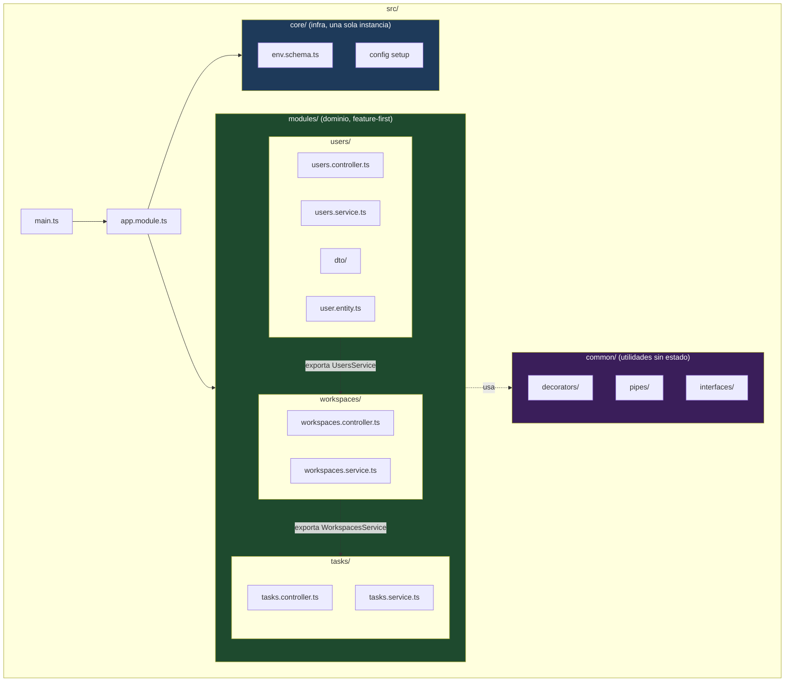

# 0.4 - Estructura Modular Profesional (Domain/Feature-First)

> **Objetivo del módulo:** Entender por qué organizar el código por _feature_ (dominio) en vez de por _capa técnica_ escala mejor en apps NestJS reales, y diseñar el esqueleto de carpetas del proyecto (Workspaces, Projects, Tasks, Users, RBAC) antes de que exista una sola línea de lógica de negocio que reorganizar después.

---

## ▶️ Panorámica Rápida & Contexto

- Dos formas de particionar un proyecto Nest: **layer-first** (`controllers/`, `services/`, `dtos/` como carpetas raíz, mezclando todos los dominios adentro) vs **feature-first** (`src/users/`, `src/tasks/`, cada una con su propio controller+service+dto+entity adentro).
- Nest empuja arquitectónicamente hacia feature-first: el propio `@Module()` ya es una unidad de encapsulamiento por dominio — layer-first pelea contra el framework en vez de usarlo.
- La señal de alarma de layer-first: un cambio de negocio en "Tasks" te obliga a tocar `controllers/tasks.controller.ts`, `services/tasks.service.ts`, `dtos/tasks.dto.ts` — tres carpetas distintas para una sola feature. Un solo PR, cambios esparcidos por todo el árbol.
- `core/` (ya existe: `src/core/env.schema.ts`) y `common/` cumplen un rol distinto: no son dominio, son infraestructura/utilidades transversales que varios módulos de dominio consumen.

---

## 🔬 Under the Hood: Fundamentos & Mecánica Interna (Deep Dive)

**Por qué Nest "empuja" hacia feature-first:**
El `@Module()` decorator no es solo organización de carpetas — es la unidad real de encapsulamiento del IoC Container. Un provider declarado en un módulo es invisible fuera de él salvo que se declare explícitamente en `exports`. Esto significa que la estructura de carpetas óptima es la que refleja 1:1 los límites de encapsulamiento reales del runtime: si `TasksModule` encapsula `TasksService`, tiene sentido que también encapsule (viva en la misma carpeta que) `TasksController`, `CreateTaskDto`, `Task` entity. Layer-first rompe esa correspondencia — el módulo `TasksModule` termina importando piezas desperdigadas por `controllers/`, `services/`, `dtos/`, y la carpeta deja de comunicar el límite real de encapsulamiento.

**`core/` vs `common/` — la distinción que casi todos los proyectos ensucian:**
No hay convención oficial única, pero el patrón dominante en la comunidad (y el que vas a mantener acá) separa dos responsabilidades distintas:

- **`core/`**: infraestructura de aplicación, cosas de las que solo debería existir **una instancia conceptual** en toda la app — validación de env, guards globales, filtros de excepción globales, el módulo de config. Se importa una vez en `AppModule` y punto.
- **`common/`**: utilidades **reusables sin estado**, sin opinión sobre la app — decoradores custom (`@CurrentUser()`), pipes genéricos, interfaces compartidas, constantes. Cualquier módulo de dominio las importa libremente, no hay "una sola instancia" conceptual.

La prueba de fuego: si lo que estás por meter en `core/` o `common/` tiene lógica de negocio de Tasks o Users adentro, no pertenece ahí — pertenece a un módulo de dominio.

**Barrel exports (`index.ts`) — por qué NO se usan acá:**
Es tentador crear un `index.ts` por módulo que re-exporte todo. NestJS y TypeScript no lo necesitan (los path aliases ya dan imports limpios), y un barrel introduce un problema real: fuerza a TypeScript a resolver el módulo completo aunque solo necesites un símbolo, y en proyectos grandes puede generar dependencias circulares invisibles entre barrels que se importan entre sí. Import directo al archivo (`from '@modules/tasks/task.entity'`) es más lento de escribir pero explícito y sin sorpresas — ponytail aplica: no se resuelve un problema (imports largos) que no existe todavía con una capa (barrels) que trae problemas propios.

Fuentes: el patrón `core/` + `common/` + `modules/` como estructura dominante en proyectos NestJS de producción está confirmado contra [Encore — NestJS Project Structure Best Practices 2026](https://encore.dev/articles/nestjs-project-structure-best-practices), que documenta explícitamente `core` (infraestructura app-wide: auth, redis, mail), `common` (utilidades genéricas reusables) e `integrations`/`modules` (dominio) como las tres capas transversales recomendadas por encima de los módulos de negocio. La recomendación de feature-first sobre layer-first para evitar que "un solo cambio termine tocando múltiples carpetas" está confirmada también en discusión de la comunidad NestJS recogida en el mismo artículo.

---

## 🧠 Analogía & Mapeo Mental (C# / ASP.NET Core & Angular)

- **Angular**: esto es exactamente la diferencia entre tener un `NgModule` por feature (`TasksModule` con su componente, servicio, rutas) vs una carpeta `services/` global con todos los servicios de la app mezclados. La comunidad Angular abandonó hace años la carpeta `services/` plana por el mismo motivo: un cambio de feature no debería tocar una carpeta compartida por 20 features distintas.
- **C# / ASP.NET Core**: layer-first acá es el equivalente a la clásica "N-Tier architecture" con carpetas `Controllers/`, `Services/`, `Repositories/` en la raíz del proyecto — funciona en proyectos chicos, se vuelve inmanejable a partir de cierto tamaño. Feature-first es el equivalente a **Vertical Slice Architecture**: cada feature (`CreateTask`, `GetTasksByWorkspace`) es una carpeta autocontenida con su propio request, handler y validación, en vez de repartir la lógica de una sola operación entre tres carpetas técnicas.

---

## 📊 Diagrama de Arquitectura / Ciclo de Vida (Mermaid)

---

## ⚖️ Tradeoffs & Análisis de Decisiones Arquitectónicas

- **Feature-first**:
  - **A favor**: alta cohesión — todo lo relacionado a una feature vive junto, borrar/mover una feature es una operación de una sola carpeta. Escala bien en equipo: dos devs tocando `tasks/` y `users/` en paralelo casi nunca generan conflictos de merge en los mismos archivos.
  - **En contra**: al principio, con 1-2 módulos, se siente como sobre-estructurar un proyecto chico — hay que resistir la tentación de "total es solo un archivo, lo pongo en la raíz".
- **Layer-first**:
  - **A favor**: cero decisión de diseño al arrancar, cualquiera sabe dónde buscar "todos los controllers".
  - **En contra**: se degrada linealmente con el tamaño del proyecto — la carpeta `services/` con 40 archivos sin relación entre sí es un antipatrón conocido, y un cambio de negocio siempre toca 3+ carpetas.
- **Cuándo elegir cada uno**: layer-first solo se justifica en un prototipo desechable de una sola feature. Para este proyecto (roadmap completo con Workspaces/Projects/Tasks/Users/RBAC, pensado para crecer fase a fase) feature-first es la única opción que no requiere una migración forzada más adelante.
- **Impacto en Mantenibilidad**: el costo real de layer-first no se paga ahora con 1 módulo — se paga en Fase 4-6 cuando el dominio tenga 5-6 módulos cruzados. Decidir la estructura ahora, con cero código de negocio, es el momento más barato posible para hacerlo.

---

## 📑 Conceptos Clave & Trampas Mentales

| Concepto                    | Clave Práctica / Under the Hood                                                                                     | Antipatrón / Trampa Común                                                                                              |
| :-------------------------- | :------------------------------------------------------------------------------------------------------------------ | :--------------------------------------------------------------------------------------------------------------------- |
| Feature-first               | Cada módulo de dominio contiene su controller+service+dto+entity en una sola carpeta                                | Crear `controllers/`, `services/`, `dtos/` como carpetas raíz — layer-first, pelea contra el `@Module()` encapsulation |
| `core/`                     | Infraestructura app-wide, una sola instancia conceptual (config, guards globales, filtros globales)                 | Meter lógica de negocio de un dominio específico en `core/` "porque se usa en varios lados"                            |
| `common/`                   | Utilidades genéricas sin estado, reusables por cualquier módulo (decoradores, pipes, interfaces compartidas)        | Confundir `common/` con `core/` — la prueba: ¿tiene opinión sobre la app (core) o es agnóstico (common)?               |
| Barrel exports (`index.ts`) | Ponytail: se omiten a propósito — import directo al archivo es explícito y evita dependencias circulares invisibles | Agregar un `index.ts` por módulo "por prolijidad" sin que resuelva un problema real de imports largos                  |
| `exports` en `@Module()`    | Solo lo que se exporta explícitamente es visible fuera del módulo — esto es lo que hace feature-first coherente     | Exportar todos los providers de un módulo "por si acaso" — recrea el problema de scope global que Nest evita           |

---

## 🎯 Reto Práctico (Hands-on Challenge)

1. Diseñar el árbol de carpetas base bajo `src/`, con al menos:
   - `src/core/` (ya existe — solo confirmar que `env.schema.ts` sigue ahí y no migra).
   - `src/common/` (vacía por ahora, o con un `.gitkeep`/README breve si Nest/git no versiona carpetas vacías — decidí vos cómo lo resolvés).
   - `src/modules/` como raíz de módulos de dominio, con al menos una carpeta de ejemplo (`src/modules/users/` o el dominio que seleccionés del roadmap: Workspaces/Projects/Tasks/Users) — **vacía de lógica todavía**, solo la carpeta y quizás un `.module.ts` placeholder si querés validar que Nest la reconoce.
2. Justificar frente al mentor: ¿por qué `modules/` como raíz intermedia y no módulos de dominio directo bajo `src/` (`src/users/` en vez de `src/modules/users/`)? Ambos son válidos — elegí uno y defendé el tradeoff.
3. Confirmar (o ajustar) los path aliases de `tsconfig.json` (definidos en 0.1) para que cubran la nueva estructura: `@modules/*`, `@core/*`, `@common/*`.
4. **Verificación del DoD**: `bun run build` compila sin errores con la nueva estructura de carpetas y los alias resolviendo correctamente hacia ella.

---

## ✅ Checklist de Active Recall & Autoevaluación

- [ ] ¿Puedo explicar por qué el `@Module()` decorator hace que feature-first sea la estructura "nativa" de Nest, no solo una preferencia estética?
- [ ] ¿Puedo distinguir con un ejemplo concreto qué va en `core/` vs qué va en `common/`?
- [ ] ¿Puedo justificar por qué este proyecto omite barrel exports (`index.ts`) a propósito?
- [ ] ¿Puedo detallar qué pasaría (en términos de merge conflicts y navegación de código) si este proyecto creciera a 6 módulos de dominio bajo una estructura layer-first en vez de feature-first?
