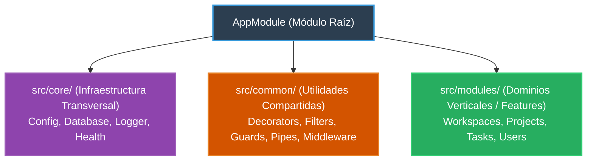

# 0.4 - Estructura Modular & Arquitectura de Carpetas

> **Objetivo del módulo:** Establecer la arquitectura modular del proyecto siguiendo el patrón _Feature-First_: diferenciar infraestructura transversal (`core/`, `common/`) de dominios de negocio (`modules/`) para garantizar escalabilidad limpia y bajo acoplamiento.

---

## 🧭 1. Posición en la Arquitectura

Organización vertical de los componentes del backend:



- **Feature-First vs Layer-First**: Agrupa cada feature con sus propios controladores, servicios, entidades y DTOs en una sola carpeta cohesiva, en lugar de separar carpetas globales (`controllers/`, `services/`).
- **Regla de dependencia**: Los dominios en `modules/` pueden consumir `core/` y `common/`, pero `core/` jamás debe depender de `modules/`.

---

## 📜 2. El Contrato Esencial

Estructura canónica de carpetas en `src/`:

```text
src/
├── core/                  # Infraestructura que arranca la app (Singletons globales)
│   ├── config/
│   └── health/
├── common/                # Piezas reutilizables del framework (sin lógica de negocio)
│   ├── decorators/
│   ├── guards/
│   ├── interceptors/
│   ├── middlewares/
│   └── pipes/
└── modules/               # Vertical slices de negocio (Feature Modules)
    └── tasks/
        ├── dto/
        ├── entities/
        ├── tasks.controller.ts
        ├── tasks.service.ts
        └── tasks.module.ts
```

- **Mapeo mental rápido**: Idéntico a la organización por Features / Bounded Contexts en Clean Architecture o módulos en Angular.

---

## ⚠️ 3. Top Trampas Mortales & Antipatrones

| Antipatrón / Trampa Común                             | Causa Técnica / Under the Hood                                                          | Corrección Idiomática                                                     |
| :---------------------------------------------------- | :-------------------------------------------------------------------------------------- | :------------------------------------------------------------------------ |
| Arquitectura _Layer-First_ en apps empresariales      | Dispersa un solo caso de uso en 5 carpetas distantes, aumentando la fricción en equipos | Agrupar por feature vertical en `modules/<feature>/`                      |
| Meter entidades o DTOs de negocio dentro de `common/` | Degrada `common/` en un "cajón de sastre" y acopla módulos de forma invisible           | Dejar en `common/` únicamente utilidades agnósticas al dominio de negocio |
| Acoplar `core/` hacia un módulo de negocio            | Crea dependencias circulares a nivel de módulos y rompe la jerarquía arquitectónica     | Los módulos consumen `core/`, nunca a la inversa                          |

---

## 🎯 4. Reto Práctico (Hands-on Challenge)

### Requisitos & Contrato

- Crear las carpetas base `src/core`, `src/common` y `src/modules`.
- Configurar un módulo de health check en `src/core/health`.
- Scaffoldear el módulo de tareas inicial en `src/modules/tasks`.
- Asegurar que `AppModule` orqueste limpiamente los módulos importados.

### Criterios de Aceptación (Definition of Done - DoD)

- [ ] Directorios organizados siguiendo la convención _Feature-First_.
- [ ] Endpoint `GET /health` respondiendo estado operativo.
- [ ] Estructura validada por linters y tests pasando.

---

## 🧠 5. Checklist de Active Recall

- [ ] ¿Por qué el enfoque _Feature-First_ escala mejor que el enfoque tradicional _Layer-First_?
- [ ] ¿Qué tipo de artefactos deben colocarse en `src/common/` y cuáles jamás deberían estar allí?
- [ ] ¿Cómo previene esta división de carpetas la aparición de dependencias circulares entre módulos?
