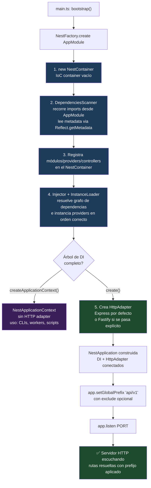

# 1.1 - Bootstrap, Application Context & HTTP Adapter

> **Objetivo del módulo:** Entender qué hace realmente `NestFactory.create()` antes de que exista un solo endpoint — cómo se construye el IoC Container, qué rol cumple el `HttpAdapter` como capa de abstracción sobre Express/Fastify, y por qué `setGlobalPrefix()` es una decisión de arquitectura de API (versionado) y no un detalle cosmético.

---

## ▶️ Panorámica Rápida & Contexto

- `NestFactory.create()` es el punto de entrada de **toda** aplicación Nest: construye el `NestContainer` (el IoC container), escanea el árbol de módulos partiendo de `AppModule`, instancia providers/controllers, y recién al final envuelve todo en un `HttpAdapter` que sabe hablar con un servidor HTTP real.
- Nest **no es** un servidor HTTP — es una capa de abstracción por encima de uno. Por defecto usa Express (vía `@nestjs/platform-express`, ya instalado en este proyecto), pero el mismo código de negocio (controllers, DTOs, guards) corre igual sobre Fastify sin tocarlos, porque nunca hablan con Express/Fastify directamente, solo con el `HttpAdapter`.
- Existe una variante sin HTTP: `NestFactory.createApplicationContext()` construye el mismo IoC container y resuelve el mismo árbol de dependencias, pero **sin** adapter HTTP — útil para scripts, workers, CLIs. Esto prueba que el IoC container es el núcleo real de Nest; el servidor HTTP es una capa opcional encima.
- `setGlobalPrefix()` es la forma más simple de versionar una API (`/api/v1/...`) sin decorar cada controller — pero corre en un punto específico del bootstrap, y tiene reglas propias para excluir rutas (como un health check que a veces se quiere fuera del prefijo).

---

## 🔬 Under the Hood: Fundamentos & Mecánica Interna (Deep Dive)

**Qué hace `NestFactory.create()` paso a paso:**

Internamente, `NestFactory` no es una clase que "arranca un server" de forma monolítica — orquesta varios colaboradores especializados:

1. **`NestContainer`**: la estructura de datos central que va a almacenar cada módulo, cada provider, cada controller y sus metadatos de dependencias. Es literalmente el IoC container — un `Map` de módulos, cada uno con su propio `Map` de providers/controllers/exports.
2. **`DependenciesScanner`**: recorre recursivamente el árbol de `imports` empezando en `AppModule` (el módulo raíz que le pasás a `create()`), leyendo la metadata que dejaron los decoradores (`@Module()`, `@Injectable()`, `@Controller()`) vía `Reflect.getMetadata` — esto es TypeScript's `emitDecoratorMetadata` (ya activo en `tsconfig.json` de este proyecto) haciendo que los decoradores adjunten metadata de tipos/tokens a cada clase en tiempo de compilación, que Nest lee en runtime.
3. **`InstanceLoader` + `Injector`**: una vez que el scanner registró **qué** existe y de **qué depende qué**, el `Injector` resuelve el grafo de dependencias e instancia cada provider en el orden correcto (dependencias antes que dependientes), inyectándolas en los constructores. Este es el motor real de Dependency Injection — no hay magia, es resolución de grafo + reflection.
4. **HTTP adapter init**: solo en este punto, `NestFactory` crea el `HttpAdapter` (Express por defecto) y lo envuelve en un `NestApplication`. Notá el orden: **el IoC container y todo el árbol de dependencias ya existen antes de que exista el servidor HTTP** — esto es lo que hace posible `createApplicationContext()` como variante sin HTTP: es el mismo pipeline, cortado antes del paso 4.

Fuente: el pipeline de colaboradores (`NestContainer`, `DependenciesScanner`, `Injector`/`InstanceLoader`, adapter) está documentado en detalle en [zalt.me — Deconstructing NestFactory in NestJS](https://zalt.me/blog/2025/09/deconstructing-nestfactory-nestjs), que confirma que `initialize()` "configura UUID mode, prepara injector/loader/scanner, opcionalmente inicializa el HTTP adapter, escanea módulos y materializa providers" — en ese orden.

**La capa de abstracción HTTP — `HttpAdapter` (Express vs Fastify):**

Nest nunca deja que tu código (controllers, guards, interceptors) llame directamente a `req`/`res` de Express o Fastify. Todo pasa por el `AbstractHttpAdapter`, una interfaz común que ambos adapters implementan (`ExpressAdapter`, `FastifyAdapter`). Esto es el patrón **Adapter** de GoF aplicado a nivel de framework completo: tu `@Controller()` declara rutas de forma declarativa, y es el `HttpAdapter` activo el que las traduce a `app.get()`/`app.post()` de Express o a `fastify.route()` internamente.

- **Por defecto**, `NestFactory.create(AppModule)` usa **Express** — requiere `@nestjs/platform-express` instalado (ya está en `package.json` de este proyecto). Si no se especifica adapter, Nest intenta autodetectar cuál paquete de plataforma está instalado.
- Para usar Fastify explícitamente: `NestFactory.create<NestFastifyApplication>(AppModule, new FastifyAdapter())`, con `@nestjs/platform-fastify` instalado en su lugar.
- La ventaja real de esta capa no es "portabilidad teórica" — es que podés migrar de Express a Fastify (buscando throughput, Fastify es sensiblemente más rápido en benchmarks crudos de req/s) sin reescribir un solo controller, guard o DTO. Solo cambia el adapter en `main.ts`.

Fuente: benchmarks (~28k req/s Express vs ~45k req/s Fastify en JSON simple) y la recomendación de considerar Fastify para throughput en 2026 confirmados contra [Encore — NestJS vs Fastify 2026](https://encore.dev/articles/nestjs-vs-fastify). El comportamiento de autodetección de adapter y el requisito de `@nestjs/platform-express`/`@nestjs/platform-fastify` como peer dependency están confirmados contra la documentación oficial ([docs.nestjs.com — HTTP adapter](https://docs.nestjs.com/faq/http-adapter)).

**Versión del framework en este proyecto — dato que corrige expectativas del training data:**
Este proyecto corre `@nestjs/core@^11.0.1` (Nest v11, release estable más reciente confirmada a agosto 2026 es v11.2.1). Existe un draft de **Nest v12** apuntando a Q3 2026 con migración a ESM completo, reemplazo de Jest por Vitest y de class-validator por Standard Schema — nada de esto aplica todavía a este proyecto ni cambia el mecanismo de bootstrap descrito acá, pero vale saber que la superficie de API actual (`NestFactory`, decoradores, CommonJS) no es la versión final del framework. Fuente: [InfoQ — NestJS v12 Roadmap](https://www.infoq.com/news/2026/04/nestjs-12-roadmap-esm/) y [GitHub nestjs/nest PR #16391 — release v12.0.0](https://github.com/nestjs/nest/pull/16391).

**`setGlobalPrefix()` — cuándo corre y cómo excluir rutas:**

`app.setGlobalPrefix('api/v1')` se llama sobre la instancia de `NestApplication` ya construida (después de `NestFactory.create()`, antes de `app.listen()`). Internamente registra el prefijo en el `HttpAdapter`, que lo antepone a cada ruta resuelta desde los `@Controller()` en tiempo de request-matching — no reescribe nada en tus decoradores, es una capa de resolución de rutas.

Para excluir una ruta específica del prefijo (ej. un health check que un load balancer necesita pegar en `/health` sin el `/api/v1`), la API acepta una segunda opción con `exclude`:

```typescript
app.setGlobalPrefix('api/v1', {
  exclude: [{ path: 'health', method: RequestMethod.GET }],
});
```

Nota práctica confirmada en la fuente: el `path` en `exclude` **no lleva slash inicial** (`'health'`, no `'/health'`) — es un error común que hace que la exclusión silenciosamente no matchee.

Fuente: sintaxis y comportamiento de `exclude` confirmados contra [docs.nestjs.com — FAQ: Global prefix](https://github.com/nestjs/docs.nestjs.com/blob/master/content/faq/global-prefix.md) y el PR original que introdujo la feature ([nestjs/nest#1542](https://github.com/nestjs/nest/pull/1542/files)).

---

## 🧠 Analogía & Mapeo Mental (C# / ASP.NET Core & Angular)

- **ASP.NET Core (`Program.cs` / `WebApplication.CreateBuilder()`)**: el paralelismo es casi 1:1. `WebApplication.CreateBuilder(args)` construye un `builder` que registra servicios en el DI container (`builder.Services.AddScoped<T>()`, equivalente a los `providers` de un `@Module()`), y luego `builder.Build()` materializa la app — exactamente el momento en que `NestFactory.create()` termina de resolver el árbol de dependencias. El `app.MapControllers()` / `app.UseRouting()` de ASP.NET es conceptualmente el `HttpAdapter` de Nest: la capa que conecta el pipeline de DI ya resuelto con el servidor HTTP (Kestrel en .NET, Express/Fastify en Nest). Kestrel en ASP.NET Core cumple el mismo rol que Express/Fastify en Nest: el servidor HTTP real, intercambiable, detrás de una abstracción común.
- **Angular (`main.ts` / `bootstrapApplication()`)**: `bootstrapApplication(AppComponent, config)` en Angular standalone también separa "construir el árbol de injectors" de "renderizar en el DOM" — el injector raíz se arma primero, resolviendo providers, y solo después Angular monta el componente raíz en el DOM real. La diferencia de dominio (DOM vs HTTP server) no cambia el patrón: primero se resuelve el grafo de DI, después se conecta con el "mundo exterior" (DOM en Angular, socket HTTP en Nest).
- **Punto de fricción a marcar**: en ASP.NET Core, `builder.Services` y el `WebApplication` final son casi el mismo objeto conceptual desde el día 1 — no hay una variante "solo DI sin HTTP" tan explícita como `createApplicationContext()` de Nest (aunque `Host.CreateDefaultBuilder()` para Worker Services cumple un rol similar). Vale la pena notar la similitud sin forzarla 1:1.

---

## 📊 Diagrama de Arquitectura / Ciclo de Vida (Mermaid)



---

## ⚖️ Tradeoffs & Análisis de Decisiones Arquitectónicas

- **Express (default) vs Fastify (explícito)**:
  - **A favor de Express**: ecosistema de middleware más grande y maduro, cero configuración extra (ya viene con `@nestjs/platform-express`), la gran mayoría de tutoriales/Stack Overflow asumen Express — menor fricción para debugging cuando algo falla en la capa HTTP.
  - **A favor de Fastify**: throughput sensiblemente mayor en benchmarks crudos, validación de schema nativa más rápida (JSON Schema compilado), diseño más moderno pensado para async/await desde el inicio.
  - **Cuándo migrar**: solo cuando el throughput HTTP crudo sea un cuello de botella medido (no especulativo) — la migración es barata gracias al adapter, así que no hay que decidirla "por si acaso" el día 1. Ponytail aplica: quedate con el default (Express) hasta tener una razón medida para cambiar.
- **`setGlobalPrefix()` vs versionado por decorador (`@Version()`)**:
  - **A favor de `setGlobalPrefix`**: una sola línea en `main.ts`, cero código repetido en cada controller, ideal cuando toda la API comparte una sola versión activa a la vez.
  - **En contra**: si en el futuro dos versiones de la misma API deben convivir (`/api/v1/tasks` y `/api/v2/tasks` sirviendo lógica distinta simultáneamente), `setGlobalPrefix` por sí solo no alcanza — ahí entra el sistema de `Versioning` nativo de Nest (`app.enableVersioning()`), que sí soporta múltiples versiones concurrentes por ruta.
  - **Decisión para este proyecto**: `setGlobalPrefix('api/v1')` es suficiente y correcto para el estado actual (una sola versión activa) — no hay que adelantarse a `enableVersioning()` sin necesidad real todavía.

---

## 📑 Conceptos Clave & Trampas Mentales

| Concepto                     | Clave Práctica / Under the Hood                                                                                                       | Antipatrón / Trampa Común                                                                                             |
| :--------------------------- | :------------------------------------------------------------------------------------------------------------------------------------ | :-------------------------------------------------------------------------------------------------------------------- |
| `NestFactory.create()`       | El IoC container y el árbol de DI se resuelven **antes** de que exista el `HttpAdapter` — HTTP es una capa opcional encima del DI     | Pensar que Nest "es" Express con decoradores encima — Express es reemplazable, el IoC container no                    |
| `HttpAdapter`                | Interfaz común (`AbstractHttpAdapter`) que Express/Fastify implementan — tu código nunca toca `req`/`res` crudo directamente          | Importar tipos de Express (`Request`, `Response`) directamente en un controller "porque funciona" — acopla al adapter |
| `createApplicationContext()` | Mismo pipeline de DI que `create()`, sin paso 5 (HTTP adapter) — útil para CLIs/scripts/workers                                       | No saber que existe y levantar un `NestApplication` HTTP completo solo para correr un script de una vez               |
| `setGlobalPrefix()`          | Corre sobre la instancia ya construida, entre `create()` y `listen()` — reescribe matching de rutas en el adapter, no tus decoradores | Path en `exclude` con slash inicial (`'/health'`) — no matchea, la ruta queda igual con el prefijo aplicado           |
| Adapter default              | Sin adapter explícito, Nest usa Express si `@nestjs/platform-express` está instalado (autodetección por paquete presente)             | Asumir que hay que pasar `new ExpressAdapter()` siempre — es implícito si no se especifica otro                       |
| `emitDecoratorMetadata`      | TypeScript escribe metadata de tipos en cada clase decorada en compile-time; Nest la lee en runtime vía `Reflect.getMetadata`         | Pensar que la DI de Nest es "magia de decoradores" — es reflection sobre metadata generada en compilación             |

---

## 🎯 Reto Práctico (Hands-on Challenge)

1. En `main.ts`, después de `NestFactory.create(AppModule)` y antes de `app.listen()`, agregar `app.setGlobalPrefix('api/v1')`.
2. Crear un módulo de dominio mínimo para el health check (decidí vos si vive en `core/` o como módulo propio bajo `modules/` — justificá la elección frente al mentor con el criterio ya fijado en la nota 0.4) con un `@Controller('health')` y un único endpoint `GET` que responda algo simple (ej. `{ status: 'ok' }`) sin lógica de negocio real todavía.
3. Verificar que el endpoint responde en `GET /api/v1/health` (con el prefijo aplicado) — no en `/health` a secas.
4. Como ejercicio de comprensión (no hace falta implementarlo en código todavía): identificar qué cambiaría en `main.ts` si quisieras excluir `health` del prefijo global usando la opción `exclude` de `setGlobalPrefix`, y cuándo tendría sentido hacerlo en un despliegue real (pista: quién pega contra ese endpoint — un load balancer, un orquestador de contenedores).
5. **Verificación del DoD**: `bun run start:dev` levanta el servidor sin errores, y `GET /api/v1/health` responde 200 con un body válido.

---

## ✅ Checklist de Active Recall & Autoevaluación

- [ ] ¿Puedo explicar, en orden, qué hace `NestFactory.create()` internamente desde que recibe `AppModule` hasta que devuelve una instancia lista para `listen()`?
- [ ] ¿Puedo explicar por qué el IoC container se resuelve antes de que exista el `HttpAdapter`, y qué lo demuestra (`createApplicationContext()`)?
- [ ] ¿Puedo detallar qué hace el `HttpAdapter` como capa de abstracción, y por qué mi código de controllers no debería importar tipos de Express directamente?
- [ ] ¿Puedo explicar en qué momento exacto del bootstrap corre `setGlobalPrefix()`, y por qué el `path` en `exclude` no lleva slash inicial?
- [ ] ¿Puedo justificar cuándo migraría de Express a Fastify en este proyecto, y por qué no lo haría "por si acaso" el día de hoy?
