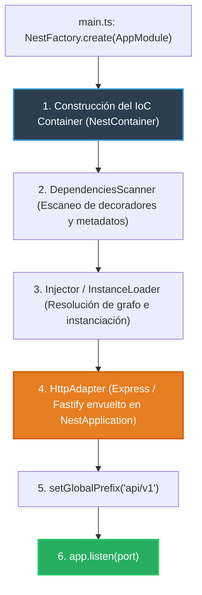

# 1.1 - Bootstrap, Application Context & HTTP Adapter

> **Objetivo del módulo:** Comprender la anatomía interna de `NestFactory.create()`: la separación entre el contenedor de IoC y la capa de transporte HTTP (Express/Fastify), el contexto sin servidor (`createApplicationContext`), y el versionado global de rutas con exclusiones.

---

## 🧭 1. Posición en la Arquitectura

Secuencia de inicialización en el arranque de la aplicación:



- **Frontera de ejecución**: Fase de bootstrap previa a la aceptación de conexiones HTTP.
- **IoC antes que HTTP**: El contenedor de dependencias se construye y resuelve completamente antes de que el servidor web empiece a existir.

---

## 📜 2. El Contrato Esencial

```typescript
// main.ts idiomático
async function bootstrap() {
  const app = await NestFactory.create(AppModule);

  // Versionado global con exclusión para health checks
  app.setGlobalPrefix('api/v1', {
    exclude: [{ path: 'health', method: RequestMethod.GET }],
  });

  const configService = app.get(ConfigService);
  const port = configService.get<number>('PORT', 3000);

  await app.listen(port);
}
bootstrap();

// Variante sin servidor HTTP (Workers, Cron jobs, CLIs)
const appContext = await NestFactory.createApplicationContext(AppModule);
```

- **Mapeo mental rápido**: Idéntico a `WebApplicationBuilder` vs `HostBuilder` en ASP.NET Core (`Program.cs`).

---

## ⚠️ 3. Top Trampas Mortales & Antipatrones

| Antipatrón / Trampa Común                               | Causa Técnica / Under the Hood                                                                 | Corrección Idiomática                                                          |
| :------------------------------------------------------ | :--------------------------------------------------------------------------------------------- | :----------------------------------------------------------------------------- |
| Poner slash inicial en `exclude` de `setGlobalPrefix`   | Nest compara strings directamente; `'/health'` no hace match y la ruta termina bajo el prefijo | Usar rutas relativas sin slash: `'health'`                                     |
| Manipular directamente el objeto `req`/`res` de Express | Acopla el código a una plataforma concreta y rompe la compatibilidad con Fastify               | Programar contra las abstracciones de NestJS (`HttpAdapter`, Decoradores)      |
| Creer que NestJS _es_ un servidor HTTP                  | Nest es una capa arquitectónica por encima; el servidor web es solo un adapter opcional        | Usar `createApplicationContext()` cuando solo se requiera el contenedor de IoC |

---

## 🎯 4. Reto Práctico (Hands-on Challenge)

### Requisitos & Contrato

- Configurar el bootstrap en `src/main.ts` usando `NestFactory.create(AppModule)`.
- Asignar el prefijo global `api/v1` a todos los endpoints.
- Excluir la ruta `GET health` del prefijo para que responda directamente en la raíz `/health`.
- Leer el puerto dinámicamente desde `ConfigService`.

### Pruebas de Verificación (cURL)

```bash
# 1. Health check fuera del prefijo
curl -i http://localhost:3000/health # Retorna 200 OK

# 2. Endpoints de negocio bajo el prefijo
curl -i http://localhost:3000/api/v1/tasks
```

### Criterios de Aceptación (Definition of Done - DoD)

- [ ] `GET /health` responde en la raíz sin el prefijo `api/v1`.
- [ ] Endpoints de features responden únicamente bajo `/api/v1/...`.
- [ ] Servidor arranca limpiamente en el puerto configurado.

---

## 🧠 5. Checklist de Active Recall

- [ ] ¿Qué ocurre internamente en `NestFactory.create()` antes de inicializar el `HttpAdapter`?
- [ ] ¿Para qué casos de uso en producción es útil `NestFactory.createApplicationContext()`?
- [ ] ¿Por qué un error en el string de exclusión de `setGlobalPrefix` puede romper monitoreos de red?
