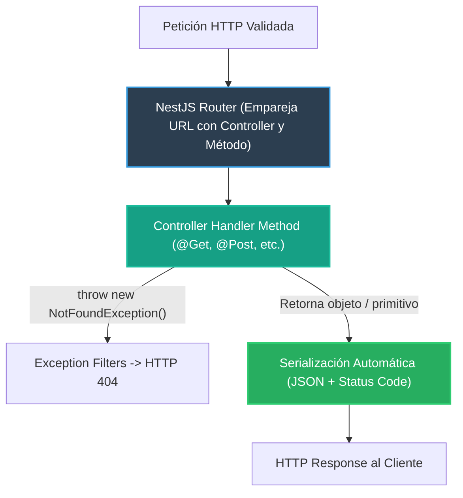

# 1.2 - Controllers, Routing & HTTP Decorators

> **Objetivo del módulo:** Dominar la capa de transporte HTTP en NestJS: la anatomía de los controladores, el enrutamiento declarativo vía decoradores, la gestión idiomática de códigos de estado REST y el manejo de excepciones HTTP estándar.

---

## 🧭 1. Posición en el Request Lifecycle

Los controladores reciben la petición una vez que ha superado los filtros de seguridad y validación:



- **Frontera de ejecución**: Capa de presentación y transporte.
- **Responsabilidad única**: Extraer parámetros del protocolo HTTP, invocar la lógica correspondiente y retornar la respuesta. No debe albergar lógica de negocio.

---

## 📜 2. El Contrato Esencial

```typescript
@Controller('tasks')
export class TasksController {
  @Get()
  findAll(): Task[] {
    return this.tasksService.findAll(); // Status 200 OK por defecto
  }

  @Post()
  create(@Body() dto: CreateTaskDto): Task {
    return this.tasksService.create(dto); // Status 201 Created por defecto
  }

  @Get(':id')
  findOne(@Param('id') id: string): Task {
    const task = this.tasksService.findOne(id);
    if (!task) throw new NotFoundException(`Task with ID ${id} not found`);
    return task;
  }

  @Delete(':id')
  @HttpCode(HttpStatus.NO_CONTENT) // Status 204 No Content
  remove(@Param('id') id: string): void {
    this.tasksService.remove(id);
  }
}
```

- **Mapeo mental rápido**: Idéntico a `[ApiController]` y `[Route("api/[controller]")]` con `[HttpGet]`, `[HttpPost]` en C# ASP.NET Core.

---

## ⚠️ 3. Top Trampas Mortales & Antipatrones

| Antipatrón / Trampa Común                                 | Causa Técnica / Under the Hood                                                            | Corrección Idiomática                                                                                   |
| :-------------------------------------------------------- | :---------------------------------------------------------------------------------------- | :------------------------------------------------------------------------------------------------------ |
| Hacer `return new NotFoundException()`                    | Nest serializa la instancia de excepción como un objeto JSON y responde `HTTP 200 OK`     | Lanzar siempre las excepciones: `throw new NotFoundException()`                                         |
| Inyectar `@Res()` de Express en los handlers              | Desactiva el modo estándar de NestJS, rompiendo interceptores posteriores y serialización | Retornar valores limpios directamente o usar `{ passthrough: true }` si se requiere manipular cabeceras |
| Colocar persistencia o lógica de negocio en el controller | Viola el principio de responsabilidad única (SRP) e impide reutilizar la lógica           | Mantener el controller delgado y delegar inmediatamente en un servicio                                  |

---

## 🎯 4. Reto Práctico (Hands-on Challenge)

### Requisitos & Contrato

- Implementar `TasksController` en `src/modules/tasks/tasks.controller.ts`.
- Exponer operaciones CRUD: `GET /tasks`, `GET /tasks/:id`, `POST /tasks`, `PUT /tasks/:id`, `PATCH /tasks/:id`, `DELETE /tasks/:id`.
- Códigos de estado HTTP correctos (`200` para lectura/mutación con retorno, `201` para creación, `204` para eliminación sin cuerpo).
- Lanzar `NotFoundException` ante IDs inexistentes.

### Pruebas de Verificación (cURL)

```bash
# 1. Crear tarea -> 201 Created
curl -i -X POST http://localhost:3000/api/v1/tasks \
  -H "Content-Type: application/json" -d '{"title":"Test"}'

# 2. Eliminar tarea -> 204 No Content
curl -i -X DELETE http://localhost:3000/api/v1/tasks/1
```

### Criterios de Aceptación (Definition of Done - DoD)

- [ ] CRUD operativo respetando códigos de estado REST estándar.
- [ ] Excepciones lanzadas con clases de `@nestjs/common` retornando formatos de error limpios.
- [ ] Pruebas unitarias básicas del controlador pasando.

---

## 🧠 5. Checklist de Active Recall

- [ ] ¿Qué código de estado HTTP emite NestJS por defecto en métodos `POST` vs `GET`?
- [ ] ¿Por qué retornar una excepción en vez de lanzarla (`throw`) provoca un fallo semántico en la API?
- [ ] ¿Qué efectos colaterales tiene usar `@Res()` sin `{ passthrough: true }` en un controlador?
