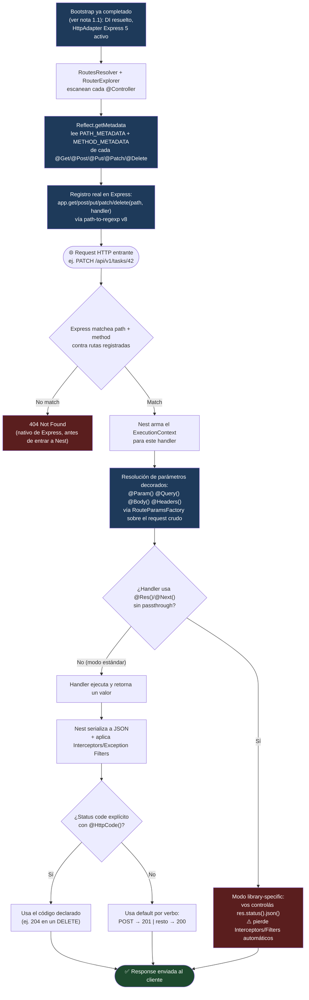

# 1.2 - Controllers, Routing & HTTP Decorators

> **Objetivo del módulo:** Entender cómo un `@Controller()` decorado con métodos HTTP (`@Get`, `@Post`, `@Put`, `@Patch`, `@Delete`) termina convertido en rutas reales que Express matchea contra cada request entrante, cómo se extraen parámetros de la request sin tocar `req`/`res` crudo, y qué status code semántico corresponde devolver en cada operación REST.

---

## ▶️ Panorámica Rápida & Contexto

- Un `@Controller()` no "es" una ruta — es una clase decorada cuyos métodos acumulan **metadata** (path + HTTP method) vía `Reflect.defineMetadata`. Esa metadata recién se traduce en rutas reales de Express durante el bootstrap, en una fase posterior a la resolución del IoC container que ya viste en 1.1.
- NestJS tiene dos modos de manejar una response: el **modo estándar** (retornás un valor desde el handler, Nest serializa y setea el status code) y el **modo library-specific** (`@Res()`, accedés directo al objeto de Express). Elegir mal entre ambos rompe features automáticas como interceptors y exception filters.
- Los status codes por defecto no son arbitrarios: `GET`/`PUT`/`PATCH`/`DELETE` responden `200` y `POST` responde `201` — reflejando la semántica HTTP estándar (creación vs operación exitosa sobre un recurso existente) sin que tengas que declararlo explícitamente.
- Este proyecto corre **Nest 11 sobre Express 5** (confirmado: `express@5.2.1` instalado vía `@nestjs/platform-express@^11.0.1`) — Express 5 cambió su motor de matching de rutas (`path-to-regexp` v8) con breaking changes reales en sintaxis de wildcards que sí importan si algún día usás rutas comodín.

---

## 🔬 Under the Hood: Fundamentos & Mecánica Interna (Deep Dive)

### De decorador a metadata: qué hace `@Controller()` y `@Get()` realmente

`@Controller('tasks')` y `@Get(':id')` no ejecutan lógica de routing en el momento en que TypeScript los evalúa — solo llaman a `Reflect.defineMetadata(clave, valor, target)` sobre la clase o el método decorado. `@Controller()` adjunta el path prefix (`PATH_METADATA`) y metadata de scope/versioning a nivel de clase. Cada decorador de método HTTP (`@Get`, `@Post`, `@Put`, `@Patch`, `@Delete`, `@Options`, `@Head`, `@All`) internamente llama a un helper compartido que setea dos piezas de metadata sobre el método: el **path** (string o array de strings, default `'/'`) y el **`RequestMethod`** (un enum: `GET`, `POST`, etc.) vía `PATH_METADATA` y `METHOD_METADATA`. Es el mismo mecanismo genérico que usa `SetMetadata()` para metadata custom (la que vas a usar más adelante con Guards) — los decoradores HTTP son syntactic sugar sobre ese mismo primitivo.

En este punto de tu formación esto no debería sorprenderte: en 1.1 ya viste que `emitDecoratorMetadata` + `Reflect` es el motor que hace posible la Dependency Injection. Acá es el **mismo** motor, aplicado a un dominio distinto (routing en vez de resolución de dependencias).

### De metadata a rutas reales: `RoutesResolver` + `RouterExplorer`

La metadata sola no sirve — alguien tiene que leerla y registrar rutas reales contra el servidor HTTP. Esto ocurre durante el bootstrap, después de que el `NestContainer` ya instanció todos los controllers (ver 1.1: DI resuelto antes de que exista routing HTTP funcional).

1. **`RoutesResolver`**: itera cada módulo registrado en el container y, para cada controller, invoca al `RouterExplorer`.
2. **`RouterExplorer`**: usa `MetadataScanner` para recorrer todos los métodos de la clase del controller (via `Object.getPrototypeOf`), lee la metadata que dejaron `@Get`/`@Post`/etc. con `Reflect.getMetadata(PATH_METADATA, ...)` y `Reflect.getMetadata(METHOD_METADATA, ...)`, y con eso arma un `RouteDefinition` (path, requestMethod, targetCallback, methodName). El path final de cada ruta es la concatenación del prefix de `@Controller()` + el path del método + el `globalPrefix` que configuraste en 1.1 (`api/v1`).
3. Con cada `RouteDefinition` resuelto, `RouterExplorer` llama al método correspondiente del `HttpAdapter` activo (`app.get(path, handler)`, `app.post(path, handler)`, etc. — literalmente los métodos nativos de Express, porque `ExpressAdapter` es un wrapper delgado sobre la instancia real de Express). Este es el punto exacto donde tu `@Controller()` deja de ser metadata abstracta y se convierte en una entrada real en el router de Express.

Fuente: la responsabilidad de `RoutesResolver` orquestando `RouterExplorer` + `MetadataScanner` + `RoutePathFactory` para resolver y registrar rutas de controller está confirmada contra el código fuente en [GitHub — nestjs/nest, `packages/core/router/routes-resolver.ts`](https://github.com/nestjs/nest/blob/master/packages/core/router/routes-resolver.ts) y [`packages/core/router/router-explorer.ts`](https://github.com/nestjs/nest/blob/master/packages/core/router/router-explorer.ts), donde `RouteDefinition` expone explícitamente `path`, `requestMethod`, `targetCallback`, `methodName` y `version`.

### El matching real de rutas: Nest 11 corre sobre **Express 5**, no Express 4

Acá hay un dato que probablemente contradiga tu expectativa por defecto: **Nest 11 usa Express 5 como adapter por defecto**, no Express 4. Esto es un cambio real de superficie — Express 5 salió de beta después de más de una década y trajo un motor de matching de rutas nuevo basado en `path-to-regexp` v8 (antes v6 en Express 4), con breaking changes de sintaxis:

- El wildcard `*` suelto (`app.get('/files/*', ...)`) **ya no es válido** — ahora debe ser nombrado: `/files/*splat` (o `/files/{*splat}`).
- Los caracteres opcionales con `?` (`/files/:id?`) ya no se soportan — se reemplazan con llaves: `/:file{.:ext}`.
- Caracteres de regex sueltos (`()`, `[]`, `?`, `+`, `!`) están reservados y requieren escape explícito — antes se interpretaban como regex parcial.

En este proyecto podés confirmarlo directamente: `express@5.2.1` y `path-to-regexp@8.4.2` están instalados como dependencia transitiva de `@nestjs/platform-express@^11.0.1`. Para las rutas simples que vas a escribir en este tema (`@Get(':id')`, sin wildcards) esto no cambia nada — pero si en algún momento futuro necesitás una ruta comodín (ej. servir archivos estáticos con path variable), la sintaxis vieja de Nest 10/Express 4 que puedas encontrar en tutoriales antiguos **va a romper el bootstrap** con un error explícito de `path-to-regexp`.

Fuente: el breaking change de wildcards nombrados en Express 5 / `path-to-regexp` v8 está confirmado contra [GitHub — expressjs/express Issue #6606](https://github.com/expressjs/express/issues/6606) y el caso real reportado en Nest 11 con `setGlobalPrefix` y regex ([GitHub — nestjs/nest Issue #16095](https://github.com/nestjs/nest/issues/16095)), que muestra el mensaje de error real: *"In previous versions, the symbols ?, _, and + were used to denote optional or repeating path parameters. The latest version of 'path-to-regexp' now requires the use of named parameters."_ La versión exacta instalada (`express@5.2.1`, `path-to-regexp@8.4.2`) fue verificada contra el `package.json` publicado de [`@nestjs/platform-express` en GitHub](https://github.com/nestjs/nest/blob/master/packages/platform-express/package.json).

### Extracción de parámetros: decoradores de parámetro y `createParamDecorator`

`@Param()`, `@Query()`, `@Body()`, `@Headers()` no son casos especiales hardcodeados — son instancias de la misma fábrica pública que exponés vos mismo cuando definís un decorador custom con `createParamDecorator()`. Cuando Nest ejecuta un route handler, antes de invocarlo resuelve cada parámetro decorado leyendo metadata (otra vez `Reflect`, esta vez indexada por posición del parámetro en la firma del método) y, para cada uno, ejecuta una función factory con acceso al `ExecutionContext` — el mismo objeto que vas a usar más adelante en Guards e Interceptors, que expone `ctx.switchToHttp().getRequest()`/`getResponse()` para llegar al request/response crudo del adapter activo sin acoplar tu código a Express directamente.

En la práctica: `@Param('id')` internamente hace algo equivalente a `request.params.id`, `@Query('page')` a `request.query.page`, `@Body()` al body ya parseado (Express con `express.json()` middleware, que Nest activa por defecto), y `@Headers('authorization')` a `request.headers.authorization`. La diferencia con escribir eso vos mismo con `@Req()` no es solo estética: los decoradores dedicados son testeables sin mockear el objeto request completo, y mantienen tu handler desacoplado del adapter HTTP subyacente (exactamente el mismo argumento del `HttpAdapter` que viste en 1.1, aplicado ahora a nivel de parámetro en vez de nivel de aplicación).

### Modo estándar vs modo library-specific (`@Res()`/`@Req()`)

Este es el punto de decisión arquitectónica más importante del tema:

- **Modo estándar (default, recomendado)**: el handler retorna un valor (objeto, array, string, `Promise`). Nest se encarga de serializarlo a JSON, setear el `Content-Type`, aplicar el status code (por defecto o el que definas con `@HttpCode()`), y — crucialmente — **ejecutar Interceptors y Exception Filters automáticamente** sobre esa respuesta.
- **Modo library-specific con `@Res()` sin `passthrough`**: inyectás el objeto `Response` nativo (de Express) y llamás vos mismo a `res.status(200).json(data)`. En cuanto Nest detecta que un handler usa `@Res()` (o `@Next()`) sin `passthrough: true`, **desactiva el modo estándar para esa ruta específica** — dejás de tener manejo automático de status codes, y algunas piezas del pipeline (particularmente el valor de retorno pasando por Interceptors post-handler) dejan de aplicar de la forma esperada, porque ahora sos vos quien controla explícitamente cuándo y cómo se envía la respuesta.
- **`@Res({ passthrough: true })`**: el punto intermedio — te da acceso al objeto Express nativo (útil para, por ejemplo, setear una cookie o un header custom que no tiene decorador dedicado) pero preservando el modo estándar: si el handler además hace `return valor`, Nest sigue serializando y aplicando el pipeline normal sobre ese valor de retorno.

Fuente: el comportamiento de que Nest desactiva el modo estándar de manejo de response al detectar `@Res()`/`@Next()` sin `passthrough: true`, y que `passthrough: true` preserva el comportamiento estándar mientras da acceso al objeto nativo, está confirmado contra la documentación oficial ([docs.nestjs.com — Controllers](https://docs.nestjs.com/controllers)).

### Status codes por defecto

Confirmado contra la doc oficial: **todos los métodos HTTP responden `200` por defecto, excepto `POST`, que responde `201`** (Created). Esto no es azar — mapea la semántica REST estándar donde `201` comunica "se creó un recurso nuevo" y el header `Location` (que podés setear manualmente o dejar que el cliente infiera) apuntaría al recurso creado. Para sobreescribir este default explícitamente (por ejemplo, un `DELETE` que preferís que devuelva `204 No Content` en vez de `200`), se usa `@HttpCode(204)` a nivel de método — declarativo, sin tocar el objeto response.

Fuente: comportamiento de status codes por defecto (200 general, 201 para POST) y `@HttpCode()` como mecanismo de override confirmados contra [docs.nestjs.com — Controllers](https://docs.nestjs.com/controllers).

---

## 🧠 Analogía & Mapeo Mental (C# / ASP.NET Core & Angular)

- **ASP.NET Core (`[ApiController]` + `[Route]` + `[HttpGet]`/`[HttpPost]`)**: el paralelismo es directo y casi 1:1 en intención, aunque el mecanismo interno difiere. `[ApiController]` sobre una clase es conceptualmente tu `@Controller()`: marca la clase como responsable de un conjunto de endpoints y activa comportamientos automáticos (en ASP.NET, model binding + validación automática; en Nest, resolución de la clase como parte del grafo DI). `[Route("api/[controller]")]` es tu path prefix — igual que el string que le pasás a `@Controller('tasks')`. Y `[HttpGet("{id}")]`/`[HttpPost]` son exactamente `@Get(':id')`/`@Post()`: decoran un método de acción con verbo HTTP + path relativo. La diferencia real está en **cómo** se descubre esa metadata en runtime: ASP.NET Core usa **Attribute Routing** resuelto por el `Endpoint Routing Middleware` (que compila un `DFA` — Deterministic Finite Automaton — de rutas en startup, vía reflection sobre atributos), mientras Nest usa `Reflect.getMetadata` + `RouterExplorer` para registrar cada ruta directamente contra Express en bootstrap. El resultado observable es el mismo (rutas registradas antes de servir el primer request), el motor interno no.
- **`IActionResult`/`return Ok(obj)` vs modo estándar de Nest**: en ASP.NET Core, `return Ok(data)` (200) o `return CreatedAtAction(...)` (201) son la forma explícita de controlar el status code desde el action method — es el equivalente mental de `@HttpCode()` + `return data` en Nest, salvo que Nest infiere el código por defecto según el verbo HTTP sin que lo pidas, mientras en ASP.NET Core generalmente sos vos quien elige el helper (`Ok`, `Created`, `NoContent`) explícitamente en cada action.
- **`HttpContext`/`Request`/`Response` directos vs `@Req()`/`@Res()`**: en ASP.NET Core es común y aceptado acceder a `HttpContext.Request`/`Response` directamente dentro de un action — no hay una penalización arquitectónica tan marcada como en Nest. En Nest, usar `@Res()` sin `passthrough` es una decisión con costo real (perdés Interceptors/Exception Filters automáticos) — es más parecido a saltarte el pipeline de Middleware/Filters de ASP.NET Core manualmente que a un simple acceso a contexto.
- **Angular (routing declarativo, sin paralelo 1:1 a nivel de decorador)**: Angular no tiene un equivalente directo a `@Get()`/`@Post()` porque no maneja verbos HTTP — su `Router` mapea rutas de navegación (URL del navegador) a componentes, no requests HTTP a handlers. El paralelo conceptual más honesto es con `HttpClient`: cuando hacés `this.http.get<Task[]>('/api/tasks')` en un servicio Angular, estás en el lado **cliente** de exactamente el contrato que tu `@Get()` de Nest define en el lado **servidor** — mismo verbo, mismo path, mismo body/params esperados. Vale la pena notar la similitud (contrato REST compartido) sin forzar un mapeo de decorador a decorador que no existe.

---

## 📊 Diagrama de Arquitectura / Ciclo de Vida (Mermaid)

---

## ⚖️ Tradeoffs & Análisis de Decisiones Arquitectónicas

- **Modo estándar vs `@Res()` library-specific**:
  - **A favor del modo estándar**: portabilidad entre adapters (Express/Fastify), Interceptors y Exception Filters funcionan automáticamente, tests unitarios del handler no requieren mockear un objeto `Response` completo — solo verificás el valor de retorno.
  - **A favor de `@Res()`**: casos reales donde necesitás control fino que Nest no expone declarativamente todavía (streaming de archivos grandes, setear múltiples cookies con opciones específicas del adapter, redirects con status codes no estándar). Con `passthrough: true` recuperás casi todo el costo perdido.
  - **Decisión para este proyecto**: modo estándar por defecto en todos los controllers de dominio (Tasks, Projects, Workspaces). `@Res()` solo si aparece un caso concreto que el modo estándar no puede resolver — no lo uses "por si necesito más control después": eso es especular sin necesidad medida (ponytail aplica igual que en 1.1 con Express/Fastify).
  - **Impacto en mantenibilidad**: un handler en modo library-specific es más difícil de testear y de razonar en code review porque el contrato de la función (¿qué devuelve? ¿qué side-effects tiene sobre `res`?) deja de ser el tipo de retorno declarado.

- **`@HttpCode()` explícito vs confiar en el default por verbo**:
  - **Cuándo confiar en el default**: para el caso estándar de cada verbo (`GET` devuelve el recurso con `200`, `POST` crea y devuelve `201`) — no hace falta declarar `@HttpCode(200)` en un `GET`, es ruido.
  - **Cuándo declarar explícito**: cualquier desviación semántica del default — el caso más común en este roadmap es un `DELETE` que preferís que devuelva `204 No Content` (sin body) en vez del `200` implícito, porque `204` comunica correctamente "operación exitosa, no hay contenido que devolver". Declarar `@HttpCode()` ahí no es opcional para ser semánticamente correcto — es la forma correcta de expresar la intención.

---

## 📑 Conceptos Clave & Trampas Mentales

| Concepto                                                           | Clave Práctica / Under the Hood                                                                                                                                                              | Antipatrón / Trampa Común                                                                                                                                                           |
| :----------------------------------------------------------------- | :------------------------------------------------------------------------------------------------------------------------------------------------------------------------------------------- | :---------------------------------------------------------------------------------------------------------------------------------------------------------------------------------- |
| `@Controller()` / `@Get()` etc.                                    | Solo adjuntan metadata (`Reflect.defineMetadata`) — el registro real de rutas en Express ocurre después, en `RouterExplorer` durante el bootstrap                                            | Pensar que el decorador "ejecuta" el routing en el momento en que se declara la clase — es metadata pasiva hasta que `RoutesResolver` la lee                                        |
| Path final de una ruta                                             | Concatenación de `globalPrefix` (1.1) + path de `@Controller()` + path del método (`@Get(':id')`)                                                                                            | Olvidar el `globalPrefix` al probar un endpoint nuevo y pegarle a `/tasks` en vez de `/api/v1/tasks`                                                                                |
| Express 5 en Nest 11                                               | Wildcards `*` deben ir nombrados (`/*splat`), `?` opcional se reemplaza por `{}` — `path-to-regexp` v8 rompe sintaxis vieja                                                                  | Copiar una ruta comodín de un tutorial de Nest 10/Express 4 y que el bootstrap falle con un error de `path-to-regexp` que no reconocés                                              |
| Decoradores de parámetro (`@Param`, `@Query`, `@Body`, `@Headers`) | Misma fábrica genérica que `createParamDecorator()` — resuelven contra el `ExecutionContext`, no acoplan el handler al adapter HTTP                                                          | Usar `@Req()` y leer `req.params.id` manualmente cuando `@Param('id')` hace exactamente eso, de forma testeable y declarativa                                                       |
| Modo estándar vs `@Res()`                                          | `@Res()`/`@Next()` sin `passthrough: true` desactiva el manejo automático de response para esa ruta específica                                                                               | Usar `@Res()` "para tener más control" sin necesidad real, perdiendo Interceptors/Exception Filters sin notarlo hasta que un Guard/Interceptor "no funciona" en esa ruta            |
| Status codes por defecto                                           | `POST` → `201`, todo el resto → `200` — mapea semántica REST estándar sin declaración explícita                                                                                              | Devolver `200` en un `POST` que crea un recurso (semánticamente incorrecto) sin darse cuenta de que hay que sobreescribir con `@HttpCode()` para desviarse del default, no al revés |
| `404` en este punto del roadmap                                    | Con datos en memoria (sin Service/persistencia todavía), un recurso no encontrado se lanza explícitamente con `NotFoundException` de Nest, no devolviendo `null`/`undefined` silenciosamente | Devolver `200` con body vacío o `null` cuando el recurso no existe — el cliente no tiene forma estándar de distinguir eso de "encontré un recurso vacío"                            |

---

## ⚡ Buenas Prácticas de Producción (Do / Don't)

- **Prefiere**: modo estándar (retornar el valor) como default en el 100% de los handlers, reservando `@Res()` solo para casos concretos documentables.
- **Prefiere**: lanzar excepciones HTTP nativas de Nest (`NotFoundException`, `BadRequestException`) en vez de manipular el status code manualmente para casos de error — esto es lo que te va a permitir en fases futuras centralizar el manejo de errores con Exception Filters sin tocar cada controller.
- **Evita**: mezclar modo estándar y `@Res()` sin `passthrough` dentro del mismo controller sin un criterio claro — la inconsistencia dentro de una misma clase es una señal de que no decidiste el patrón, lo fuiste improvisando ruta por ruta.
- **Evita**: hardcodear el path completo con el prefijo (`@Get('api/v1/tasks/:id')`) en vez de dejar que `@Controller('tasks')` + `setGlobalPrefix` lo compongan — acopla el controller a una decisión de infraestructura que no le corresponde.

---

## 🎯 Reto Práctico (Hands-on Challenge)

**Objetivo**: crear un controlador REST completo para un recurso del dominio, cubriendo los cinco verbos HTTP estándar con status codes semánticamente correctos.

**Recurso sugerido**: `tasks` (te da naturalmente los cinco verbos con sentido: listar, crear, actualizar completo, actualizar parcial, borrar) — pero la elección final es tuya; `projects` o `workspaces` son válidos igual si preferís arrancar por ahí. Justificá tu elección si el mentor te lo pregunta.

**Requisitos funcionales**:

1. Crear un módulo de dominio para el recurso elegido bajo `src/modules/` (aplicá el mismo criterio de ubicación que ya usaste en la nota 0.4/1.1), con su `@Controller('<recurso>')` correspondiente.
2. Implementar los cinco endpoints:
   - `GET /` — listar todos los recursos.
   - `GET /:id` — obtener uno por id.
   - `POST /` — crear uno nuevo.
   - `PUT /:id` — reemplazar completo un recurso existente.
   - `PATCH /:id` — actualizar parcialmente un recurso existente.
   - `DELETE /:id` — eliminar un recurso existente.
3. **No hay Service todavía** (llega en el tema 1.3) — es válido y esperado que la lógica y el almacenamiento vivan temporalmente en el propio controller, con un array en memoria a nivel de módulo o de la clase. Vas a discutir con el mentor por qué esto viola Separation of Concerns cuando lleguemos a 1.3 — por ahora, avanzá así a propósito.
4. Para cada endpoint, razoná y aplicá explícitamente el status code correcto:
   - ¿Cuál es el default de Nest para cada verbo, y en cuáles casos necesitás sobreescribirlo con `@HttpCode()`?
   - ¿Qué debería pasar cuando `GET /:id`, `PUT /:id`, `PATCH /:id` o `DELETE /:id` reciben un `id` que no existe en tu array en memoria? (pista: `NotFoundException` de `@nestjs/common`, no un `return null`).
   - ¿Qué status code es el semánticamente correcto para un `DELETE` exitoso: `200` con el recurso borrado en el body, o `204` sin body? Justificá tu elección.
5. Usá `@Param()`, `@Query()` (si aplica, ej. un filtro simple en el `GET /`) y `@Body()` para extraer datos de la request — no uses `@Req()` para leerlos manualmente.

**Verificación del DoD**:

1. `bun run start:dev` levanta sin errores.
2. Con `curl` (o el cliente HTTP que prefieras — Postman, REST Client de VS Code, etc.), verificá contra `http://localhost:3000/api/v1/<recurso>`:
   - `POST` con un body válido responde `201` y el recurso creado (incluyendo su id) en el body.
   - `GET /` responde `200` con la lista (incluyendo el recurso recién creado).
   - `GET /:id` con un id existente responde `200` con el recurso; con un id inexistente responde `404`.
   - `PUT /:id` y `PATCH /:id` sobre un id existente responden `200` con el recurso actualizado; sobre un id inexistente, `404`.
   - `DELETE /:id` sobre un id existente responde el status code que justificaste en el paso 4 (y el recurso deja de aparecer en un `GET /` posterior); sobre un id inexistente, `404`.

---

## ✅ Checklist de Active Recall & Autoevaluación

- [ ] ¿Puedo explicar qué hace exactamente `@Get(':id')` en el momento en que TypeScript evalúa la clase, y en qué momento posterior del bootstrap se convierte en una ruta real de Express?
- [ ] ¿Puedo nombrar los dos colaboradores (`RoutesResolver`, `RouterExplorer`) que leen esa metadata y la registran contra el `HttpAdapter`, conectando esto con lo que ya sé de `NestFactory.create()` de la nota 1.1?
- [ ] ¿Puedo explicar por qué Nest 11 en este proyecto corre sobre Express 5, y qué breaking change concreto de `path-to-regexp` me afectaría si copio una ruta comodín de un tutorial viejo?
- [ ] ¿Puedo explicar la diferencia real (no solo sintáctica) entre modo estándar y `@Res()` sin `passthrough`, y qué pierdo específicamente al usar el segundo?
- [ ] ¿Puedo decir de memoria cuáles son los status codes por defecto para cada verbo HTTP en Nest, y cuándo necesito `@HttpCode()` para desviarme de ellos?
- [ ] ¿Puedo justificar por qué un recurso no encontrado debería lanzar `NotFoundException` en vez de devolver `null`/`undefined` con `200`?
