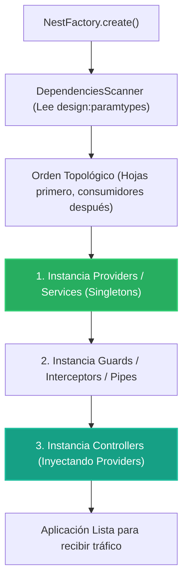

# 1.3 - Providers, Services & Inversión de Control (IoC)

> **Objetivo del módulo:** Dominar el contenedor de inversión de control (IoC) y la inyección de dependencias (DI) en NestJS: `@Injectable()`, cómo `design:paramtypes` resuelve constructores, la anatomía de un Provider (`token` + `receta`) y el scope Singleton.

---

## 🧭 1. Posición en la Arquitectura

El IoC Container resuelve el grafo de dependencias en tiempo de arranque (**bootstrap**) en orden topológico estricto:



- **Frontera de ejecución**: Tiempo de arranque (Bootstrap / Compile-time resolution). No ocurre por cada petición HTTP (a menos que uses `Scope.REQUEST`, desaconsejado por rendimiento).
- **Visibilidad**: Los providers registrados en `providers` de un módulo son privados a ese módulo por defecto.

---

## 📜 2. El Contrato Esencial

```typescript
// Declaración del Provider
@Injectable()
export class TasksService {
  findAll(): Task[] {
    /* ... */
  }
}

// Inyección idiomática en el consumidor
@Controller('tasks')
export class TasksController {
  constructor(private readonly tasksService: TasksService) {}
}

// Expansión interna de la receta (Shorthand vs Completo)
// providers: [TasksService] equivale a:
providers: [{ provide: TasksService, useClass: TasksService }];
```

- **Tokens alternativos**: Si el token es un string o Symbol (`@Inject('CONFIG_TOKEN')`), se usa para valores fijos (`useValue`) o fábricas (`useFactory`).
- **Mapeo mental rápido**: Idéntico al IoC de ASP.NET Core (`services.AddSingleton<ITaskService, TaskService>()`) o a los `@Injectable({ providedIn: 'root' })` de Angular.

---

## ⚠️ 3. Top Trampas Mortales & Antipatrones

| Antipatrón / Trampa Común                                 | Causa Técnica / Under the Hood                                                                               | Corrección Idiomática                                                          |
| :-------------------------------------------------------- | :----------------------------------------------------------------------------------------------------------- | :----------------------------------------------------------------------------- |
| Inyectar una `interface` de TypeScript en el constructor  | Las interfaces sufren _type erasure_ al compilar a JS; TS emite `Object` en `design:paramtypes` y Nest falla | Inyectar clases concretas o usar un token explícito con `@Inject('TOKEN')`     |
| Instanciar con `new MyService()` dentro de un controlador | Rompe el principio de inversión de control (IoC), acopla capas y anula la gestión de ciclo de vida de Nest   | Declarar la dependencia en el constructor y dejar que el contenedor la inyecte |
| Olvidar `@Injectable()` en un servicio sin dependencias   | Sin ningún decorador, TypeScript no emite metadata de tipos para esa clase                                   | Decorar siempre los servicios con `@Injectable()`                              |

---

## 🎯 4. Reto Práctico (Hands-on Challenge)

### Requisitos & Contrato

- Extraer el almacenamiento en memoria y la lógica de negocio de `TasksController` hacia `TasksService`.
- Marcar `TasksService` como `@Injectable()` e inyectarlo en `TasksController` vía `private readonly`.
- El controlador solo atiende transporte HTTP y delega inmediatamente en el servicio.

### Criterios de Aceptación (Definition of Done - DoD)

- [ ] `TasksService` registrado en `providers` de `TasksModule`.
- [ ] `TasksController` sin arrays ni mutaciones directas de estado.
- [ ] Endpoints funcionando idéntico con tests unitarios pasando.

---

## 🧠 5. Checklist de Active Recall

- [ ] ¿Qué papel juega `emitDecoratorMetadata` y `design:paramtypes` para que Nest sepa qué clase inyectar?
- [ ] ¿Por qué un token de inyección no puede ser una interfaz de TypeScript?
- [ ] ¿En qué orden se instancian los Controllers respecto a sus Services durante el bootstrap?
