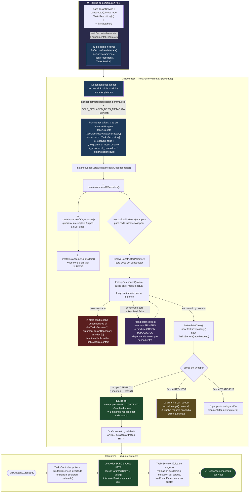

# 1.3 - Providers, Services & Inversión de Control (IoC)

> **Objetivo del módulo:** Entender por qué un `@Injectable()` decorado no "se instancia solo" sino que el `NestContainer` lo resuelve como nodo de un grafo de dependencias — cómo `emitDecoratorMetadata` + `reflect-metadata` hacen que el tipo de cada parámetro del constructor sobreviva a la compilación, cómo el `Injector` recorre ese grafo en orden topológico durante el bootstrap, qué diferencia hay entre el shorthand `providers: [TasksService]` y la forma completa `{ provide, useClass }`, por qué no podés inyectar por interface, y por qué el scope por defecto (Singleton) es una decisión de arquitectura, no un accidente.

---

## ▶️ Panorámica Rápida & Contexto

- **Inversión de Control (IoC)** significa que tu clase deja de decidir _cómo_ obtener sus colaboradores (`new TasksRepository()` adentro del constructor) y solo _declara_ qué necesita (`constructor(private readonly repo: TasksRepository)`). Un tercero — el **IoC Container** de Nest — es quien construye, cachea e inyecta esas instancias. **Dependency Injection (DI)** es la técnica concreta con la que se implementa esa inversión.
- Un **provider** es cualquier cosa que el container sabe crear y entregar: un service, un repository, un factory, un value constante, un cliente HTTP. `@Injectable()` es solo el marcador que dice "esta clase participa del sistema DI" — no crea la instancia, solo la hace _elegible_.
- El pegamento técnico es el mismo motor de metadata que ya viste en 1.1 y 1.2: `@Injectable()` fuerza a TypeScript (vía `emitDecoratorMetadata`) a emitir `Reflect.defineMetadata('design:paramtypes', [TasksRepository, Logger], TasksService)`. En el bootstrap, el `Injector` lee ese array con `Reflect.getMetadata`, resuelve cada token, y recién ahí hace el `new`.
- El scope por defecto es **Singleton** (`Scope.DEFAULT`): una sola instancia por aplicación, compartida por todos los que la inyectan, viva durante todo el ciclo de vida del proceso. `Scope.REQUEST` y `Scope.TRANSIENT` existen pero tienen costo real (performance + propagación viral del scope).
- Las **interfaces de TypeScript se borran en compilación** (type erasure). No existen en runtime, así que **no podés usarlas como token de inyección**. Para desacoplar de la implementación concreta necesitás un token explícito (string/`Symbol`/`abstract class`) + la forma completa `{ provide: TOKEN, useClass: Impl }`.

---

## 🔬 Under the Hood: Fundamentos & Mecánica Interna (Deep Dive)

### 1. De `@Injectable()` a `design:paramtypes`: cómo el tipo del constructor sobrevive a la compilación

TypeScript borra todos los tipos al compilar a JavaScript. Sin ayuda, un `constructor(private repo: TasksRepository)` se compila a `constructor(repo) {}` y la información de que `repo` _era_ un `TasksRepository` se pierde para siempre. Nest necesita esa información en runtime para saber qué inyectar. El mecanismo que la preserva tiene tres piezas que tienen que estar todas presentes:

1. **`experimentalDecorators: true`** en `tsconfig.json` — habilita los _legacy decorators_ (la propuesta vieja de TC39, no los Stage 3 / TS 5.0). Nest **sigue dependiendo de los legacy decorators** porque usa _parameter decorators_ (`@Inject()`, `@Optional()` sobre parámetros del constructor), que **no existen en el estándar Stage 3**. TS 5.0 estabilizó los decoradores nuevos, pero `--experimentalDecorators` "va a seguir existiendo en el futuro previsible" y es el modo que Nest requiere. Fuente: [TypeScript 5.0 — Decorators announcement](https://www.typescriptlang.org/tsconfig/emitDecoratorMetadata.html) y discusión de por qué Nest necesita `experimentalDecorators` por los parameter decorators ([shiftasia — Custom Decorators and Metadata in NestJS](https://shiftasia.com/community/mastering-custom-decorators-and-metadata-in-nestjs/)).
2. **`emitDecoratorMetadata: true`** — cuando una clase tiene _al menos un decorador_ (por eso `@Injectable()` es obligatorio aunque la clase no tenga dependencias propias que declarar de forma especial), el compilador emite metadata adicional para esa clase: `design:type`, `design:paramtypes` (array con los constructores de cada parámetro) y `design:returntype`. Esto se materializa como llamadas a `Reflect.metadata(...)` en el JS de salida.
3. **`import 'reflect-metadata'`** — el polyfill que agrega `Reflect.defineMetadata` / `Reflect.getMetadata` al objeto global `Reflect`. Nest lo importa por vos en su entrypoint; por eso no lo ves en `main.ts` pero está.

El resultado observable: después de compilar `TasksService`, en runtime `Reflect.getMetadata('design:paramtypes', TasksService)` devuelve `[TasksRepository]` — **referencias a los constructores reales, no strings**. Ese array es la lista de tokens que el `Injector` va a resolver.

**Caveat crítico del type erasure:** `design:paramtypes` solo puede contener cosas que existan en runtime. Un `constructor(private repo: ITasksRepository)` donde `ITasksRepository` es una `interface` emite `[Object]` en esa posición (la interface se borró, TS pone `Object` como fallback) → Nest tira `Nest can't resolve dependencies... found: Object`. Lo mismo con tipos primitivos, uniones y genéricos. Por eso la inyección "por tipo" solo funciona con **clases concretas**.

### 2. El shorthand `providers: [TasksService]` vs la forma completa

```ts
// Shorthand — azúcar sintáctico
@Module({ providers: [TasksService] })

// Forma completa equivalente — lo que Nest expande internamente
@Module({ providers: [{ provide: TasksService, useClass: TasksService }] })
```

Cada provider tiene dos partes: un **token** (la _llave_ con la que se lo pide) y una **receta** (_cómo_ se lo construye). En el shorthand, la clase `TasksService` es _ambas cosas_: es el token (lo que ponés como tipo en el constructor) y la receta (`useClass`). Las recetas posibles:

| Receta        | Cuándo                                                             | Ejemplo                                                                           |
| :------------ | :----------------------------------------------------------------- | :-------------------------------------------------------------------------------- |
| `useClass`    | caso normal: instanciar una clase                                  | `{ provide: TOKEN, useClass: TasksService }`                                      |
| `useValue`    | inyectar un objeto/constante ya construido (config, mock en tests) | `{ provide: 'CONFIG', useValue: { apiKey: '...' } }`                              |
| `useFactory`  | construcción que depende de lógica o de otros providers            | `{ provide: 'CONN', useFactory: (cfg) => connect(cfg), inject: [ConfigService] }` |
| `useExisting` | alias: dos tokens → la misma instancia                             | `{ provide: 'AliasLogger', useExisting: Logger }`                                 |

El token puede ser una `class`, un `string`, un `Symbol` o una `abstract class`. Cuando el token **no es la clase** (string/Symbol), Nest ya no puede inferirlo de `design:paramtypes` → tenés que marcar el punto de inyección explícitamente con `@Inject(TOKEN)`.

### 3. La resolución del árbol de dependencias en el bootstrap

Retomando el pipeline de 1.1 (`NestContainer` → `DependenciesScanner` → `InstanceLoader`/`Injector` → HTTP adapter):

1. **`DependenciesScanner`** recorre el árbol de módulos desde `AppModule`. Para cada clase en `providers` / `controllers`, lee `design:paramtypes` (dependencias por tipo) y `SELF_DECLARED_DEPS_METADATA` (dependencias declaradas explícitamente con `@Inject()`), y registra en el `NestContainer` un **`InstanceWrapper`** por provider: un objeto con el token, la receta, el scope, el estado (`isResolved`), y la lista de dependencias sin resolver todavía. Cada módulo mantiene sus mapas internos `_providers`, `_controllers`, `_injectables`, `_imports`, `_exports`. Fuente: [DeepWiki — nestjs/nest, Dependency Injection System](https://deepwiki.com/nestjs/nest/3-dependency-injection-system) y [Medium — NestJS Deep Dive: InstanceLoader and Injector](https://koko8624.medium.com/nestjs-deep-dive-03-instanceloader-and-injector-e95f111682b5).
2. **`InstanceLoader.createInstancesOfDependencies()`** dispara la materialización en orden: primero `createInstancesOfProviders()`, después `createInstancesOfInjectables()` (guards/interceptors/pipes a nivel clase), y al final `createInstancesOfControllers()` — **los controllers se instancian últimos**, cuando todos sus providers ya existen.
3. **`Injector.loadInstance()`** para cada `InstanceWrapper`:
   - `resolveConstructorParams()` itera el array de dependencias. Para cada una, `resolveSingleParam()` → `lookupComponent()`: busca el token **primero en el módulo actual**, después en los módulos que ese módulo `imports` **y que exportan ese token** (`_exports`). Si no lo encuentra: `Nest can't resolve dependencies of the <X> (?). Please make sure that the argument <token> at index [n] is available in the <Module> context`.
   - Si la dependencia todavía no está resuelta, `loadInstance()` se llama **recursivamente sobre ella primero** → esto es lo que produce el **orden topológico**: una dependencia siempre se instancia antes que quien la necesita.
   - `instantiateClass()` hace finalmente `new Wrapper.metatype(...resolvedArgs)` y guarda la instancia en `wrapper.values` bajo `STATIC_CONTEXT` (la clave del singleton).
4. **Cache / Singleton:** en la siguiente inyección del mismo token, `loadInstance()` ve `isResolved === true` y devuelve la instancia cacheada de `STATIC_CONTEXT`. Por eso _hay una sola_ `TasksService` para toda la app.

### 4. Scopes: Singleton (default), Request, Transient

| Scope                       | Instancias                    | Almacenamiento                 | Ciclo de vida                                          |
| :-------------------------- | :---------------------------- | :----------------------------- | :----------------------------------------------------- |
| `Scope.DEFAULT` (Singleton) | 1 por app                     | `values.get(STATIC_CONTEXT)`   | toda la vida del proceso                               |
| `Scope.REQUEST`             | 1 por request HTTP entrante   | `values.get(contextId)`        | se crea al entrar el request, se descarta al responder |
| `Scope.TRANSIENT`           | 1 por cada punto de inyección | `transientMap.get(inquirerId)` | igual que quien la inyecta                             |

Fuente de los tres modos de almacenamiento: [DeepWiki — nestjs/nest, DI System](https://deepwiki.com/nestjs/nest/3-dependency-injection-system).

**Propagación viral del scope:** si `TasksService` es `Scope.REQUEST`, entonces `TasksController` (que lo inyecta) _también_ pasa a ser request-scoped automáticamente, y así hacia arriba. Un solo provider request-scoped puede convertir media app en request-scoped, con el costo de performance de instanciar todo ese subárbol en cada request. Regla práctica: quedate en Singleton salvo que _necesites_ estado per-request que no puedas pasar por parámetro (ej. el usuario autenticado, y aún así hay alternativas mejores como `AsyncLocalStorage`).

### 5. `@Optional()`, dependencias circulares y `forwardRef()`

- **`@Optional()`**: `constructor(@Optional() @Inject('CONFIG') private cfg?: Config)`. Si el token no está registrado, Nest inyecta `undefined` en vez de tirar. Útil para dependencias que un módulo consumidor puede o no proveer.
- **Dependencia circular**: `A` necesita `B` y `B` necesita `A`. En el momento de `resolveConstructorParams()` de `A`, `B` todavía no existe y viceversa → el `Injector` (usando `SettlementSignal` para detectar el ciclo) lanza `CircularDependencyException` (o inyecta `undefined` de forma no determinística). Fuente: [DeepWiki — nestjs/nest, DI System](https://deepwiki.com/nestjs/nest/3-dependency-injection-system).
- **`forwardRef()`**: el workaround oficial — `constructor(@Inject(forwardRef(() => BService)) private b: BService)` en ambos lados, y `forwardRef(() => BModule)` en los `imports`. Difiere la resolución del token hasta que ambas clases estén registradas. **Es un code smell**: casi siempre indica que hay una tercera responsabilidad que debería vivir en su propia clase. Preferí refactorizar antes que aceptar el `forwardRef`.

---

## 🧠 Analogía & Mapeo Mental (C# / ASP.NET Core & Angular)

Este tema tiene el paralelo más limpio de toda la fase, porque **los tres frameworks implementan el mismo patrón GoF (DI Container) con vocabulario casi idéntico**.

### ASP.NET Core

| NestJS                                            | ASP.NET Core                                                                       | Nota                                                                                                                                                                  |
| :------------------------------------------------ | :--------------------------------------------------------------------------------- | :-------------------------------------------------------------------------------------------------------------------------------------------------------------------- |
| `@Injectable()` sobre la clase                    | (nada — no hace falta marcar la clase)                                             | En .NET el registro _es_ la declaración; en Nest necesitás el decorador para que se emita `design:paramtypes`                                                         |
| `providers: [TasksService]` en `@Module`          | `services.AddScoped<TasksService>()` en `Program.cs` / `Startup.ConfigureServices` | registro en el container                                                                                                                                              |
| `{ provide: ITasksRepo, useClass: SqlTasksRepo }` | `services.AddScoped<ITasksRepository, SqlTasksRepository>()`                       | **acá C# gana**: las interfaces existen en runtime (metadata del CLR), así que en .NET _sí_ inyectás por interface directamente. En Nest necesitás un token explícito |
| `Scope.DEFAULT` (Singleton)                       | `services.AddSingleton<T>()`                                                       | 1 por app                                                                                                                                                             |
| `Scope.REQUEST`                                   | `services.AddScoped<T>()`                                                          | 1 por request HTTP                                                                                                                                                    |
| `Scope.TRANSIENT`                                 | `services.AddTransient<T>()`                                                       | 1 por resolución                                                                                                                                                      |
| `useFactory` + `inject: [...]`                    | `services.AddScoped<T>(sp => new T(sp.GetRequiredService<Dep>()))`                 | factory con acceso al provider                                                                                                                                        |
| `Nest can't resolve dependencies of...`           | `InvalidOperationException: Unable to resolve service for type...`                 | mismo error, misma causa                                                                                                                                              |
| resolución en el bootstrap (`InstanceLoader`)     | `IServiceProvider` construido al arrancar el host                                  | ambos validan el grafo antes de servir tráfico (`ValidateOnBuild` en .NET)                                                                                            |

El _default scope_ difiere: en ASP.NET Core el idiom para servicios de negocio con acceso a `DbContext` es `AddScoped` (per-request), mientras en Nest el idiom es Singleton. Razón: el `DbContext` de EF Core no es thread-safe y se ata al request; los ORMs típicos de Nest (TypeORM/Prisma) manejan el pooling de conexiones internamente, así que un service Singleton está bien.

### Angular

| NestJS                                                               | Angular                                                                          | Nota                                                                                               |
| :------------------------------------------------------------------- | :------------------------------------------------------------------------------- | :------------------------------------------------------------------------------------------------- |
| `@Injectable()`                                                      | `@Injectable()`                                                                  | **literalmente el mismo decorador y la misma idea** — Nest nació copiando el sistema DI de Angular |
| `providers: [TasksService]` en `@Module`                             | `providers: [TasksService]` en `@NgModule` / `@Component`                        | registro con el mismo nombre de propiedad                                                          |
| Singleton a nivel módulo (default)                                   | `@Injectable({ providedIn: 'root' })`                                            | Singleton para toda la app, con tree-shaking                                                       |
| provider registrado en un módulo no exportado = privado a ese módulo | provider en `providers` de un `@Component` = scoped a ese componente y sus hijos | jerarquía de injectors en ambos                                                                    |
| inyección por constructor con tipo                                   | `constructor(private tasks: TasksService)` (o `inject(TasksService)`)            | idéntico                                                                                           |
| token con `@Inject('TOKEN')`                                         | `InjectionToken<T>` + `@Inject(TOKEN)`                                           | Angular formaliza el token en una clase `InjectionToken`; Nest acepta string/Symbol crudo          |

La diferencia estructural: Angular tiene una **jerarquía de injectors en árbol** (root → módulo → componente → elemento) y resuelve subiendo por ese árbol. Nest tiene una jerarquía más plana basada en el grafo de `imports`/`exports` entre módulos: un provider es visible solo dentro de su módulo _salvo_ que el módulo lo `exports` y otro lo `imports`.

---

## 📊 Diagrama de Arquitectura / Ciclo de Vida (Mermaid)



---

## ⚖️ Tradeoffs & Análisis de Decisiones Arquitectónicas

### Inyección por clase concreta vs por token (interface / abstract class)

- **Inyección por clase concreta** (`constructor(private repo: TasksRepository)` + `providers: [TasksRepository]`):
  - **A favor**: cero boilerplate, Nest infiere el token de `design:paramtypes`, el tipado fluye solo, la navegación del IDE ("go to definition") funciona directo.
  - **En contra**: `TasksService` queda acoplado a la clase concreta. Si mañana querés cambiar `InMemoryTasksRepository` por `PrismaTasksRepository`, tocás el import del service.
  - **Cuándo**: la mayoría del código de aplicación. El acoplamiento a una clase que vos controlás y que vive en el mismo módulo no es deuda real — es YAGNI intentar abstraerlo antes de tener la segunda implementación.
- **Inyección por token** (`@Inject('TASKS_REPOSITORY')` o `abstract class TasksRepository` como token + `{ provide: TasksRepository, useClass: PrismaTasksRepository }`):
  - **A favor**: `TasksService` depende de una abstracción (Dependency Inversion Principle, la "D" de SOLID). Swappear implementación = cambiar una línea en el módulo. Testing con un fake se vuelve trivial (`{ provide: TasksRepository, useValue: fakeRepo }`).
  - **En contra**: boilerplate por cada dependencia (token + `@Inject()` en cada punto), la navegación del IDE se corta en el token, un string token mal tipado es un error de runtime y no de compilación (mitigable usando `abstract class` como token en vez de string — mantiene el tipo).
  - **Cuándo**: en el borde entre capas donde _sabés_ que va a haber múltiples implementaciones o que vas a querer mockear: repositories (memoria vs DB vs DB de test), clientes de servicios externos, adapters de infraestructura. **`abstract class` como token es el mejor punto medio**: es un valor real en runtime (sirve de token sin string mágico) y arrastra el tipo.
- **Recomendación para este proyecto**: `TasksService` se inyecta por clase concreta (es lógica de aplicación, una sola implementación). Cuando en fases posteriores aparezca `TasksRepository` con persistencia real, ahí sí evaluamos token / `abstract class` para desacoplar el service del ORM concreto.

### Scope: Singleton por defecto vs Request-scoped

- **Singleton (default)**:
  - **A favor**: una instancia, cero overhead de creación por request, puede cachear en memoria (ej. un `Map` de datos), el grafo se resuelve una vez en el bootstrap.
  - **En contra**: **no puede tener estado mutable per-request** sin race conditions. Nada de guardar "el usuario actual" en un campo del service.
  - **Cuándo**: el 95% de los services. Es el default por algo.
- **Request-scoped**:
  - **A favor**: cada request tiene su instancia aislada — podés inyectar `REQUEST` y leer headers/user directamente en el service.
  - **En contra**: **propagación viral** — vuelve request-scoped a todo el subárbol que lo inyecta, incluido el controller. Performance: se reinstancia ese subárbol en cada request. Rompe el uso desde `OnModuleInit` y desde cron jobs (no hay request).
  - **Cuándo**: casos muy puntuales (multitenancy con conexión por tenant). Antes de llegar ahí, `AsyncLocalStorage` (via `nestjs-cls`) resuelve el 90% de "necesito el user en el service" sin tocar el scope.
- **Impacto en rendimiento**: un solo provider `Scope.REQUEST` cerca de la raíz puede multiplicar por N la cantidad de objetos creados por request. Medí antes de introducirlo.

---

## 📑 Conceptos Clave & Trampas Mentales

| Concepto                           | Clave Práctica / Under the Hood                                                                                                                                                                                                                | Antipatrón / Trampa Común                                                                                                                                                       |
| :--------------------------------- | :--------------------------------------------------------------------------------------------------------------------------------------------------------------------------------------------------------------------------------------------- | :------------------------------------------------------------------------------------------------------------------------------------------------------------------------------ |
| `@Injectable()`                    | No instancia nada — solo fuerza la emisión de `design:paramtypes` y marca la clase como elegible para el container. Obligatorio aunque la clase no tenga dependencias, porque sin _ningún_ decorador `emitDecoratorMetadata` no emite metadata | Pensar que `@Injectable()` "crea un singleton" o que sin él la clase igual se inyecta si está en `providers` (falla: `design:paramtypes` no se emitió → deps `undefined`)       |
| Provider = token + receta          | El shorthand `providers: [TasksService]` expande a `{ provide: TasksService, useClass: TasksService }`: la clase es token _y_ receta                                                                                                           | Creer que solo se pueden proveer clases — `useValue` / `useFactory` / `useExisting` proveen objetos, primitivos y aliases                                                       |
| `design:paramtypes` y type erasure | Solo contiene cosas con identidad en runtime (clases). Interfaces, tipos, uniones y genéricos se borran → emiten `Object`                                                                                                                      | `constructor(private repo: ITasksRepository)` con `interface` → `Nest can't resolve dependencies ... found: Object`. Hay que usar `abstract class` o token string + `@Inject()` |
| Orden de instanciación             | `Injector.loadInstance()` es recursivo sobre las dependencias primero → orden topológico automático. Controllers se instancian **últimos**                                                                                                     | Asumir que el orden en el array `providers` importa. No importa — el grafo lo determina                                                                                         |
| Visibilidad entre módulos          | Un provider es privado a su módulo salvo que el módulo lo `exports` **y** el consumidor lo `imports`                                                                                                                                           | `Nest can't resolve dependencies... is not available in the X context`: registraste el provider pero en otro módulo que no lo exporta                                           |
| Scope Singleton (default)          | 1 instancia cacheada en `STATIC_CONTEXT`, reusada por todos. No admite estado mutable per-request                                                                                                                                              | Guardar `this.currentUser` en un service Singleton → un request pisa el dato de otro (race condition silenciosa)                                                                |
| Scope propagación viral            | Un provider `Scope.REQUEST` vuelve request-scoped a todo lo que lo inyecta hacia arriba                                                                                                                                                        | Marcar un service `Scope.REQUEST` "por las dudas" y degradar la performance de media app sin notarlo                                                                            |
| Dependencia circular               | `A↔B` → `CircularDependencyException` o `undefined` no determinístico. `forwardRef()` es el parche                                                                                                                                             | Usar `forwardRef()` y seguir — casi siempre esconde una tercera clase que no extrajiste                                                                                         |
| Controller vs Service              | Controller = capa de transporte (HTTP in / HTTP out). Service = lógica de dominio, agnóstico del protocolo                                                                                                                                     | Lógica de negocio en el controller "porque es corta" — no es testeable sin levantar HTTP y no se reusa desde un cron/CLI/otro controller                                        |

---

## ⚡ Buenas Prácticas de Producción (Do / Don't)

- **Prefiere**: constructor injection con `private readonly` (`constructor(private readonly tasksService: TasksService) {}`) — es inmutable, explícito, y el shorthand de TS declara _y_ asigna el campo en una línea. Nada de property injection (`@Inject()` sobre un campo) salvo circular deps inevitables.
- **Prefiere**: un service por agregado/recurso del dominio (`TasksService`), con métodos que expresen operaciones de negocio (`complete(id)`, `assignTo(id, userId)`), no CRUD anémico calcado del controller.
- **Prefiere**: lanzar excepciones de dominio (`NotFoundException`, `ConflictException`) **desde el service** — el controller no debería tener que saber cuándo algo "no existe". El service es el dueño de esas reglas.
- **Prefiere**: `abstract class` en vez de string token cuando necesites desacoplar — mantiene el tipado y evita el string mágico.
- **Evita**: `new MiDependencia()` dentro de cualquier clase manejada por Nest — rompe la inversión de control, hace la clase no testeable y el container pierde el control del ciclo de vida.
- **Evita**: services `Scope.REQUEST` como default. Empezá Singleton; subí el scope solo con una necesidad medida.
- **Evita**: inyectar el `NestContainer` / `ModuleRef` para hacer `get()` manual de providers (Service Locator) — es DI al revés, esconde las dependencias reales de la clase. `ModuleRef` es para casos avanzados puntuales (providers dinámicos), no para uso diario.
- **Evita**: un "GodService" que hace todo. Si `TasksService` importa 8 dependencias, probablemente hay 2-3 responsabilidades para separar.

---

## 🎯 Reto Práctico (Hands-on Challenge)

**Objetivo**: aplicar Separation of Concerns y IoC extrayendo **toda** la lógica de negocio de `TasksController` hacia un `TasksService` inyectable. Al terminar, el controller no debe contener ni una sola decisión de dominio: solo traduce HTTP ↔ llamadas al service.

**Contexto**: hoy `src/modules/tasks/tasks.controller.ts` tiene el array `tasks` en memoria como campo de la clase, y cada handler (`getAll`, `get`, `create`, `update`, `patch`, `delete`) hace el `find` / `push` / `splice` / mutación y lanza `NotFoundException` directamente. Eso viola SoC (lo hiciste a propósito en 1.2) y hace la lógica no reusable ni testeable sin levantar HTTP.

**Requisitos funcionales y arquitectónicos**:

1. **Crear `src/modules/tasks/tasks.service.ts`** con una clase `TasksService` decorada con `@Injectable()`.
2. **Mover el estado**: el array `tasks` en memoria (y la `interface ITask`) pasan a vivir en el service, como `private` de la clase. El controller no debe conservar ninguna referencia al array.
3. **Mover la lógica**: implementar en el service los métodos de negocio que necesita el controller. Decidí vos las firmas, pero deben tener **tipado estricto** (nada de `any`, parámetros y retornos explícitos) y expresar operaciones, no verbos HTTP. Sugerencia de contrato:
   - `findAll(): ITask[]`
   - `findOne(id: string): ITask` — lanza `NotFoundException` si no existe (la excepción vive **acá**, no en el controller).
   - `create(dto: CreateTaskDto): ITask`
   - `replace(id: string, dto: UpdateTaskDto): ITask`
   - `patch(id: string, dto: PatchTaskDto): ITask`
   - `remove(id: string): void`
4. **Registrar el provider**: agregar `TasksService` al array `providers` de `TasksModule`. Usá el **shorthand** (`providers: [TasksService]`) y podé explicar en el review a qué forma completa `{ provide, useClass }` equivale.
5. **Inyectar por constructor con tipado estricto** en `TasksController`:
   ```ts
   constructor(private readonly tasksService: TasksService) {}
   ```
   Sin `@Inject()` (no hace falta: el token se infiere de `design:paramtypes`). Sin property injection.
6. **Vaciar el controller**: cada handler queda en 1-2 líneas — lee los parámetros con `@Param()` / `@Body()` / `@Query()` y hace `return this.tasksService.<método>(...)`. Cero `find`, cero `push`, cero `if (!task) throw`, cero mutación de estado en el controller.
7. **No cambiar el contrato HTTP**: rutas, verbos, status codes (`@HttpCode(204)` en el `DELETE` se queda en el controller — es una decisión de transporte, no de dominio) y forma de las responses idénticos a 1.2.

**Preguntas para defender en el Architectural Review**:

- ¿Por qué `NotFoundException` va en el service y no en el controller? ¿Qué pasaría si mañana exponés `TasksService` también por gRPC o por un CLI?
- ¿Por qué `private readonly` en el parámetro del constructor y no un campo asignado aparte?
- El `@HttpCode(204)` del `DELETE`: ¿por qué se queda en el controller y no "baja" al service?
- ¿A qué forma `{ provide, useClass }` equivale tu `providers: [TasksService]`? ¿Cuándo necesitarías la forma completa?
- Tu `TasksService` es Singleton. Guarda el array `tasks` en memoria mutable. ¿Es esto un problema de concurrencia? ¿Por qué sí o por qué no con Node?
- Si quisieras testear `TasksService.findOne()` con un id inexistente, ¿necesitás levantar Nest? ¿Y antes de la extracción?

**Verificación del DoD**:

1. `bun run start:dev` levanta sin errores (el grafo DI se resuelve en el bootstrap: si el provider no está registrado o mal importado, falla acá con `Nest can't resolve dependencies`).
2. `tasks.controller.ts`: ningún handler contiene lógica de dominio; ninguno referencia un array de tasks; ninguno hace `throw` directo de una excepción de dominio (más allá de propagar la del service).
3. `tasks.service.ts`: `@Injectable()`, tipado estricto en todas las firmas, dueño del estado y de las reglas (incluida `NotFoundException`).
4. `tasks.module.ts`: `TasksService` en `providers`.
5. `curl` contra `http://localhost:3000/api/v1/tasks` — mismo comportamiento observable que al cierre de 1.2:
   - `GET /` → `200` + lista.
   - `GET /:id` inexistente → `404`.
   - `POST /` válido → `201` + recurso con `id`.
   - `PUT /:id` y `PATCH /:id` sobre id existente → `200` + recurso actualizado; inexistente → `404`.
   - `DELETE /:id` existente → `204` sin body; inexistente → `404`.

---

## ✅ Checklist de Active Recall & Autoevaluación

- [ ] ¿Puedo explicar qué es IoC y en qué se diferencia de DI (uno es el principio, el otro la técnica)?
- [ ] ¿Puedo detallar las tres piezas (`experimentalDecorators`, `emitDecoratorMetadata`, `reflect-metadata`) que hacen que el tipo del constructor sobreviva a la compilación, y qué pasa si falta cada una?
- [ ] ¿Puedo explicar por qué Nest **no** usa los decoradores Stage 3 de TS 5.0 y sigue en legacy decorators (pista: parameter decorators)?
- [ ] ¿Puedo describir qué hace `@Injectable()` exactamente — y por qué es obligatorio aunque la clase no declare dependencias especiales?
- [ ] ¿Puedo explicar la diferencia entre `providers: [TasksService]` y `{ provide: TOKEN, useClass: TasksService }`, y nombrar las 4 recetas (`useClass`/`useValue`/`useFactory`/`useExisting`)?
- [ ] ¿Puedo explicar por qué no puedo inyectar por interface, y cuáles son las dos alternativas (string/Symbol token con `@Inject()`, o `abstract class` como token)?
- [ ] ¿Puedo describir cómo `DependenciesScanner` → `InstanceLoader` → `Injector` resuelven el grafo, y por qué el orden resultante es topológico y los controllers van últimos?
- [ ] ¿Puedo explicar dónde se cachea la instancia Singleton (`STATIC_CONTEXT`) y por qué eso significa que no puede tener estado mutable per-request?
- [ ] ¿Puedo explicar la propagación viral del `Scope.REQUEST` y su costo de performance?
- [ ] ¿Puedo identificar el antipatrón de `forwardRef()` y qué suele esconder?
- [ ] ¿Puedo justificar por qué `NotFoundException` pertenece al service y no al controller?
- [ ] ¿Puedo mapear `Scope.DEFAULT/REQUEST/TRANSIENT` a `AddSingleton/AddScoped/AddTransient` de ASP.NET Core, y explicar por qué el default scope idiomático difiere entre ambos?
