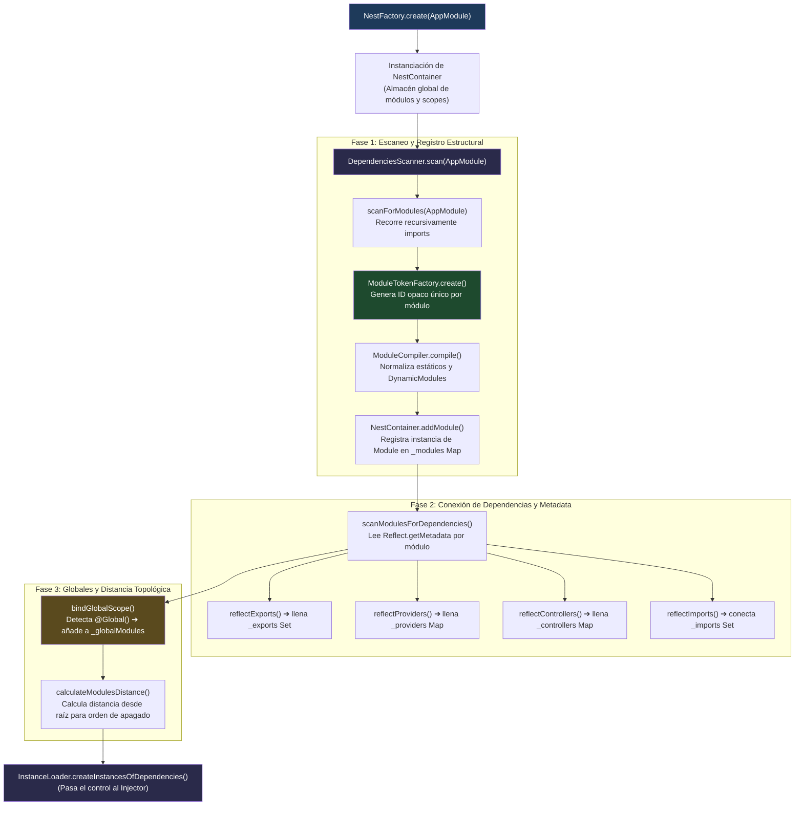
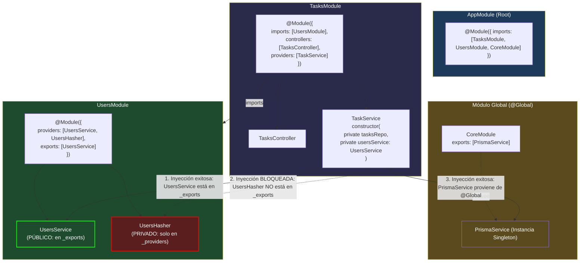

# 1.4 - Modules, Encapsulamiento & Re-exports

> **Objetivo del módulo:** Comprender la arquitectura modular de NestJS como un grafo dirigido de contextos aislados y encapsulados por defecto. Entender cómo el decorador `@Module()` registra metadatos en tiempo de compilación/ejecución, cómo `DependenciesScanner`, `ModuleCompiler`, `ModuleTokenFactory` y `NestContainer` construyen el mapa interno de la aplicación, cómo funciona el algoritmo de resolución de dependencias entre módulos (`lookupComponent` y `lookupComponentInImports`), cómo y cuándo re-exportar módulos (`exports: [CommonModule]`), el impacto y riesgos del decorador `@Global()`, y la mecánica interna de `forwardRef()` ante dependencias circulares.

---

## ▶️ Panorámica Rápida & Contexto

- **Un módulo en NestJS no es una carpeta ni un archivo; es una frontera de encapsulamiento (_bounded context_ en runtime)**. A diferencia de un container de Inyección de Dependencias plano (como el `IServiceCollection` de ASP.NET Core), Nest organiza los providers en **islas de contexto aisladas**.
- **Encapsulamiento por defecto**: Un provider registrado en `providers: [UsersService]` de `UsersModule` es **estrictamente privado** a ese módulo. Ningún otro módulo puede inyectarlo, aunque importe `UsersModule`, a menos que `UsersModule` lo declare explícitamente en su array `exports: [UsersService]`.
- **Los cuatro pilares de `@Module()`**:
  - `imports`: Módulos externos cuyos providers exportados son consumidos por este módulo.
  - `controllers`: Controladores HTTP/transporte instanciados dentro de este módulo.
  - `providers`: Servicios, repositorios, factories y valores privados o públicos creados por el IoC container de este módulo.
  - `exports`: Subconjunto de `providers` (o módulos enteros) que este módulo hace visibles a los módulos que lo importen.
- **Re-exports de módulos**: Un módulo puede importar un módulo y re-exportarlo en una sola declaración (`exports: [CommonModule]`). Todo módulo que importe al intermediario recibe automáticamente acceso a los providers públicos del módulo re-exportado (patrón **Shared Module** / **Aggregator**).
- **El decorador `@Global()` rompe el encapsulamiento**: Hace que los providers exportados estén disponibles en toda la aplicación sin requerir `imports` explícitos. Es útil para infraestructura de nivel cero (`ConfigModule`, logging global, conexiones raíz), pero un antipatrón destructivo si se usa para lógica de dominio.
- **Resolución determinista**: Cuando un constructor solicita una dependencia, el `Injector` busca en el módulo local (`_providers`). Si no está, consulta los módulos importados que explícitamente lo exporten (`_exports`). Si no lo encuentra en ningún módulo importado ni en el conjunto de módulos globales (`_globalModules`), falla inmediatamente durante el bootstrap con `UnknownDependenciesException`.

---

## 🔬 Under the Hood: Fundamentos & Mecánica Interna (Deep Dive)

### 1. Anatomía de `@Module()` y almacenamiento de metadatos

El decorador `@Module()` provisto por `@nestjs/common` es una función de metaprogramación que toma una interfaz `ModuleMetadata`:

```typescript
export interface ModuleMetadata {
  imports?: Array<
    Type<any> | DynamicModule | Promise<DynamicModule> | ForwardReference
  >;
  controllers?: Type<any>[];
  providers?: Provider[];
  exports?: Array<
    | DynamicModule
    | Promise<DynamicModule>
    | string
    | symbol
    | Provider
    | ForwardReference
    | Abstract<any>
    | Function
  >;
}
```

Bajo el capó, `@Module()` no instancia clases ni ejecuta lógica de negocio. Su único propósito inmediato es llamar a la API de reflexión (`Reflect.defineMetadata`) asociando claves constantes al constructor de la clase del módulo:

```typescript
// Mecánica interna simplificada de @Module en @nestjs/common
export function Module(metadata: ModuleMetadata): ClassDecorator {
  const propsKeys = Object.keys(metadata);
  validateModuleKeys(propsKeys);

  return (target: Function) => {
    for (const property in metadata) {
      if (metadata.hasOwnProperty(property)) {
        Reflect.defineMetadata(property, (metadata as any)[property], target);
      }
    }
  };
}
```

Las constantes utilizadas como claves corresponden al objeto `MODULE_METADATA` (`'imports'`, `'providers'`, `'controllers'`, `'exports'`). Cuando Node.js carga el archivo que define la clase del módulo, la metadata queda almacenada en el registro global de `reflect-metadata` ligada a la referencia de dicha clase.

Fuente: Código fuente oficial de [NestJS — packages/common/decorators/modules/module.decorator.ts](https://github.com/nestjs/nest/blob/master/packages/common/decorators/modules/module.decorator.ts).

---

### 2. Módulos como islas de contexto: `_providers` vs `_exports`

En el núcleo de `@nestjs/core`, la clase interna `Module` (`packages/core/injector/module.ts`) representa la instancia de ejecución de cada módulo registrado en la aplicación.

Cada instancia de `Module` mantiene colecciones independientes que delimitan su ámbito de visibilidad:

```typescript
export class Module {
  private readonly _imports = new Set<Module>();
  private readonly _providers = new Map<InstanceToken, InstanceWrapper>();
  private readonly _injectables = new Map<InstanceToken, InstanceWrapper>();
  private readonly _controllers = new Map<InstanceToken, InstanceWrapper>();
  private readonly _exports = new Set<InstanceToken>();
  // ...
}
```

#### La frontera de aislamiento

- **`_providers`**: Almacena todos los `InstanceWrapper` definidos en el array `providers` del decorador. Estos wrappers contienen la receta de instanciación (`useClass`, `useValue`, `useFactory`, `useExisting`), el ciclo de vida (scope) y el estado de resolución (`isResolved`).
- **`_exports`**: Es un `Set<InstanceToken>`. **No contiene instancias ni recetas de creación**, únicamente los _tokens_ (constructores de clase, strings o símbolos) que el módulo autoriza a exponer al exterior.

Cuando el `Injector` intenta resolver una dependencia para una clase perteneciente al `ModuleA`, ejecuta el siguiente flujo determinista:

```typescript
// Pseudo-código del algoritmo en Injector (packages/core/injector/injector.ts)
public async lookupComponent(
  collection: Map<InstanceToken, InstanceWrapper>,
  moduleRef: Module,
  token: InstanceToken,
  contextId: ContextId
): Promise<InstanceWrapper | undefined> {
  // 1. Búsqueda local: ¿Existe el token en los providers del módulo actual?
  if (collection.has(token)) {
    return collection.get(token);
  }

  // 2. Búsqueda en imports: ¿Existe en algún módulo explícitamente importado?
  const wrapper = await this.lookupComponentInImports(moduleRef, token, contextId);
  if (wrapper) {
    return wrapper;
  }

  // 3. Búsqueda en módulos globales: ¿Está en el Set de módulos @Global()?
  return this.lookupComponentInGlobalModules(moduleRef, token, contextId);
}
```

En `lookupComponentInImports`:

1. El injector itera sobre la colección `moduleRef.imports` (los módulos que `ModuleA` declaró en su array `imports`).
2. Para cada módulo importado (`ModuleB`), verifica estrictamente:
   ```typescript
   if (!importedModule.exports.has(token)) {
     continue; // Si el token no está en _exports, se IGNORA completamente.
   }
   return importedModule.providers.get(token);
   ```
3. **Consecuencia técnica**: Si `UsersModule` tiene `UsersService` en `providers`, pero **omite** `UsersService` en `exports`, la comprobación `importedModule.exports.has(UsersService)` devuelve `false`. Para el `Injector`, el provider es completamente inexistente desde el punto de vista del módulo consumidor, disparando el conocido error:

```text
Error: Nest can't resolve dependencies of the TasksService (?).
Please make sure that the argument UsersService at index [0] is available in the TasksModule context.

Potential solutions:
- Is TasksModule importing the module that exports UsersService?
- If UsersService is a Provider, is it part of the current TasksModule?
- If UsersService is exported from a separate @Module, is that module imported within TasksModule?
  @Module({
    imports: [ /* the Module containing UsersService */ ]
  })
```

Fuente: [NestJS Deep Dive — InstanceLoader & Injector](https://koko8624.medium.com/nestjs-deep-dive-03-instanceloader-and-injector-e95f111682b5) y [packages/core/injector/injector.ts](https://github.com/nestjs/nest/blob/master/packages/core/injector/injector.ts).

---

### 3. El ciclo de compilación del grafo modular: `DependenciesScanner`, `ModuleTokenFactory` y `NestContainer`

Durante el arranque (`NestFactory.create(AppModule)`), antes de instanciar cualquier servicio o escuchar peticiones HTTP, Nest compila el grafo modular completo mediante una serie de fases discretas coordinadas por el `DependenciesScanner`:



#### Detalles clave de los componentes:

1. **`NestContainer`**: Es el cerebro maestro. Mantiene una colección `modules: ModulesContainer` (`Map<string, Module>`), donde cada módulo se indexa por su token opaco. También gestiona `_globalModules: Set<Module>`.
2. **`ModuleTokenFactory`**: Genera identificadores únicos para cada módulo.
   - _Evolución arquitectónica (Nest v10 / v11)_: Históricamente, Nest serializaba la metadata del módulo a JSON con `JSON.stringify` y generaba un hash SHA256 para el token. Esto causaba degradaciones severas de rendimiento si la metadata contenía buffers o configuraciones masivas (ej. esquemas gRPC o clientes DB). En las versiones modernas (Nest v11+), Nest optimizó este mecanismo incorporando generadores de claves por referencia (`ByReferenceModuleOpaqueKeyFactory`), evitando serializaciones pesadas y acelerando el arranque en frío.
   - Fuente: Discusiones de optimización en [NestJS Core PRs / Issue #12800](https://github.com/nestjs/nest/pull/12800) y [Deep Dive: ModuleTokenFactory](https://deepwiki.com/nestjs/nest/3-dependency-injection-system).
3. **`ModuleCompiler`**: Extrae la clase real subyacente cuando se procesan Dynamic Modules (ej. objetos devueltos por `ConfigModule.forRoot()`), normalizando la estructura para que el `NestContainer` la procese uniformemente.

---

### 4. Re-exports: Pasar dependencias hacia afuera y el patrón Shared Module

Nest permite incluir módulos dentro del array `exports` de otro módulo. Esta capacidad es fundamental para componer arquitecturas escalables sin duplicar código de configuración:

```typescript
@Module({
  imports: [DatabaseModule, CryptoModule],
  providers: [CommonService],
  exports: [
    CommonService, // Exporta un provider propio
    DatabaseModule, // Re-exporta un módulo externo
    CryptoModule, // Re-exporta un módulo externo
  ],
})
export class SharedModule {}
```

#### ¿Qué ocurre internamente durante un re-export?

Cuando `TasksModule` declara `imports: [SharedModule]`:

1. `DependenciesScanner.reflectImports()` vincula `SharedModule` en el `_imports` de `TasksModule`.
2. Al procesar los exports de `SharedModule`, `reflectExports()` detecta que `DatabaseModule` es un módulo.
3. Nest **añade transitivamente los providers exportados por `DatabaseModule`** al rango de visibilidad accesible por `TasksModule`.
4. De este modo, `TasksService` puede inyectar `DatabaseConnection` directamente sin necesidad de importar explícitamente `DatabaseModule` en `TasksModule`.

#### Cuándo usar Re-exports:

- **Shared Modules de Utilidades**: Agrupar providers reutilizables (Criptografía, Clientes de caché, Formateadores) que se consumen en conjunto en múltiples bounded contexts.
- **Módulos Feature Compuestos**: Cuando un subdominio amplio (ej. `ProjectsModule`) encapsula submódulos (`MilestonesModule`, `TasksModule`) y expone un contrato unificado hacia el exterior.

---

### 5. `@Global()`: Cuándo sí, cuándo no, y su impacto en el grafo

El decorador `@Global()` altera radicalmente la visibilidad de los providers:

```typescript
import { Global, Module } from '@nestjs/common';

@Global()
@Module({
  providers: [PrismaService],
  exports: [PrismaService],
})
export class DatabaseModule {}
```

#### Mecánica interna de `@Global()`:

1. `@Global()` asigna el metadato `GLOBAL_MODULE_METADATA` (`'__module:global__'`) con valor `true` en la clase del módulo.
2. Durante el arranque, en el método `bindGlobalScope()` de `DependenciesScanner`, Nest inspecciona cada módulo. Si la metadata está presente, lo registra en `NestContainer._globalModules`.
3. Cuando cualquier provider de cualquier módulo solicita una dependencia y no se localiza en su propio módulo ni en sus `imports`, `lookupComponent` consulta `_globalModules`. Si el provider está exportado por un módulo global, la inyección tiene éxito sin que el módulo consumidor haya declarado nada en `imports`.

#### El costo arquitectónico de `@Global()`:

> [!WARNING]
> Hacer un módulo `@Global()` destruye las fronteras del diseño modular. Convierte las dependencias explícitas en implícitas.

- **Pérdida de trazabilidad**: Al leer `tasks.module.ts`, es imposible deducir de dónde proviene un servicio global inyectado.
- **Dificultad en testing de integración**: Para testear `TasksModule` en aislamiento (`Test.createTestingModule`), estás obligado a cargar también los módulos globales invisibles o mockearlos a ciegas, pues el módulo ya no declara sus dependencias reales en su propio contrato.
- **Riesgo de colisión de tokens**: Si dos módulos globales proveen un token genérico (ej. un string token como `'LOGGER'`), el comportamiento de resolución se vuelve no determinista o dependiente del orden de registro en `AppModule`.

#### Regla de oro para `@Global()`:

- **SÍ**: Módulos de infraestructura transversal de nivel 0, presentes en el 100% de la aplicación y configurados una sola vez en la raíz (ej. `ConfigModule`, `DatabaseModule` / ORM base, `LoggerModule`).
- **NUNCA**: Módulos de dominio o negocio (`UsersModule`, `TasksModule`, `BillingModule`). Si dos módulos de negocio se necesitan, **deben declararlo explícitamente vía `imports` y `exports`**.

Fuente: Documentación oficial de [NestJS — Global Modules](https://docs.nestjs.com/modules#global-modules).

---

### 6. Dependencias circulares entre módulos y `forwardRef()`

Una dependencia circular ocurre cuando el módulo A necesita providers del módulo B, y el módulo B necesita providers del módulo A:

```text
TasksModule ──(imports)──> UsersModule
     ▲                           │
     └─────────(imports)─────────┘
```

#### El problema en tiempo de ejecución (JavaScript / Node.js):

En el sistema de módulos de ECMAScript / CommonJS, cuando dos archivos se importan mutuamente:

```typescript
// tasks.module.ts
import { UsersModule } from '../users/users.module'; // UsersModule aún no termina de evaluarse -> undefined
```

Al momento en que se evalúa el decorador `@Module({ imports: [UsersModule] })`, la variable `UsersModule` es literalmente `undefined`. Nest lanzará una excepción fatídica durante el arranque:

```text
Error: Nest cannot create the TasksModule instance.
The module at index [0] of the TasksModule "imports" array is undefined.
Potential causes:
- A circular dependency between modules. Use forwardRef() to avoid it.
```

#### Cómo opera `forwardRef()` bajo el capó:

`forwardRef()` es una función de orden superior utilitaria extremadamente sencilla pero ingeniosa:

```typescript
// Implementación real en @nestjs/common
export const forwardRef = (fn: () => any): ForwardReference => ({
  forwardRef: fn,
});
```

En lugar de pasar la referencia directa a la clase (que en ese instante vale `undefined`), pasás una **closure (arrow function)**: `forwardRef(() => UsersModule)`.

1. En tiempo de compilación y carga de archivo, la función flecha `() => UsersModule` captura la variable en un cierre lèxico en memoria, pero **no la evalúa inmediatamente**.
2. Cuando el `DependenciesScanner` de Nest procesa el grafo tras haber cargado todos los archivos en el runtime de Node, ejecuta la closure: `item.forwardRef()`.
3. En ese punto temporal posterior, ambas clases ya están completamente definidas en memoria por el motor V8 de JavaScript, resolviendo la referencia de forma diferida.

```typescript
// tasks.module.ts
@Module({
  imports: [forwardRef(() => UsersModule)],
  providers: [TaskService],
  exports: [TaskService],
})
export class TasksModule {}

// users.module.ts
@Module({
  imports: [forwardRef(() => TasksModule)],
  providers: [UsersService],
  exports: [UsersService],
})
export class UsersModule {}
```

> [!IMPORTANT]
> Si la dependencia circular también existe a nivel de servicios (`TaskService` inyecta `UsersService`, y `UsersService` inyecta `TaskService`), **también debés usar `@Inject(forwardRef(() => UsersService))` en los constructores de ambos servicios**. Resolver el módulo no resuelve automáticamente el ciclo en el constructor.

#### Diagnóstico arquitectónico:

`forwardRef()` es un **parche técnico**, no una solución de diseño. La presencia de dependencias circulares revela casi con total certeza un **Bounded Context mal delimitado** o una violación del principio de Responsabilidad Única (SRP):

- **Solución arquitectónica correcta**: Extraer la funcionalidad o los datos compartidos hacia un tercer módulo independiente (ej. `ProjectsModule` o un módulo común `AssignmentModule`), haciendo que tanto `TasksModule` como `UsersModule` dependan hacia abajo del nuevo módulo unidireccionalmente (Grafo Acíclico Dirigido - DAG).

Fuente: [NestJS Docs — Circular Dependency](https://docs.nestjs.com/fundamentals/circular-dependency).

---

## 🧠 Analogía & Mapeo Mental (C# / ASP.NET Core & Angular)

### Angular (`NgModule`) vs NestJS (`@Module`)

NestJS fue diseñado intencionalmente tomando la arquitectura de Angular 2+. El paralelismo es prácticamente 1:1, pero con una diferencia crítica en el objetivo del encapsulamiento:

| Característica                    | NestJS (`@Module`)                                                                  | Angular (`@NgModule`)                                                                                                    |
| :-------------------------------- | :---------------------------------------------------------------------------------- | :----------------------------------------------------------------------------------------------------------------------- |
| **Objetivo central**              | Encapsular **Providers** (backend services, repositories) y Controllers.            | Encapsular **Declaraciones visuales** (Components, Directives, Pipes).                                                   |
| **Encapsulamiento de Providers**  | **Estricto por defecto**. Un provider solo es accesible fuera si está en `exports`. | **Abierto históricamente**. Un provider en un `@NgModule` no perezoso se registraba en el root injector automáticamente. |
| **Re-exports (`exports: [...]`)** | Re-exporta providers y módulos para propagar dependencias de DI.                    | Re-exporta `CommonModule`, `FormsModule` para componentes de plantilla.                                                  |
| **Shared Module Pattern**         | `SharedModule` consolida servicios y módulos transversales.                         | `SharedModule` consolida componentes UI, pipes y directivas comunes.                                                     |

### C# / ASP.NET Core vs NestJS

En ASP.NET Core estándar **no existe el concepto de módulo con encapsulamiento de DI en tiempo de ejecución**. El contenedor de dependencias nativo es completamente plano:

| Concepto                            | NestJS                                                                 | C# / ASP.NET Core                                                                                               |
| :---------------------------------- | :--------------------------------------------------------------------- | :-------------------------------------------------------------------------------------------------------------- |
| **Frontera de Inyección**           | Grafo modular jerárquico. Árbol de módulos con visibilidad controlada. | Contenedor plano único (`IServiceCollection` / `IServiceProvider`).                                             |
| **Encapsulamiento de clases**       | Controlado por el `_exports` Set de cada módulo en runtime.            | Controlado por el compilador mediante modificadores de acceso (`internal` vs `public` en assemblies).           |
| **Empaquetado de dependencias**     | Clase con decorador `@Module({ imports, providers, exports })`.        | Métodos de extensión sobre `IServiceCollection` (ej. `services.AddUsersModule()`).                              |
| **Acceso no autorizado a servicio** | `UnknownDependenciesException` en bootstrap si no se exporta.          | Si se registró en `IServiceCollection`, cualquiera en cualquier controlador puede inyectarlo sin restricciones. |

En C#, si registrás `services.AddScoped<UsersService>()`, cualquier clase del proyecto puede inyectar `UsersService` sin pedir permiso. En NestJS, aunque `UsersService` esté registrado, si `TasksModule` no importa `UsersModule` (y este no lo exporta), la inyección está bloqueada. **NestJS traslada las fronteras de Bounded Contexts de Domain-Driven Design al propio motor de IoC**.

---

## 📊 Diagrama de Arquitectura / Ciclo de Vida (Mermaid)

El siguiente diagrama ilustra el flujo de visibilidad y el algoritmo de búsqueda de dependencias entre módulos:



---

## ⚖️ Tradeoffs & Análisis de Decisiones Arquitectónicas

### 1. Fine-Grained Modules vs Coarse-Grained Modules

- **Fine-Grained (Módulos de grano fino / Micro-módulos)**:
  - _Enfoque_: Un módulo por cada recurso individual (`TasksModule`, `TaskCommentsModule`, `TaskAttachmentsModule`).
  - **Pros**: Máximo desacoplamiento, árboles de dependencias explícitos, fácil extracción a microservicios independientes si el sistema escala.
  - **Cons**: Explosión de archivos `@Module()`, boilerplate excesivo en arrays de `imports`, riesgo constante de ciclos de dependencias entre módulos pequeños hermanos.
  - **Cuándo elegirlo**: Bounded contexts complejos donde cada recurso tiene reglas de negocio pesadas y ciclos de vida independientes.

- **Coarse-Grained (Módulos de grano grueso / Bounded Context Modules)**:
  - _Enfoque_: Un módulo que agrupa el agregado completo (`TasksModule` encapsula internamente tareas, comentarios y archivos adjuntos).
  - **Pros**: Menor fricción de configuración, menos boilerplate, cohesión interna natural del dominio.
  - **Cons**: El módulo puede inflarse con demasiados providers y controllers si no se vigila su tamaño.
  - **Cuándo elegirlo**: La mayoría de proyectos monolíticos modulares. Agrupar por _Feature / Aggregated Context_ (ej. `ProjectsModule` que gestiona proyectos y miembros de proyecto).

### 2. Shared Module vs Importaciones Específicas Directas

- **Shared Module (`SharedModule` re-exportando utilidades)**:
  - **Pros**: Comodidad máxima para el desarrollador; importar `SharedModule` brinda acceso instantáneo a logging, criptografía, formateadores y validadores.
  - **Cons**: Carga cognitiva opaca; un módulo puede terminar teniendo acceso a 15 servicios cuando solo necesitaba uno. Si el shared module importa servicios pesados, aumenta el tiempo de arranque y consumo de memoria.
  - **Recomendación**: Usar `SharedModule` únicamente para utilidades puras y librerías livianas. Los módulos de dominio nunca deben formar parte de un Shared Module comodín.

### 3. Módulos Globales (`@Global()`) vs Módulos Importados Explícitamente

- **Enfoque Explícito (Default recomendado)**: Cada módulo declara en `imports` exactamente de quién depende. Favorece la arquitectura limpia, la comprensión del grafo y el testing aislado.
- **Enfoque Global (`@Global()`)**: Solo justificado para el núcleo de infraestructura (`ConfigModule`, `DatabaseModule`). Cualquier otro uso debe ser vetado en code reviews por comprometer la mantenibilidad a largo plazo.

---

## 📑 Conceptos Clave & Trampas Mentales

| Concepto                            | Clave Práctica / Under the Hood                                                                                                                              | Antipatrón / Trampa Común                                                                                                                                      |
| :---------------------------------- | :----------------------------------------------------------------------------------------------------------------------------------------------------------- | :------------------------------------------------------------------------------------------------------------------------------------------------------------- |
| **Encapsulamiento por defecto**     | Los providers listados en `providers` son estrictamente privados a menos que se listen en `exports`.                                                         | Creer que con solo hacer `imports: [UsersModule]` ya podés inyectar `UsersService` sin haberlo exportado en `UsersModule`.                                     |
| **`exports` solo expone tokens**    | El array `exports` no crea instancias; solo autoriza a otros módulos a consultar ese token en su tabla interna `_exports`.                                   | Duplicar un servicio en `providers` de dos módulos distintos para "evitar exportarlo". Esto crea **dos singletons distintos** con estado bifurcado en memoria. |
| **Re-exports de módulos**           | `exports: [AuthModule]` permite que quien importe este módulo acceda a lo que `AuthModule` exporta.                                                          | Re-exportar módulos sin control hasta crear una dependencia transitiva invisible que dificulta rastrear de dónde proviene cada servicio.                       |
| **`@Global()`**                     | Registra el módulo en `NestContainer._globalModules`. Ahorra `imports` en features.                                                                          | Usar `@Global()` en módulos de dominio (`UsersModule`) por pereza de escribir el array `imports`. Destruye la modularidad y el testing.                        |
| **Dependencia Circular en Módulos** | Provoca que uno de los módulos sea `undefined` en la evaluación de Node.js.                                                                                  | Poner `forwardRef()` a ciegas sin analizar la arquitectura. Un ciclo indica que ambos módulos están demasiado acoplados y requieren un tercer módulo mediador. |
| **`forwardRef()` asimétrico**       | Debe colocarse en **ambos extremos** del ciclo (en los dos módulos y en los constructores de los dos servicios).                                             | Poner `forwardRef()` en `ModuleA` pero olvidarlo en `ModuleB`. La app sigue fallando con error de resolución.                                                  |
| **Dynamic Modules vs Modules**      | Un módulo estático es una clase fija; un Dynamic Module es un método estático (`forRoot()`, `forFeature()`) que retorna un objeto con metadata configurable. | Tratar un módulo dinámico como estático (ej. poner `ConfigModule` en `imports` en vez de `ConfigModule.forRoot()`), perdiendo la configuración del provider.   |
| **Scope y Re-exports**              | Re-exportar un módulo mantiene el scope original de sus providers (Singleton sigue siendo Singleton).                                                        | Pensar que re-exportar un servicio clona o crea una nueva instancia; el `InstanceWrapper` en `NestContainer` sigue siendo el mismo nodo del grafo.             |

---

## ⚡ Buenas Prácticas de Producción (Do / Don't)

- **Prefiere**: Mantener los módulos pequeños, enfocados en un único _Bounded Context_ del dominio (`UsersModule`, `TasksModule`, `ProjectsModule`).
- **Prefiere**: Exportar **únicamente la interfaz mínima necesaria**. Si `UsersModule` tiene `UsersService`, `UsersRepository`, y `PasswordHasher`, exportá solo `UsersService`. Ocultá los detalles de almacenamiento y hashing en el ámbito privado del módulo.
- **Prefiere**: Usar re-exports (`exports: [CommonModule]`) en módulos de infraestructura compartida para evitar que los módulos de feature tengan listas de `imports` con 10 librerías repetitivas.
- **Prefiere**: Refactorizar dependencias circulares creando un nuevo módulo o invirtiendo el control mediante eventos (`EventEmitter2`) en lugar de depender permanentemente de `forwardRef()`.
- **Evita**: Registrar el mismo servicio en los `providers` de múltiples módulos. Si `TasksModule` y `UsersModule` necesitan `EmailService`, `EmailService` debe pertenecer a `EmailModule`, ser exportado, y `EmailModule` debe ser importado por ambos. Duplicarlo en `providers` genera **múltiples instancias independientes** en memoria, destruyendo el patrón Singleton.
- **Evita**: Abusar de `@Global()`. En una aplicación empresarial madura, no debería haber más de 2 o 3 módulos globales (Configuración, Base de Datos, Logging).
- **Evita**: Imports circulares a través de barrel files (`index.ts`). Exportar dos módulos en el mismo `index.ts` que se importan entre sí es una causa frecuente de módulos `undefined` en tiempo de inicialización de Node.js.

---

## 🎯 Reto Práctico (Hands-on Challenge)

### Contexto del Dominio (Task & Project Management API)

En nuestra aplicación de gestión de tareas, hoy tenemos `TasksModule` aislado con su `TaskService` en memoria. Sin embargo, en el dominio real, **una tarea no puede existir en el vacío**: debe estar asignada a un usuario válido (`assignedTo` / `userId`), o debemos poder consultar quién es el responsable de una tarea.

Actualmente, el directorio `src/modules/users/` tiene solo un `.gitkeep`. Es hora de construir el módulo de usuarios y experimentar de primera mano el encapsulamiento modular y el consumo cross-module.

---

### Requisitos Funcionales & Arquitectónicos

#### 1. Construir `UsersModule` y `UsersService`

1. Crear `src/modules/users/users.service.ts`:
   - Decorado con `@Injectable()`.
   - Mantener un array privado en memoria con usuarios mock de prueba:
     ```typescript
     export interface IUser {
       id: string;
       name: string;
       email: string;
     }
     ```
   - Métodos públicos tipados estrictamente:
     - `findAll(): IUser[]`
     - `findById(id: string): IUser` — lanza `NotFoundException` si el usuario no existe.
2. Crear `src/modules/users/users.module.ts`:
   - Decorado con `@Module()`.
   - Registrar `UsersService` en `providers`.
   - **EXPORTAR `UsersService` en `exports: [UsersService]`**.
3. Registrar `UsersModule` en `src/app.module.ts` dentro del array `imports`.

#### 2. Consumir `UsersService` desde `TasksModule`

1. En `src/modules/tasks/tasks.module.ts`:
   - Importar `UsersModule` en el array `imports: [UsersModule]`.
2. En `src/modules/tasks/task.service.ts`:
   - Inyectar `UsersService` en el constructor con `private readonly usersService: UsersService`.
   - Modificar la creación de tareas (`create`): validar que si viene un `assignedTo` (o validar un usuario por defecto), el usuario exista llamando a `this.usersService.findById(assignedTo)`.
   - Si el usuario no existe, `UsersService` lanzará automáticamente `NotFoundException`, impidiendo la creación de tareas huérfanas.

#### 3. Experimento de Aprendizaje Activo (Romper el encapsulamiento deliberadamente)

1. **Paso A**: Remové temporalmente `UsersService` del array `exports` de `users.module.ts` (dejándolo solo en `providers`).
2. Ejecutá `bun run start:dev` y observá el error de resolución de dependencias que emite Nest en la consola. Analizá por qué `TasksModule` no puede ver a `UsersService` a pesar de haber importado `UsersModule`.
3. **Paso B**: Volvé a colocar `UsersService` en `exports`, pero ahora quitá `UsersModule` del array `imports` de `tasks.module.ts`. Volvé a observar el error.
4. **Paso C**: Restaurá ambos y comprobá cómo el grafo compila limpiamente sin un solo warning.

---

### Preguntas para defender en el Architectural Review

1. ¿Por qué Nest exige declarar `UsersService` tanto en `providers` como en `exports` de `UsersModule`? ¿Qué responsabilidad técnica cumple cada array en las colecciones internas `_providers` y `_exports` de la clase `Module`?
2. Si registráramos `UsersService` en los `providers` de `TasksModule` directamente (sin importar `UsersModule`), ¿qué pasaría con el estado interno en memoria de los usuarios? ¿Compartirían la misma lista de usuarios ambos módulos?
3. Si `UsersService` a su vez necesitara inyectar `TaskService` para contar cuántas tareas tiene asignadas un usuario, ¿qué problema ocurriría en tiempo de arranque de Node.js y cómo se manifestaría en la consola? ¿Cómo lo resolverías con `forwardRef()` y cuál sería la alternativa arquitectónica limpia sin usar `forwardRef()`?
4. ¿Por qué no hicimos simplemente a `UsersModule` decorado con `@Global()` para ahorrarnos el `imports: [UsersModule]` en `TasksModule`? ¿Qué tradeoffs de testing y claridad habríamos sacrificado?

---

### Verificación del DoD (Definition of Done)

1. `bun run start:dev` arranca limpiamente sin errores de resolución de dependencias.
2. `UsersModule` exporta explícitamente `UsersService`.
3. `TasksModule` importa explícitamente `UsersModule`.
4. `TaskService` inyecta `UsersService` por constructor y lo utiliza para validar el usuario asignado.
5. `GET /api/v1/tasks` y `POST /api/v1/tasks` continúan funcionando correctamente con contratos HTTP consistentes.
6. `bun run lint` y `bun run test` pasan sin errores ni advertencias de tipado (`strict: true`).

---

## ✅ Checklist de Active Recall & Autoevaluación

- [ ] ¿Puedo explicar con mis palabras la diferencia entre un container de DI plano (ASP.NET Core) y un grafo modular con encapsulamiento estricto (NestJS)?
- [ ] ¿Puedo detallar qué hacen internamente los 4 arrays de `@Module()` (`imports`, `controllers`, `providers`, `exports`) y qué colecciones internas (`_providers`, `_exports`, etc.) representan en la clase `Module`?
- [ ] ¿Sé explicar qué hace `DependenciesScanner` durante el arranque y cómo se relacionan `ModuleCompiler`, `ModuleTokenFactory` y `NestContainer`?
- [ ] ¿Por qué en Nest 11 se optimizó `ModuleTokenFactory` reemplazando la serialización JSON pesada por generadores de claves por referencia?
- [ ] ¿Puedo describir paso a paso cómo `lookupComponent` y `lookupComponentInImports` buscan un provider a través del grafo de módulos?
- [ ] ¿Qué ocurre cuando un módulo re-exporta otro módulo (`exports: [CommonModule]`) y para qué sirve el patrón Shared Module?
- [ ] ¿Cómo funciona internamente el decorador `@Global()`, en qué colección de `NestContainer` se registra y por qué está prohibido usarlo para módulos de dominio?
- [ ] ¿Por qué se produce un error de módulo `undefined` ante dependencias circulares en JavaScript/Node.js?
- [ ] ¿Cómo resuelve `forwardRef()` este problema mediante closures diferidas en memoria y por qué debe colocarse en ambos extremos?
- [ ] ¿Por qué una dependencia circular es considerada un _code smell_ arquitectónico y cómo se refactoriza extrayendo un tercer módulo?
- [ ] ¿Puedo predecir exactamente qué mensaje de error mostrará Nest si olvido poner un servicio en `exports` vs si olvido poner el módulo en `imports`?
