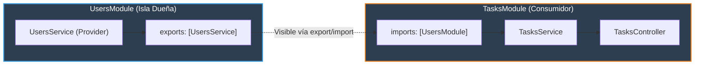

# 1.4 - Módulos: Encapsulamiento, Exports & Re-exports

> **Objetivo del módulo:** Dominar los límites de aislamiento en NestJS: cómo funciona el encapsulamiento modular por defecto, el contrato de `imports`/`exports`/`providers`, los riesgos de `@Global()`, y cómo compartir dependencias limpiamente entre módulos de dominio.

---

## 🧭 1. Posición en la Arquitectura

Los módulos son las unidades organizativas y fronteras de contexto del contenedor de NestJS:



- **Frontera de ejecución**: Compilación y registro en el `NestContainer`. Cada módulo mantiene un mapa privado `_providers`.
- **Encapsulamiento**: Un provider es **privado** por defecto. Solo los providers explícitamente listados en `exports` son accesibles fuera del módulo.

---

## 📜 2. El Contrato Esencial

```typescript
// Módulo dueño que exporta el servicio
@Module({
  controllers: [UsersController],
  providers: [UsersService],
  exports: [UsersService], // Hace público el provider para consumidores
})
export class UsersModule {}

// Módulo consumidor que importa el módulo dueño
@Module({
  imports: [UsersModule], // Importa la frontera completa (nunca el servicio directo)
  controllers: [TasksController],
  providers: [TasksService],
})
export class TasksModule {}
```

- **Re-exports**: Un módulo puede re-exportar módulos importados: `exports: [CommonModule]`.
- **Mapeo mental rápido**: Idéntico a los `NgModule` de Angular clásica (`declarations`, `imports`, `exports`) o a _internal_ vs _public_ access modifiers en C#.

---

## ⚠️ 3. Top Trampas Mortales & Antipatrones

| Antipatrón / Trampa Común                                          | Causa Técnica / Under the Hood                                                               | Corrección Idiomática                                                                      |
| :----------------------------------------------------------------- | :------------------------------------------------------------------------------------------- | :----------------------------------------------------------------------------------------- |
| Poner un Service en `imports: [...]`                               | `imports` solo acepta módulos (`Type<any> \| DynamicModule`). Falla en bootstrap             | Solo importar clases `@Module()`. Los servicios van en `providers` o `exports`             |
| Registrar el mismo Service en `providers` de dos módulos distintos | Nest crea dos instancias singleton aisladas e independientes, rompiendo el estado compartido | Registrarlo en un único módulo dueño, exportarlo en `exports`, e importar el módulo        |
| Abusar de `@Global()` para módulos de negocio                      | Crea acoplamiento implícito, oculta dependencias y dificulta mocks en pruebas unitarias      | Reservar `@Global()` solo para infraestructura core transversal (Database, Config, Logger) |

---

## 🎯 4. Reto Práctico (Hands-on Challenge)

### Requisitos & Contrato

- Crear `UsersModule`, `UsersController` y `UsersService` gestionando un almacén básico de usuarios.
- Exportar `UsersService` desde `UsersModule`.
- Importar `UsersModule` dentro de `TasksModule`.
- Inyectar `UsersService` dentro de `TasksService` para validar que el `userId` exista antes de permitir crear una tarea.

### Criterios de Aceptación (Definition of Done - DoD)

- [ ] `TasksService` inyecta `UsersService` sin errores de resolución de dependencias.
- [ ] Intentar crear una tarea con un `userId` inexistente lanza `NotFoundException`.
- [ ] Suite de pruebas y lint pasando limpiamente.

---

## 🧠 5. Checklist de Active Recall

- [ ] ¿Qué ocurre en memoria si registras `UsersService` en los `providers` de `TasksModule` en vez de importarlo en `imports: [UsersModule]`?
- [ ] ¿Por qué `@Global()` está desaconsejado para módulos que pertenecen al dominio de negocio?
- [ ] Si el módulo A importa el módulo B, ¿tiene el módulo A acceso a los controllers del módulo B?
