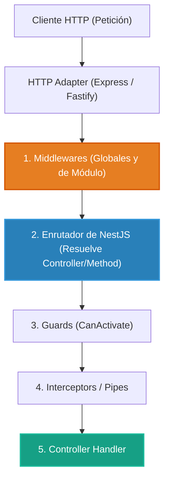

# 2.1 - Middlewares: Interceptando el Flujo HTTP Base

> **Objetivo del módulo:** Dominar la primera línea de defensa en NestJS: la interfaz `NestMiddleware`, su ejecución temprana a nivel de adapter HTTP (Express), su naturaleza ciega al contexto (`context-blind`), y el manejo de streams de red para trazabilidad (`X-Request-ID`) y medición de latencia.

---

## 🧭 1. Posición en el Request Lifecycle

Los middlewares corren en la capa más externa, **antes del enrutador de NestJS**:



- **Frontera de ejecución**: Nivel de transporte TCP/HTTP. Captura el 100% de las peticiones entrantes, incluyendo rutas 404 y peticiones que luego sean bloqueadas por Guards.
- **Visibilidad de contexto**: Es **context-blind**. Solo recibe `(req, res, next)` crudos; desconoce qué controller o handler procesará la petición y no tiene acceso a `ExecutionContext`.

---

## 📜 2. El Contrato Esencial

```typescript
// Definición del Middleware
@Injectable()
export class RequestCorrelationMiddleware implements NestMiddleware {
  private readonly logger = new Logger('HTTP');

  use(req: Request, res: Response, next: NextFunction): void {
    const correlationId =
      (req.headers['x-request-id'] as string) || crypto.randomUUID();
    req.headers['x-request-id'] = correlationId;
    res.setHeader('x-request-id', correlationId);

    const start = performance.now();
    res.on('finish', () => {
      const duration = Math.round(performance.now() - start);
      this.logger.log(
        `${req.method} ${req.originalUrl} ${res.statusCode} - ${duration}ms`,
      );
    });

    next();
  }
}

// Registro en el Módulo
export class AppModule implements NestModule {
  configure(consumer: MiddlewareConsumer): void {
    consumer.apply(RequestCorrelationMiddleware).forRoutes('*');
  }
}
```

- **Mapeo mental rápido**: Equivalente a los Middlewares de ASP.NET Core (`app.Use(...)`) o Express estándar.

---

## ⚠️ 3. Top Trampas Mortales & Antipatrones

| Antipatrón / Trampa Común                        | Causa Técnica / Under the Hood                                                                            | Corrección Idiomática                                                                  |
| :----------------------------------------------- | :-------------------------------------------------------------------------------------------------------- | :------------------------------------------------------------------------------------- |
| Intentar hacer `await next()` para medir tiempo  | `next()` en Express es síncrono y retorna `void`. La petición aún no ha terminado al retornar `next()`    | Suscribirse a los eventos del stream de red: `res.on('finish')` y `res.on('close')`    |
| Inyectar `Logger` en el constructor de clase     | Genera metadatos `design:paramtypes` que confunden al contenedor de DI con `UnknownDependenciesException` | Instanciarlo como propiedad directa: `private readonly logger = new Logger('Context')` |
| Querer leer roles o decoradores en un Middleware | El enrutador de NestJS aún no ha corrido; no existe `ExecutionContext` ni `Reflector` disponible          | Usar **Guards** para cualquier lógica de autorización que dependa de metadatos         |

---

## 🎯 4. Reto Práctico (Hands-on Challenge)

### Requisitos & Contrato

- Crear `RequestCorrelationMiddleware` en `src/common/middlewares/request-correlation.middleware.ts`.
- Asignar o preservar cabecera `x-request-id` en la petición entrante y reflejarla en la respuesta saliente.
- Medir tiempo de respuesta con `performance.now()` y registrar en log con formato: `[METHOD] [URL] [STATUS] - [DURATION]ms`.
- Registrar el middleware en `AppModule` para todas las rutas (`forRoutes('*')`).

### Pruebas de Verificación (cURL)

```bash
curl -i http://localhost:3000/api/v1/tasks
# Debe retornar cabecera x-request-id: <uuid>
```

### Criterios de Aceptación (Definition of Done - DoD)

- [ ] Cabecera `x-request-id` presente en cada respuesta.
- [ ] Logs en terminal mostrando método, URL, código de estado y duración en ms.
- [ ] Tests pasando limpiamente.

---

## 🧠 5. Checklist de Active Recall

- [ ] ¿Por qué un Middleware se ejecuta antes que un Guard?
- [ ] ¿Por qué `await next()` no funciona para calcular la latencia en un middleware sobre Express?
- [ ] ¿Qué evento de Node.js `res` indica que el cliente abortó la conexión antes de terminar la respuesta?
