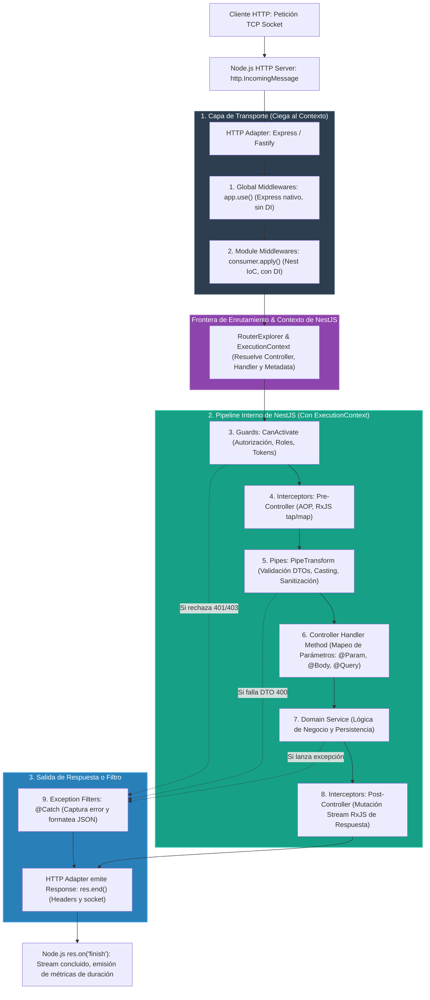
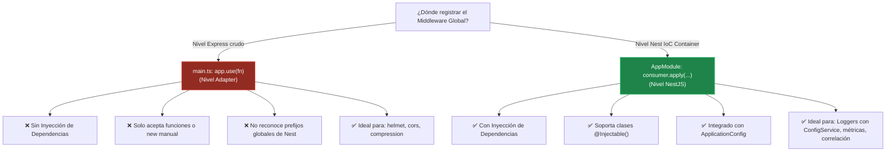
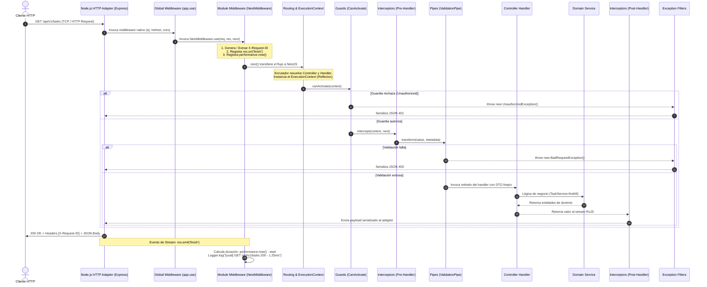

# 2.1 - Middlewares: Interceptando el flujo HTTP base

> **Objetivo del módulo:** Dominar la primera línea de defensa y procesamiento del ciclo de vida HTTP en NestJS: los Middlewares. Comprender su posición exacta previa al motor de enrutamiento y al `ExecutionContext`, su integración a bajo nivel con el adapter HTTP (`ExpressAdapter` / `FastifyAdapter`), la arquitectura interna de `MiddlewareModule`, `MiddlewareBuilder` y `RoutesMapper`, las diferencias fundamentales entre middlewares basados en clases (`NestMiddleware`) y funcionales, la trampa arquitectónica de Inyección de Dependencias entre `app.use()` y `MiddlewareConsumer`, cómo interceptar el ciclo asíncrono de respuesta mediante eventos de stream (`res.on('finish')`), y el diseño de mecanismos de observabilidad y correlación distribuida (`X-Request-ID`).

---

## ▶️ Panorámica Rápida & Contexto

- **Primera barrera en el pipeline**: Los middlewares son funciones que se ejecutan a nivel de transporte HTTP **antes de que NestJS resuelva qué controlador o método atenderá la petición**. Son equivalentes directos a los middlewares de Express.
- **Ciegos al contexto (`Context-Blind`)**: A diferencia de Guards, Interceptors o Pipes, un middleware **no tiene acceso a `ExecutionContext`** ni a la metadata de reflexión (`Reflector`). Solo recibe los objetos primitivos de la capa HTTP: `(req, res, next)`.
- **Dos sabores de implementación**:
  - **Class-based (`NestMiddleware`)**: Clases decoradas con `@Injectable()` que implementan el método `use()`. Participan plenamente en el contenedor de Inyección de Dependencias (IoC) de NestJS.
  - **Functional Middlewares**: Funciones puras `(req, res, next) => void`. Ligeras, sin sobrecarga de instanciación, pero **sin acceso a DI**.
- **Configuración declarativa modular**: Los middlewares no se registran en los metadatos de `@Module()`, sino a través de la interfaz `NestModule` implementando el método `configure(consumer: MiddlewareConsumer)`.
- **La gran trampa de DI global**: Registrar un middleware global con `app.use(fn)` en `main.ts` se conecta directo a Express y **pierde acceso al IoC container**. Para tener un middleware global con inyección de dependencias, debe registrarse en `AppModule` vía `consumer.apply(MiMiddleware).forRoutes('(.*)')`.
- **Naturaleza asíncrona de `next()` en Node.js**: En Express/NestJS, `next()` es un callback de continuación síncrono para pasar el control al siguiente middleware; **no retorna una promesa awaitable**. Para calcular la duración total de una petición o ejecutar lógica post-controlador, es obligatorio escuchar los eventos del stream de red de Node.js: `res.on('finish', ...)` o `res.on('close', ...)`.

---

## 🔬 Under the Hood: Fundamentos & Mecánica Interna (Deep Dive)

### 1. Ubicación en el Request Lifecycle global de NestJS

Para comprender por qué un middleware no puede reemplazar a un Guard ni a un Interceptor, es imprescindible rastrear el viaje exacto que realiza un paquete TCP/HTTP al ingresar a un servidor NestJS:



#### Por qué el Middleware es "Ciego al Contexto" (`Context-Blind`)

En las fases 3 a 8, NestJS ya determinó qué método de qué controlador atenderá la petición. Por lo tanto, crea una instancia de `ExecutionContext`, lo que permite a Guards e Interceptors invocar `context.getClass()` y `context.getHandler()`, y usar `Reflector` para inspeccionar decoradores personalizados (como `@Roles('ADMIN')` o `@Public()`).

En contraste, **el Middleware se ejecuta en la capa del adapter HTTP antes de que el enrutador de Nest tome cualquier decisión**. En ese momento:

- Nest no sabe si la ruta existe o terminará en un 404.
- Nest no sabe qué controlador manejará la petición.
- No existen metadatos de reflexión disponibles.
- Solo existen los objetos estándar de la plataforma: `Request` (`http.IncomingMessage`), `Response` (`http.ServerResponse`) y la función de continuación `next`.

Fuente: Documentación oficial de [NestJS — Request Lifecycle](https://docs.nestjs.com/faq/request-lifecycle).

---

### 2. La interfaz `NestMiddleware` y middlewares funcionales

NestJS ofrece dos patrones para declarar un middleware: **Class-based** y **Functional**.

#### A. Class-Based Middleware (`NestMiddleware`)

Es una clase TypeScript decorada con `@Injectable()` que implementa la interfaz `NestMiddleware` provista por `@nestjs/common`:

```typescript
export interface NestMiddleware<TRequest = any, TResponse = any> {
  use(req: TRequest, res: TResponse, next: (error?: any) => void): any;
}
```

```typescript
import { Injectable, NestMiddleware, Logger } from '@nestjs/common';
import { Request, Response, NextFunction } from 'express';
import { ConfigService } from '@nestjs/config';

@Injectable()
export class ApiVersionHeaderMiddleware implements NestMiddleware {
  private readonly logger = new Logger(ApiVersionHeaderMiddleware.name);

  constructor(private readonly configService: ConfigService) {}

  use(req: Request, res: Response, next: NextFunction): void {
    const apiVersion = this.configService.get<string>('API_VERSION', 'v1');
    res.setHeader('X-API-Version', apiVersion);
    this.logger.debug(`Injected API version: ${apiVersion} to ${req.path}`);
    next();
  }
}
```

**Mecánica interna:**

1. Al estar marcado con `@Injectable()`, Nest registra la clase en el contenedor IoC del módulo correspondiente.
2. Durante la fase de bootstrap, el `Injector` resuelve e inyecta las dependencias declaradas en el constructor (`ConfigService`).
3. Por defecto, las instancias de middleware son **Singletons** administrados por el ciclo de vida del contenedor de Nest.

#### B. Functional Middleware

Si el middleware no necesita inyectar ningún servicio, repositorio o configuración desde el contenedor IoC, puede escribirse como una función simple:

```typescript
import { Request, Response, NextFunction } from 'express';

export function simpleSecurityHeaders(
  req: Request,
  res: Response,
  next: NextFunction,
): void {
  res.setHeader('X-Content-Type-Options', 'nosniff');
  res.setHeader('X-Frame-Options', 'DENY');
  next();
}
```

**Tradeoff**: Es más ligero porque no requiere instanciación de clases ni resolución en el contenedor de dependencias, pero pierde total acceso a la Inyección de Dependencias. Si más adelante necesita un servicio, debe refactorizarse obligatoriamente a una clase con `@Injectable()`.

Fuente: Código fuente oficial de [NestJS — packages/common/interfaces/middleware/nest-middleware.interface.ts](https://github.com/nestjs/nest/blob/master/packages/common/interfaces/middleware/nest-middleware.interface.ts).

---

### 3. El motor de registro: `MiddlewareModule`, `MiddlewareBuilder` y `RoutesMapper`

Bajo el capó, NestJS orquesta el registro de middlewares mediante tres componentes internos del paquete `@nestjs/core`:

1. **`MiddlewareModule`** (`packages/core/middleware/middleware-module.ts`):
   - Es el orquestador principal del ciclo de vida de los middlewares.
   - En el método `register()`, itera sobre todos los módulos instanciados en `NestContainer`.
   - Si un módulo implementa el método `configure(consumer: MiddlewareConsumer)`, invoca dicha función pasando una instancia de `MiddlewareBuilder`.

2. **`MiddlewareBuilder`** (`packages/core/middleware/builder.ts`):
   - Es la clase que implementa la interfaz pública `MiddlewareConsumer`.
   - Implementa una interfaz fluida (_fluent builder_) acumulando configuraciones a través de tres métodos:
     - `apply(...middleware)`: Almacena las clases o funciones middleware a registrar.
     - `exclude(...routes)`: Almacena patrones o rutas a excluir.
     - `forRoutes(...routes)`: Asocia los middlewares y exclusiones a rutas o controladores concretos.

3. **`RoutesMapper`** (`packages/core/middleware/routes-mapper.ts`):
   - Transforma las definiciones polimórficas de `.forRoutes(...)` en una colección normalizada de objetos `RouteInfo`:
     ```typescript
     export interface RouteInfo {
       path: string;
       method: RequestMethod;
     }
     ```
   - Si pasas una clase controladora (ej. `forRoutes(TasksController)`), `RoutesMapper` inspecciona los metadatos de reflexión de la clase (`PATH_METADATA`), lee todos los métodos del prototipo decorados con `@Get()`, `@Post()`, etc., y extrae la ruta completa combinando el prefijo del controlador con cada endpoint.

4. **`bindHandler` y `createProxy`**:
   - `MiddlewareModule` toma cada middleware registrado y verifica si su árbol de dependencias es estático (Singleton) o dinámico (Request-Scoped).
   - Para middlewares estáticos, obtiene la instancia única del `NestContainer` y genera un proxy de ejecución mediante `createProxy()`.
   - Luego, registra este proxy en el router de Express/Fastify mediante `httpAdapter.use(...)` o vinculando la ruta específica.
   - En caso de middlewares **Request-Scoped**, `createProxy()` genera un contexto IoC dinámico en cada petición para instanciar el middleware y sus dependencias por solicitud.

Fuente: Código fuente oficial de [NestJS — packages/core/middleware/middleware-module.ts](https://github.com/nestjs/nest/blob/master/packages/core/middleware/middleware-module.ts).

---

### 4. Scoping y rutas: `forRoutes()`, `exclude()`, patrones y Controllers

El método `consumer.apply().forRoutes(...)` es sumamente flexible y admite diferentes tipos de argumentos:

```typescript
@Module({
  imports: [TasksModule],
})
export class AppModule implements NestModule {
  configure(consumer: MiddlewareConsumer) {
    consumer
      .apply(LoggerMiddleware)
      // Opción A: Pasar una o varias clases Controller completas
      .forRoutes(TasksController)

      // Opción B: Pasar un objeto RouteInfo específico con verbo HTTP
      .apply(AuthTokenExtractorMiddleware)
      .forRoutes(
        { path: 'tasks', method: RequestMethod.POST },
        { path: 'tasks/:id', method: RequestMethod.PUT },
      )

      // Opción C: Excluir sub-rutas específicas del middleware
      .apply(RateLimiterMiddleware)
      .exclude(
        { path: 'tasks/health', method: RequestMethod.GET },
        { path: 'tasks/metrics', method: RequestMethod.GET },
      )
      .forRoutes(TasksController);
  }
}
```

#### ⚠️ El cambio de Wildcards en Express 5 y NestJS 11 (`path-to-regexp` v8)

En versiones anteriores (Express 4 y NestJS 10 hacia atrás), era común ver middlewares configurados con comodines sin nombre:

```typescript
// ❌ OBSOLETO / ERROR EN EXPRESS 5 (NestJS 11)
consumer.apply(LoggerMiddleware).forRoutes('*');
```

**¿Por qué falla?** NestJS 11 adoptó **Express 5** por defecto, el cual actualizó la librería subyacente `path-to-regexp` a la versión 8. En `path-to-regexp` v8, **los comodines anónimos (`*`) fueron eliminados** por razones de seguridad y predictibilidad. Si usas `'*'`, la aplicación lanzará un error en tiempo de arranque: `TypeError: Missing parameter name at ...`.

**Sintaxis moderna compatible con Express 5 y Nest 11:**

1. **Comodín con expresión regular**:
   ```typescript
   consumer.apply(LoggerMiddleware).forRoutes('(.*)');
   ```
2. **Comodín con nombre (_splat parameter_)**:
   ```typescript
   consumer.apply(LoggerMiddleware).forRoutes('*splat');
   // o con llaves:
   consumer.apply(LoggerMiddleware).forRoutes('{*splat}');
   ```
3. **Uso de `RequestMethod.ALL`**:
   ```typescript
   consumer.apply(LoggerMiddleware).forRoutes({
     path: '(.*)',
     method: RequestMethod.ALL,
   });
   ```

Fuente: Guía oficial de migración de [Express.js — Migrating to Express 5](https://expressjs.com/en/guide/migrating-5.html).

---

### 5. Global Middlewares: `app.use()` vs `consumer.apply().forRoutes('(.*)')` (La gran trampa de DI)

Uno de los errores arquitectónicos más frecuentes en proyectos NestJS es la confusión entre registrar un middleware en `main.ts` vs registrarlo en `AppModule`.



#### Caso 1: `app.use()` en `main.ts` (Nivel Adapter)

```typescript
// src/main.ts
async function bootstrap() {
  const app = await NestFactory.create(AppModule);

  // ✅ Válido para librerías de terceros puras sin dependencias de Nest
  app.use(helmet());
  app.use(compression());

  // ❌ ERROR COMÚN: Pasar una clase de Nest a app.use()
  // app.use(LoggerMiddleware); // Lanza: "Route.all() requires a callback function but got a [class LoggerMiddleware]"

  await app.listen(3000);
}
```

`app.use()` es un método delegado directamente a la instancia subyacente de Express (`expressApp.use(...)`). En ese punto, la función que pasas no tiene enlace con el árbol de resolución de dependencias de NestJS.

#### Caso 2: `MiddlewareConsumer` en `AppModule` (Nivel NestJS)

```typescript
// src/app.module.ts
@Module({
  imports: [ConfigModule, TasksModule],
})
export class AppModule implements NestModule {
  configure(consumer: MiddlewareConsumer) {
    consumer
      .apply(LoggerMiddleware) // ✅ Nest inyecta LoggerService, ConfigService, etc.
      .forRoutes({ path: '(.*)', method: RequestMethod.ALL });
  }
}
```

Aquí el middleware es instanciado por `NestContainer`, respetando su ciclo de vida y resolviendo cualquier dependencia declarada en su constructor.

---

### 6. Interceptando el ciclo de vida de `req` y `res`: Asincronía, Headers y Correlación

#### La Trampa del `next()` síncrono en Express

En frameworks como ASP.NET Core o Koa, la función `next()` retorna una promesa (`await next()`). Esto permite ejecutar código antes del downstream y esperar a que el downstream termine para ejecutar código posterior:

```csharp
// C# ASP.NET Core: Modelo de cebolla asíncrono (Russian Doll)
public async Task InvokeAsync(HttpContext context, RequestDelegate next)
{
    var sw = Stopwatch.StartNew();
    await next(context); // ◄── ESPERA a que el Controller y la respuesta finalicen
    sw.Stop();
    _logger.LogInformation($"Duración: {sw.ElapsedMilliseconds}ms");
}
```

En cambio, **en Express y en los middlewares de NestJS, `next()` es un callback de continuación no bloqueante**:

```typescript
// ❌ ERROR GRAVE DE MODELO MENTAL EN NESTJS / EXPRESS:
use(req: Request, res: Response, next: NextFunction) {
  const start = performance.now();
  next(); // ◄── Invoca síncronamente el siguiente eslabón

  // 💥 ESTE CÓDIGO SE EJECUTA INMEDIATAMENTE DESPUÉS DE INVOCAR next()!
  // El controlador ni siquiera ha consultado la base de datos ni ha enviado la respuesta.
  const duration = performance.now() - start;
  console.log(`Duración: ${duration}ms`); // Imprime: 0.05ms (completamente falso)
}
```

#### La Solución: Suscripción a Eventos de Stream (`res.on('finish')`)

El objeto `res` en Express es una instancia de `http.ServerResponse` de Node.js, que hereda de `stream.Writable` y `EventEmitter`. Para capturar el instante exacto en que la respuesta fue completada y enviada a la red, se debe escuchar el evento `'finish'`:

```typescript
import { Injectable, NestMiddleware, Logger } from '@nestjs/common';
import { Request, Response, NextFunction } from 'express';
import { randomUUID } from 'node:crypto';

@Injectable()
export class CorrelationAndLoggingMiddleware implements NestMiddleware {
  private readonly logger = new Logger('HTTP');

  use(req: Request, res: Response, next: NextFunction): void {
    const startTime = performance.now();

    // 1. Manejo del ID de correlación (reusar el entrante o generar uno nuevo)
    const correlationId =
      (req.headers['x-request-id'] as string) || randomUUID();

    // 2. Inyectar en headers de entrada (para que Services/Controllers puedan leerlo)
    req.headers['x-request-id'] = correlationId;

    // 3. Inyectar en headers de salida (para que el cliente reciba su tracking ID)
    res.setHeader('X-Request-ID', correlationId);

    // 4. Suscripción al cierre del stream HTTP
    res.on('finish', () => {
      const duration = (performance.now() - startTime).toFixed(2);
      const { method, originalUrl } = req;
      const { statusCode } = res;

      const message = `[${correlationId}] ${method} ${originalUrl} ${statusCode} - ${duration}ms`;

      if (statusCode >= 500) {
        this.logger.error(message);
      } else if (statusCode >= 400) {
        this.logger.warn(message);
      } else {
        this.logger.log(message);
      }
    });

    // 5. Suscripción ante cancelación prematura del cliente (abort)
    res.on('close', () => {
      if (!res.writableEnded) {
        this.logger.warn(
          `[${correlationId}] Request connection aborted by client: ${req.method} ${req.originalUrl}`,
        );
      }
    });

    next();
  }
}
```

- **`finish`**: Se emite cuando el último fragmento de datos (_chunk_) del cuerpo y los encabezados han sido entregados al subsistema de red del sistema operativo.
- **`close`**: Se emite si la conexión TCP subyacente se corta prematuramente antes de que `res.end()` haya sido llamado (ej. el usuario canceló la petición o cerró el navegador).
- **`performance.now()`**: Disponible de forma nativa en Node.js 16+ y Bun. Ofrece precisión sub-milisegundo (microsegundos en punto flotante) sin requerir conversiones de tuplas como `process.hrtime()`.

---

## 🧠 Analogía & Mapeo Mental (C# / ASP.NET Core & Angular)

Para desarrolladores con experiencia en **C# / ASP.NET Core** y **Angular**, este mapeo fija el modelo mental de forma inequívoca:

| Concepto en NestJS           | Equivalente en C# (ASP.NET Core)             | Equivalente en Angular                     | Responsabilidad & Comportamiento                                                                                         |
| :--------------------------- | :------------------------------------------- | :----------------------------------------- | :----------------------------------------------------------------------------------------------------------------------- |
| **`NestMiddleware` (`use`)** | **`IMiddleware` / `InvokeAsync`**            | **`HttpInterceptor`** (cliente)            | Intercepta la petición HTTP antes del pipeline MVC / Routing. En C# ocurre en `app.UseMiddleware<T>()`.                  |
| **`MiddlewareConsumer`**     | **`IApplicationBuilder`** (`app.Use(...)`)   | N/A (Configuración de `provideHttpClient`) | API fluida para registrar qué rutas atraviesan qué middlewares.                                                          |
| **`req` / `res`**            | **`HttpContext.Request` / `Response`**       | `HttpRequest` / `HttpResponse`             | Objetos crudos de la capa de transporte con headers, cookies y streams.                                                  |
| **`next()`**                 | **`RequestDelegate next`**                   | `HttpHandler.handle(req)`                  | Pasa el control al siguiente eslabón. **Ojo:** en C# es `await next(context)` (cebolla); en NestJS es callback síncrono. |
| **`res.on('finish')`**       | **Código posterior a `await next(context)`** | Operador `finalize()` de RxJS              | Punto donde la respuesta ya fue procesada y se pueden auditar métricas de duración y status codes.                       |
| **`app.use()` en `main.ts`** | **`app.Use(...)` en `Program.cs`**           | N/A                                        | Middleware a nivel servidor sin DI del framework de alto nivel.                                                          |

---

## 📊 Diagrama de Arquitectura / Ciclo de Vida (Mermaid)

El siguiente diagrama detalla la travesía completa de una petición a través de todas las capas de NestJS, evidenciando exactamente dónde opera el Middleware y cómo interactúa con el stream de respuesta:



---

## ⚖️ Tradeoffs & Análisis de Decisiones Arquitectónicas

### Matriz de Decisión: ¿Cuándo usar Middleware, Guard, Interceptor o Pipe?

| Criterio                             | Middleware                                                                                             | Guard                                                                         | Interceptor                                                                                                             | Pipe                                                                                                         |
| :----------------------------------- | :----------------------------------------------------------------------------------------------------- | :---------------------------------------------------------------------------- | :---------------------------------------------------------------------------------------------------------------------- | :----------------------------------------------------------------------------------------------------------- |
| **Punto de Ejecución**               | Pre-Routing (Capa HTTP pura)                                                                           | Post-Routing, Pre-Interceptor                                                 | Pre y Post Controller (RxJS)                                                                                            | Inmediatamente antes del Handler                                                                             |
| **Acceso a `ExecutionContext`**      | ❌ No                                                                                                  | ✅ Sí                                                                         | ✅ Sí                                                                                                                   | ❌ No (`ArgumentMetadata`)                                                                                   |
| **Uso de Inyección de Dependencias** | ✅ Sí (si es clase en módulo)                                                                          | ✅ Sí                                                                         | ✅ Sí                                                                                                                   | ✅ Sí                                                                                                        |
| **Parada de Flujo**                  | `res.send()` o no llamar a `next()`                                                                    | Retornar `false` o lanzar excepción                                           | Lanzar excepción o mutar Observable                                                                                     | Lanzar `HttpException`                                                                                       |
| **Caso de Uso Ideal**                | Headers globales, CORS, correlación (`X-Request-ID`), rate limiting por IP, parsing de cookies crudas. | Autenticación (JWT), Autorización (RBAC, permisos), verificación de API Keys. | Medición de tiempo de ejecución de servicios, envoltura de respuestas (`{ data, meta }`), caching, reintentos con RxJS. | Transformación de tipos (`ParseIntPipe`), validación de DTOs con `class-validator`, sanitización de strings. |

### Cuándo EVITAR Middlewares

1. **Evítalo para autenticación dependiente de roles**: Si necesitas verificar si un usuario tiene el rol `'ADMIN'`, **no uses un middleware**. El middleware no sabe qué rol exige el endpoint porque no tiene acceso a los metadatos `@Roles()`. Usa un **Guard**.
2. **Evítalo para transformar la respuesta de dominio**: Modificar el JSON que devuelve un controlador dentro de un middleware requiere secuestrar los métodos `res.write` y `res.send` de Express (técnica sucia y propensa a bugs). Usa un **Interceptor** con operadores RxJS (`map()`).
3. **Evítalo para validación de datos de entrada**: Validar el body de una petición dentro de un middleware te obliga a parsear y validar manualmente sin el tipado de tus clases DTO. Usa un **ValidationPipe**.

---

## 📑 Conceptos Clave & Trampas Mentales

| Concepto                            | Clave Práctica / Under the Hood                                                                                    | Antipatrón / Trampa Común                                                                                                                                     |
| :---------------------------------- | :----------------------------------------------------------------------------------------------------------------- | :------------------------------------------------------------------------------------------------------------------------------------------------------------ |
| **Context Blindness**               | Los middlewares se ejecutan antes del router; no conocen el Controller ni el Handler final.                        | Intentar inyectar `Reflector` en un middleware para leer decoradores del controlador. Siempre fallará o dará `null`.                                          |
| **`next()` no es awaitable**        | En Express, `next()` es un callback inmediato; no espera la respuesta.                                             | Poner `const duration = Date.now() - start` después de `next()` creyendo que mide el request. Mide 0ms porque se ejecuta antes del controller.                |
| **Eventos `finish` vs `close`**     | `finish` ocurre cuando la respuesta se envió con éxito; `close` ocurre si la conexión se interrumpió abruptamente. | Escuchar únicamente `finish` y no auditar cancelaciones de peticiones abortadas por clientes lentos o caídos.                                                 |
| **DI en `app.use()`**               | `app.use()` conecta directo a Express; no tiene acceso al contenedor de NestJS.                                    | Intentar inyectar un servicio pasando una clase a `app.use(LoggerMiddleware)` en `main.ts`. Causa error de tipo en runtime.                                   |
| **Express 5 Wildcards**             | Express 5 / `path-to-regexp` v8 rechaza el comodín `'*'`. Exige `'(.*)'` o `'*splat'`.                             | Usar `.forRoutes('*')` en NestJS 11 y sufrir `TypeError: Missing parameter name` en el bootstrap.                                                             |
| **Llamar `next()` múltiples veces** | Cada llamada a `next()` avanza la cadena del router de Express.                                                    | Poner `next()` dentro de un bloque `if` y otro `next()` al final sin hacer `return`. Provoca el error `Cannot set headers after they are sent to the client`. |
| **Olvidar llamar a `next()`**       | Si el middleware no llama a `next()` ni finaliza la respuesta con `res.send()`, la petición queda colgada.         | La petición del cliente entra en _infinite loading_ hasta agotar el timeout del navegador o gateway (Gateway Timeout 504).                                    |
| **Mutación de cabeceras tardía**    | Una vez que el stream comenzó a escribir (`res.writeHead` o `res.send`), los headers quedan congelados.            | Intentar llamar a `res.setHeader('X-Request-ID', id)` dentro del callback de `res.on('finish')`. Lanza `ERR_HTTP_HEADERS_SENT`.                               |

---

## ⚡ Buenas Prácticas de Producción (Do / Don't)

- **Prefiere**: Generar o propagar IDs de correlación (`X-Request-ID`) en la primera línea del pipeline para unificar los logs en microservicios o arquitecturas distribuidas.
- **Prefiere**: Usar `performance.now()` en lugar de `new Date().getTime()` para registrar tiempos de respuesta precisos a nivel microsegundo.
- **Prefiere**: Registrar middlewares globales dependientes de servicios en el método `configure` de `AppModule` con `consumer.apply(...).forRoutes('(.*)')`.
- **Prefiere**: Limitar la responsabilidad del middleware a tareas de infraestructura HTTP (headers de seguridad, logging de red, correlación de trazas, parsing de streams).
- **Evita**: Ejecutar operaciones bloqueantes síncronas pesadas (hashing, compresión CPU-bound masiva) dentro del middleware que congelen el event loop de Node.js.
- **Evita**: Modificar el body de la petición (`req.body`) de forma destructiva o no tipada dentro de un middleware. La transformación de payloads pertenece a los **Pipes**.
- **Evita**: Duplicar la lógica de logging. Si ya usas un middleware para registrar peticiones HTTP a nivel de red, no uses además un Interceptor para loguear exactamente el mismo mensaje, a menos que el Interceptor tenga el propósito específico de aislar solo el tiempo del controlador.

---

## 🎯 Reto Práctico (Hands-on Challenge)

### Contexto del Dominio (Task & Project Management API)

En nuestra API de gestión de tareas, cuando un cliente (Frontend en React, aplicación móvil o un servicio externo) envía peticiones concurrentes para crear tareas, actualizar estados o consultar proyectos, **los logs del servidor se mezclan**.

Si dos peticiones fallan simultáneamente, es imposible saber en la consola qué logs de error pertenecen a qué petición HTTP. Además, no tenemos visibilidad del tiempo de procesamiento real de cada endpoint ni devolvemos un identificador para que el equipo de frontend reporte incidentes con un ticket de seguimiento.

Vamos a implementar la infraestructura de observabilidad base: **Request Tracking & Logging Middleware**.

---

### Requisitos Funcionales & Arquitectónicos

#### 1. Crear el Middleware de Correlación y Logging

Crear el archivo `src/common/middleware/request-logger.middleware.ts`:

1. La clase debe llamarse `RequestLoggerMiddleware`.
2. Debe estar decorada con `@Injectable()` e implementar `NestMiddleware`.
3. Inyectar `private readonly logger = new Logger('HTTP')` de `@nestjs/common`.
4. En el método `use(req: Request, res: Response, next: NextFunction)`:
   - Extraer la cabecera `x-request-id` de la petición. Si no existe, generar un UUID v4 criptográfico usando `randomUUID()` del módulo nativo `node:crypto`.
   - Asignar el ID a la petición: `req.headers['x-request-id'] = requestId`.
   - Asignar el ID a la cabecera de la respuesta HTTP: `res.setHeader('X-Request-ID', requestId)`.
   - Capturar el tiempo inicial con `const startTime = performance.now();`.
   - Suscribirse al evento `'finish'` del objeto `res`:
     - Calcular la duración en milisegundos: `const duration = (performance.now() - startTime).toFixed(2);`.
     - Extraer `method`, `originalUrl` de `req`, y `statusCode` de `res`.
     - Construir el log con el formato exacto:
       `[${requestId}] ${method} ${originalUrl} ${statusCode} - ${duration}ms`
     - Si `statusCode >= 500`: registrar con `this.logger.error(...)`.
     - Si `statusCode >= 400`: registrar con `this.logger.warn(...)`.
     - En caso contrario: registrar con `this.logger.log(...)`.
   - Suscribirse al evento `'close'` del objeto `res`:
     - Si `!res.writableEnded`, registrar una advertencia:
       `[${requestId}] Request aborted by client: ${req.method} ${req.originalUrl}`.
   - Invocar `next()` para ceder el control al siguiente eslabón.

#### 2. Registrar el Middleware en `AppModule`

1. En `src/app.module.ts`:
   - Hacer que `AppModule` implemente la interfaz `NestModule` de `@nestjs/common`.
   - Implementar el método `configure(consumer: MiddlewareConsumer)`:
     ```typescript
     export class AppModule implements NestModule {
       configure(consumer: MiddlewareConsumer) {
         consumer
           .apply(RequestLoggerMiddleware)
           .forRoutes({ path: '(.*)', method: RequestMethod.ALL });
       }
     }
     ```

---

### Experimento de Aprendizaje Activo (Rompiendo el modelo mental)

1. **Experimento 1: La trampa de la llamada síncrona**
   - Temporalmente, quita el `res.on('finish', ...)` y coloca el cálculo de duración e impresión del log inmediatamente después de `next()`.
   - Realiza un `GET /api/v1/tasks`.
   - Observa qué imprime la consola: ¿Por qué la duración marca `0.0Xms` y qué código de `statusCode` imprime? (Observa que `res.statusCode` aún no refleja el valor final que pondrá el Controller).
   - Restaura el código con `res.on('finish')`.

2. **Experimento 2: Verificación de Cabeceras**
   - Ejecuta una petición con `curl` inspeccionando las cabeceras de respuesta:
     ```bash
     curl -i http://localhost:3000/api/v1/tasks
     ```
   - Comprueba que la respuesta incluye: `x-request-id: <uuid>`.
   - Ahora envía una petición pasando tu propio ID de correlación:
     ```bash
     curl -i -H "X-Request-ID: mi-trace-personalizado-123" http://localhost:3000/api/v1/tasks
     ```
   - Comprueba que la respuesta y el log del servidor reutilizan exactamente `mi-trace-personalizado-123`.

---

### Preguntas para defender en el Architectural Review

1. ¿Por qué implementamos el registro de tiempo y correlación en un `NestMiddleware` y no en un `Interceptor` con RxJS? ¿Qué diferencia habría en lo que mide la duración entre ambos?
2. Si un cliente cancela la petición mientras la base de datos está procesando una consulta pesada, ¿cuál evento se emite en el objeto `res`: `'finish'` o `'close'`? ¿Cómo protegemos nuestro sistema de logging para no reportar una respuesta exitosa fantasma?
3. ¿Por qué usamos `consumer.apply().forRoutes('(.*)')` en `AppModule` en lugar de `app.use(RequestLoggerMiddleware)` en `main.ts`?
4. Si quisiéramos excluir del logging las consultas al endpoint de salud (`/api/v1/health`), ¿cómo lo configurarías usando la API fluida de `MiddlewareConsumer`?

---

### Verificación del DoD (Definition of Done)

1. `src/common/middleware/request-logger.middleware.ts` creado y tipado estrictamente sin `any`.
2. `AppModule` implementa `NestModule` y registra el middleware globalmente con compatibilidad Express 5 (`'(.*)'`).
3. Toda petición entrante a la API (`GET /api/v1/tasks`, `POST /api/v1/tasks`, etc.) imprime en consola su ID de correlación, método, URL, status code y duración precisa en milisegundos.
4. Las respuestas HTTP devuelven la cabecera `X-Request-ID` al cliente.
5. Si el cliente envía una cabecera `X-Request-ID`, el servidor la respeta y la propaga en los logs y en la respuesta.
6. `bun run lint` y `bun run test` pasan limpiamente sin errores ni advertencias.

---

## ✅ Checklist de Active Recall & Autoevaluación

- [ ] ¿Puedo explicar detalladamente en qué posición del Request Lifecycle global de NestJS se ejecuta un middleware en relación con Guards, Interceptors y Pipes?
- [ ] ¿Por qué un middleware no tiene acceso a `ExecutionContext` ni a `Reflector`?
- [ ] ¿Qué diferencia técnica existe entre `NestMiddleware` (Class-based) y un Functional Middleware en términos de Dependency Injection?
- [ ] ¿Qué responsabilidades tienen `MiddlewareModule`, `MiddlewareBuilder` y `RoutesMapper` en `@nestjs/core`?
- [ ] ¿Por qué el comodín `'*'` falla en NestJS 11 y qué cambios introdujo Express 5 con `path-to-regexp` v8?
- [ ] ¿Por qué en Express/NestJS `next()` no retorna una promesa y por qué es un error intentar medir la duración de la petición inmediatamente después de invocar `next()`?
- [ ] ¿Cuál es la diferencia entre el evento `'finish'` y el evento `'close'` en el stream `http.ServerResponse` de Node.js?
- [ ] ¿Por qué `app.use()` en `main.ts` no permite inyectar dependencias y cómo se resuelve un middleware global con DI en `AppModule`?
- [ ] ¿Cómo mapea el concepto de middleware de NestJS con el pipeline de ASP.NET Core (`IMiddleware`, `HttpContext`, `await next()`) y cuáles son sus divergencias fundamentales de modelo de ejecución?
- [ ] ¿Qué sucede si un middleware omite llamar a `next()` y no envía una respuesta con `res.send()`?
- [ ] ¿Por qué lanzar un error o mutar cabeceras dentro del callback de `res.on('finish')` provoca un `ERR_HTTP_HEADERS_SENT`?
