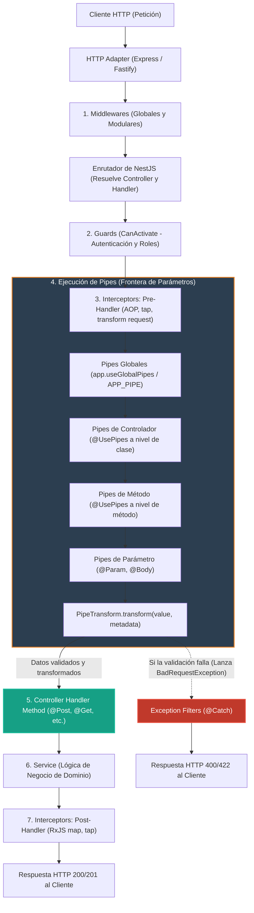
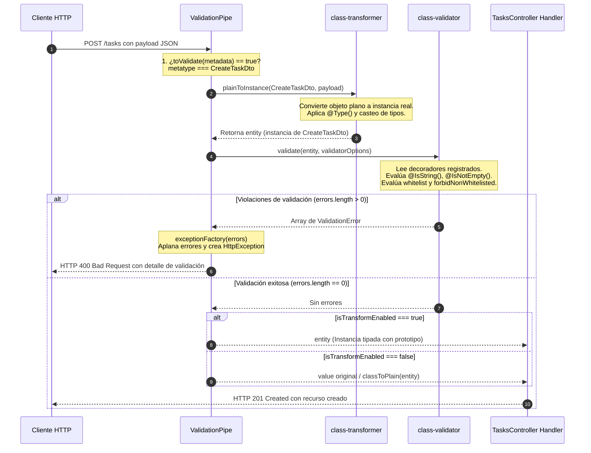
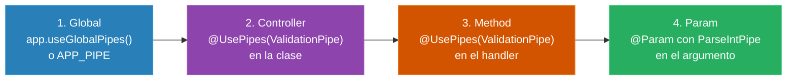
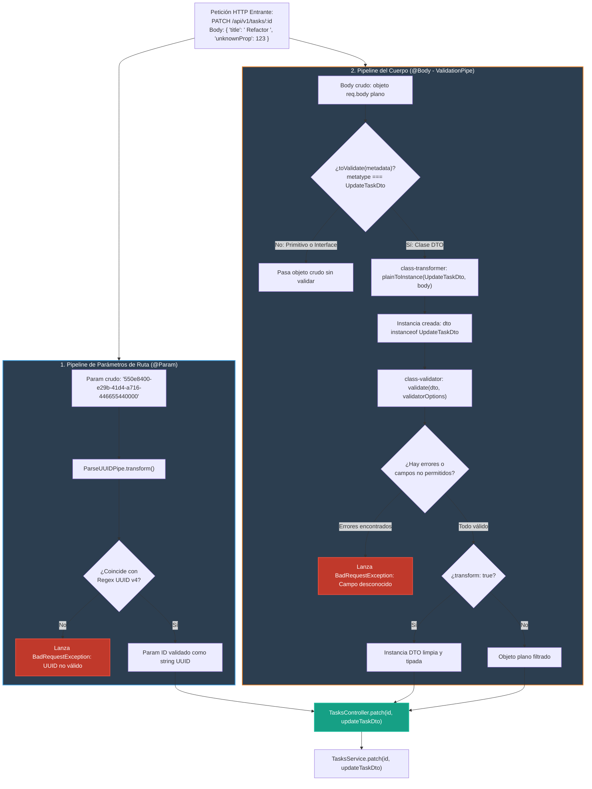

# 2.2 - Pipes: Transformación y Validación de Datos

> **Objetivo del módulo:** Dominar la segunda y última frontera previa a la ejecución de los controladores en NestJS: los **Pipes**. Comprender su rol dual (transformación de tipos y validación de esquemas), su posición exacta en el `Request Lifecycle`, la anatomía interna de la interfaz `PipeTransform<T, R>` y el objeto `ArgumentMetadata`, el mecanismo de reflexión de TypeScript (`emitDecoratorMetadata` y `design:paramtypes`), por qué los DTOs **deben ser clases y jamás interfaces**, el funcionamiento interno de `ValidationPipe` orquestando `class-transformer` (`plainToInstance`) y `class-validator` (`validate`), el catálogo completo de pipes nativos (`ParseIntPipe`, `ParseUUIDPipe`, `ParseBoolPipe`, `ParseArrayPipe`, `ParseEnumPipe`, `DefaultValuePipe`, y la novedad de NestJS 11 `StandardSchemaValidationPipe`), los scopes de resolución y rendimiento (instancia vs token de clase), y la composición avanzada de DTOs con `@nestjs/mapped-types`.

---

## ▶️ Panorámica Rápida & Contexto

- **Rol Dual en el Pipeline**: Los pipes tienen dos responsabilidades exclusivas en NestJS:
  1. **Transformación**: Mutar los datos de entrada a la forma o tipo deseado (e.g., convertir el string `"42"` de la URL al primitivo numérico `42`, o instanciar una clase DTO a partir de un objeto JSON plano).
  2. **Validación**: Evaluar si los datos recibidos cumplen con un contrato o invariante de negocio antes de tocar el controlador. Si fallan, el pipe interrumpe la ejecución arrojando inmediatamente una excepción HTTP (por defecto `400 Bad Request`).
- **Posición en el Request Lifecycle**: Los pipes se ejecutan **inmediatamente antes de invocar el handler del controlador**. Se ejecutan después de los Middlewares, después de los Guards (la petición ya está autenticada y autorizada) y después de la fase pre-handler de los Interceptors.
- **Ámbito por Parámetro (`Param-Scoped`)**: A diferencia de Guards o Interceptors que envuelven el método completo, **los pipes operan parámetro por parámetro**. Se ejecutan de manera independiente para cada argumento decorado (`@Body()`, `@Param()`, `@Query()`, `@Headers()`).
- **La Interfaz `PipeTransform<T, R>`**: Cualquier pipe en NestJS es una clase `@Injectable()` que implementa el método `transform(value: T, metadata: ArgumentMetadata): R | Promise<R>`.
- **La Regla de Oro de los DTOs**: En NestJS, los DTOs (Data Transfer Objects) **deben ser obligatoriamente clases de TypeScript (`class`) y nunca interfaces (`interface`)**. Las interfaces son eliminadas durante la compilación a JavaScript (_type erasure_), destruyendo los metadatos de reflexión (`metatype`) requeridos por el motor de validación.
- **Orquestación de Validación**: NestJS delega la validación declarativa a dos librerías del ecosistema: `class-transformer` (convierte JSON crudo en instancias de clase con prototipo) y `class-validator` (inspecciona los decoradores de validación de la clase y emite violaciones).

---

## 🔬 Under the Hood: Fundamentos & Mecánica Interna (Deep Dive)

### 1. Ubicación Exacta en el Pipeline de Peticiones

Para entender el aislamiento de responsabilidades, observemos cómo fluye la petición a través de los componentes de NestJS:



#### Implicaciones Arquitectónicas Clave:

1. **Los Guards ya corrieron**: Si una petición carece de un JWT válido o de permisos de rol, **ningún pipe se ejecuta**. Esto protege a la aplicación contra ataques de denegación de servicio (DoS) por payloads maliciosos pesados que intenten saturar el CPU deserializando datos antes de la autenticación.
2. **Los Pipes no tienen `ExecutionContext` completo**: A diferencia de Guards e Interceptors, un Pipe no recibe un `ExecutionContext` que permita saltar entre protocolos (HTTP, RPC, WebSockets) ni inspeccionar el handler vía `Reflector`. Un pipe solo recibe el `value` a procesar y el `ArgumentMetadata` específico del argumento de la función donde está inyectado.
3. **Cero lógica de negocio**: El controlador recibe datos ya limpios, casteados y garantizados. El controlador nunca debe hacer `if (!body.title) throw ...` ni `const id = parseInt(req.params.id)`.

---

### 2. La Interfaz `PipeTransform<T, R>` y `ArgumentMetadata`

Todo pipe en NestJS debe implementar la interfaz `PipeTransform<T, R>` provista por `@nestjs/common`:

```typescript
export interface PipeTransform<T = any, R = any> {
  transform(value: T, metadata: ArgumentMetadata): R | Promise<R>;
}
```

- `value`: El argumento de la ruta entrante antes de ser recibido por el método del controlador (por ejemplo, el payload de `req.body`, el string de `req.params.id`, o el objeto `req.query`).
- `metadata`: Objeto que describe el contexto técnico del argumento que se está procesando.

#### Anatomía de `ArgumentMetadata`

```typescript
export interface ArgumentMetadata {
  readonly type: Paramtype;
  readonly metatype?: Type<any> | undefined;
  readonly data?: string | undefined;
}

export type Paramtype = 'body' | 'query' | 'param' | 'custom';
```

| Propiedad  | Tipo                                       | Descripción                                                                                   | Ejemplo Práctico                                                                                |
| :--------- | :----------------------------------------- | :-------------------------------------------------------------------------------------------- | :---------------------------------------------------------------------------------------------- |
| `type`     | `'body' \| 'query' \| 'param' \| 'custom'` | Indica el origen HTTP del argumento procesado.                                                | En `@Body() dto: CreateTaskDto`, `type` es `'body'`.                                            |
| `metatype` | `Type<any> \| undefined`                   | La función constructora/clase asociada al tipo de TypeScript del parámetro en el controlador. | En `create(@Body() dto: CreateTaskDto)`, `metatype` es la función constructora `CreateTaskDto`. |
| `data`     | `string \| undefined`                      | El string exacto pasado como parámetro al decorador de parámetro.                             | En `@Param('id') id: string`, `data` es `'id'`. Si se usa `@Body()`, `data` es `undefined`.     |

---

### 3. La Magia de la Reflexión en TypeScript: `design:paramtypes`

¿Cómo sabe NestJS en tiempo de ejecución (`runtime`) qué tipo tiene el parámetro de un método si JavaScript carece de tipos estáticos?

La respuesta reside en la combinación de **`reflect-metadata`** y las opciones del compilador de TypeScript en `tsconfig.json`:

```json
{
  "compilerOptions": {
    "experimentalDecorators": true,
    "emitDecoratorMetadata": true
  }
}
```

Cuando `emitDecoratorMetadata` está activo, `tsc` (el compilador de TypeScript) inspecciona cada método decorado (por ejemplo, un método de controlador con `@Post()`) y emite llamadas a la API de reflexión estándar de ECMAScript (`Reflect.metadata`) con tres llaves reservadas:

1. `design:type`: Tipo del decorador.
2. `design:paramtypes`: Array con los constructores de cada uno de los parámetros del método.
3. `design:returntype`: Constructor del tipo retornado por el método.

#### Desensamblado: De TypeScript a JavaScript Compilado

Consideremos el siguiente controlador en TypeScript:

```typescript
@Controller('tasks')
export class TasksController {
  @Post()
  create(@Body() dto: CreateTaskDto): Task {
    return this.tasksService.create(dto);
  }
}
```

Al compilarse a JavaScript (`dist/tasks.controller.js`), el compilador genera el siguiente código equivalente:

```javascript
__decorate(
  [
    (0, common_1.Post)(),
    __param(0, (0, common_1.Body)()),
    __metadata('design:type', Function),
    __metadata('design:paramtypes', [create_task_dto_1.CreateTaskDto]), // <-- AQUÍ SE PRESERVA LA CLASE
    __metadata('design:returntype', Object),
  ],
  TasksController.prototype,
  'create',
  null,
);
```

Cuando NestJS inicializa las rutas en su motor interno (`RouteParamsFactory` y `PipesConsumer`), ejecuta:

```typescript
const paramTypes = Reflect.getMetadata('design:paramtypes', target, methodName);
const metatype = paramTypes[paramIndex]; // create_task_dto_1.CreateTaskDto
```

Este `metatype` es inyectado directamente en el segundo argumento de `pipe.transform(value, { type: 'body', metatype, data: undefined })`.

---

### 4. Por qué los DTOs DEBEN ser Clases y JAMÁS Interfaces

Uno de los errores conceptuales más frecuentes de desarrolladores que migran de TypeScript puro a NestJS es definir los DTOs como interfaces:

```typescript
// ❌ GRAVE ERROR EN NESTJS
export interface CreateTaskDto {
  title: string;
  description: string;
}
```

#### La Trampa del _Type Erasure_ (Borrado de Tipos)

En TypeScript, las interfaces y los type aliases (`type`) son **constructos puramente de tiempo de compilación**. No generan un solo byte de código en el archivo JavaScript resultante.

Cuando el compilador de TypeScript procesa un método decorado cuyo parámetro está tipado con una interfaz:

```typescript
@Post()
create(@Body() dto: ICreateTaskDto) { ... }
```

Como `ICreateTaskDto` no existe en JavaScript, `tsc` no tiene ninguna función constructora que colocar en `design:paramtypes`. En su lugar, emite:

```javascript
__metadata('design:paramtypes', [Object]); // <-- EMITE Object, NO LA INTERFAZ
```

#### La Consecuencia Silenciosa en `ValidationPipe`

Observemos la implementación interna de `ValidationPipe.toValidate()` extraída del código fuente de `@nestjs/common`:

```typescript
protected toValidate(metadata: ArgumentMetadata): boolean {
  const { metatype, type } = metadata;
  if (type === 'custom' && !this.validateCustomDecorators) {
    return false;
  }
  // Si el tipo es un primitivo u Object, NO SE VALIDA
  const types = [String, Boolean, Number, Array, Object, Buffer, Date];
  return !types.some(t => metatype === t) && !isNil(metatype);
}
```

Si el DTO es una `interface`:

1. `metadata.metatype` vale `Object`.
2. `types.some(t => metatype === t)` se evalúa como `true`.
3. `toValidate(metadata)` retorna **`false`**.
4. **`ValidationPipe` se salta la validación por completo en silencio**. La petición entra al controlador sin verificar campos, sin filtrar propiedades maliciosas y sin arrojar ningún error `400`.

En cambio, al usar una `class`:

1. `class CreateTaskDto` existe en JavaScript como una función constructora con prototipo.
2. `metadata.metatype === CreateTaskDto`.
3. `toValidate(metadata)` retorna **`true`**.
4. `ValidationPipe` procede a instanciar y validar los datos.

Fuente: Código fuente oficial de [`@nestjs/common/pipes/validation.pipe.js`](https://github.com/nestjs/nest/blob/master/packages/common/pipes/validation.pipe.ts).

---

### 5. `ValidationPipe` Under the Hood: La Orquestación Interna

El `ValidationPipe` estándar de NestJS es un orquestador de dos librerías externas esenciales:

- **`class-transformer`**: Transforma objetos literales planos de JavaScript (`{}`) en instancias formales de la clase DTO con métodos y prototipo mediante `plainToInstance`.
- **`class-validator`**: Inspecciona los metadatos de validación registrados por decoradores (`@IsString`, `@MinLength`, etc.) en el prototipo de la clase y ejecuta las reglas mediante `validate()`.



#### Opciones Cruciales de `ValidationPipe` en Producción

```typescript
new ValidationPipe({
  whitelist: true,
  forbidNonWhitelisted: true,
  transform: true,
  transformOptions: {
    enableImplicitConversion: false, // ⚠️ Cuidado: ver tradeoffs
  },
});
```

##### A. `whitelist: true` (Defensa contra Mass Assignment)

- **Mecánica**: Examina todas las propiedades del objeto entrante. Si alguna propiedad **no tiene al menos un decorador de `class-validator`** en la clase DTO, es eliminada automáticamente del objeto antes de pasarlo al controlador.
- **Seguridad**: Previene ataques de asignación masiva (_Mass Assignment_ o _Over-posting_), donde un atacante inyecta campos como `isAdmin: true`, `verified: true` o `organizationId: "hacked"`.

##### B. `forbidNonWhitelisted: true` (Modo Estricto)

- **Mecánica**: En lugar de simplemente descartar las propiedades no reconocidas en silencio, **detiene la petición y lanza un `400 Bad Request`** indicando explícitamente cuáles propiedades no están permitidas:
  ```json
  {
    "message": ["property hackField should not exist"],
    "error": "Bad Request",
    "statusCode": 400
  }
  ```
- **Práctica**: Indispensable para APIs públicas y de integración frontend: detecta _typos_ inmediatamente en el cliente (e.g., enviar `titlle` en vez de `title`) en vez de descartar el campo en silencio y guardar un registro vacío o corrupto.

##### C. `transform: true` (Hidratación de Instancias y Coerción de Tipos)

- **Mecánica**:
  1. Si `transform: false` (default), el controlador recibe un objeto JavaScript plano (`Object`), lo que significa que `dto instanceof CreateTaskDto` retorna `false`, y cualquier método o getter declarado en la clase DTO **no existirá en tiempo de ejecución**.
  2. Si `transform: true`, `ValidationPipe` retorna el resultado de `plainToInstance(metatype, value)`. Ahora `dto instanceof CreateTaskDto` retorna `true`.
  3. Además, si se utiliza en parámetros de ruta (`@Param()`) o query (`@Query()`), intenta transformar primitivos automáticamente si el tipo destino es `Number`, `Boolean`, etc.

##### D. La Trampa de los Objetos Anidados: `@ValidateNested()` y `@Type()`

Si un DTO incluye otro DTO anidado, como una tarea con un autor o etiquetas:

```typescript
// ❌ INSUFICIENTE: La validación anidada NO se ejecutará
export class CreateTaskDto {
  @IsString()
  title: string;

  @ValidateNested()
  metadata: TaskMetadataDto;
}
```

**¿Por qué falla?**
En tiempo de ejecución, el objeto JSON anidado `{ metadata: { priority: "HIGH" } }` es simplemente un `Object` anónimo. `class-validator` no puede saber qué reglas aplicar a `metadata` porque no conoce su función constructora.

**La Solución Obligatoria**:
Se debe emparejar `@ValidateNested()` con el decorador `@Type(() => ClassConstructor)` provisto por `class-transformer`:

```typescript
import { ValidateNested } from 'class-validator';
import { Type } from 'class-transformer';

export class CreateTaskDto {
  @IsString()
  title: string;

  @ValidateNested()
  @Type(() => TaskMetadataDto) // <-- Le dice a class-transformer a qué clase hidratar
  metadata: TaskMetadataDto;
}
```

---

### 6. Catálogo Completo de Pipes Nativos (Built-in Pipes)

NestJS provee un catálogo robusto de pipes listos para producción exportados por `@nestjs/common`:

| Pipe                           | Propósito / Tipo Salida                                                                                                                           | Configuración / Opciones Típicas                                                                                                             |
| :----------------------------- | :------------------------------------------------------------------------------------------------------------------------------------------------ | :------------------------------------------------------------------------------------------------------------------------------------------- |
| `ParseIntPipe`                 | Convierte string a `number` entero. Valida con `parseInt(value, 10)` y `isNaN`.                                                                   | `{ errorHttpStatusCode: HttpStatus.NOT_ACCEPTABLE, optional: true }`                                                                         |
| `ParseFloatPipe`               | Convierte string a `number` de coma flotante.                                                                                                     | `{ optional: true }`                                                                                                                         |
| `ParseBoolPipe`                | Convierte string (`"true"`, `"false"`, `"1"`, `"0"`) a `boolean`.                                                                                 | `{ optional: true }`                                                                                                                         |
| `ParseUUIDPipe`                | Valida que el string cumpla con el estándar RFC 4122 de UUID.                                                                                     | `{ version: '4', errorHttpStatusCode: HttpStatus.BAD_REQUEST, optional: true }` (En NestJS 11 soporta versiones `'3' \| '4' \| '5' \| '7'`). |
| `ParseArrayPipe`               | Convierte y valida arrays enviados como strings delimitados o JSON.                                                                               | `{ items: String, separator: ',', optional: true }`                                                                                          |
| `ParseEnumPipe`                | Valida que el string pertenezca a un `enum` de TypeScript.                                                                                        | `new ParseEnumPipe(TaskStatus, { optional: true })`                                                                                          |
| `DefaultValuePipe`             | Provee un valor por defecto si el argumento entrante es `null` o `undefined`.                                                                     | `new DefaultValuePipe(1)`                                                                                                                    |
| `ParseDatePipe`                | _(Novedad NestJS 11)_ Parsea strings ISO-8601 o marcas de tiempo a objetos `Date` válidos.                                                        | `{ optional: true }`                                                                                                                         |
| `StandardSchemaValidationPipe` | _(Novedad NestJS 11)_ Permite validar argumentos usando esquemas estándar de validación (Zod, Valibot, ArkType) vía el consorcio Standard Schema. | Recibe esquemas que cumplan con la especificación `~standard`.                                                                               |

#### Personalización del Error HTTP en Pipes Nativos

Todos los pipes de tipo `Parse*` permiten personalizar el código de estado retornado o la fábrica de excepciones (`exceptionFactory`):

```typescript
@Get(':id')
findOne(
  @Param(
    'id',
    new ParseUUIDPipe({
      version: '4',
      errorHttpStatusCode: HttpStatus.UNPROCESSABLE_ENTITY, // 422 en vez de 400
      exceptionFactory: (error) => new BadRequestException(`Task ID '${error}' is not a valid v4 UUID`),
    }),
  )
  id: string,
) {
  return this.tasksService.findById(id);
}
```

#### Encadenamiento de Pipes (Pipe Chaining)

Es posible encadenar múltiples pipes en un solo parámetro. NestJS los ejecuta secuencialmente de **izquierda a derecha**, alimentando la salida del primero a la entrada del siguiente:

```typescript
@Get()
findAll(
  @Query('page', new DefaultValuePipe(1), ParseIntPipe) page: number,
  @Query('limit', new DefaultValuePipe(10), ParseIntPipe) limit: number,
  @Query('status', new ParseEnumPipe(TaskStatus, { optional: true })) status?: TaskStatus,
) {
  return this.tasksService.findPaginated(page, limit, status);
}
```

_Si el cliente no envía `?page=`, `DefaultValuePipe` emite `1`. Luego `ParseIntPipe` recibe `1` (que ya es número o string convertible) y lo entrega al handler como `number`._

---

### 7. Scopes de Pipes y Rendimiento: Instancia vs Referencia de Clase

Los pipes pueden registrarse en cuatro niveles de alcance:



#### La Diferencia Crítica: `ParseUUIDPipe` vs `new ParseUUIDPipe()`

En los decoradores de parámetros y métodos, podemos pasar tanto la **clase** como una **instancia**:

```typescript
// Opción A: Paso de referencia de Clase (RECOMENDADO para configuración por defecto)
@Get(':id')
findOne(@Param('id', ParseUUIDPipe) id: string) {}

// Opción B: Paso de Instancia (OBLIGATORIO solo si se configuran opciones personalizadas)
@Get(':id')
findOne(@Param('id', new ParseUUIDPipe({ version: '4' })) id: string) {}
```

#### Mecánica de Rendimiento e IoC:

1. **Pasar la Clase (`ParseUUIDPipe`)**:
   - NestJS delega la instanciación al contenedor IoC.
   - Crea una **única instancia Singleton** compartida para toda la aplicación.
   - Reduce el consumo de memoria y la presión sobre el recolector de basura (_Garbage Collector_ de V8) en aplicaciones de alto tráfico.
   - Permite que el pipe inyecte dependencias en su constructor si fuera necesario.
2. **Pasar la Instancia (`new ParseUUIDPipe(...)`)**:
   - Se crea una instancia en el momento en que se evalúa el archivo TypeScript (a nivel de módulo).
   - Necesario cuando el pipe requiere opciones específicas en su constructor (`new ParseEnumPipe(MyEnum)`).
   - **Limitación**: Los pipes instanciados con `new` no pueden recibir dependencias inyectadas por el IoC container de NestJS.

#### Inyección de Dependencias en Pipes Globales (`APP_PIPE`)

Si configuras un pipe global con `app.useGlobalPipes(new CustomPipe())` en `main.ts`, dicho pipe vive **fuera del contenedor IoC** y no puede inyectar ningún servicio (como `ConfigService` o `DatabaseService`).

Para crear un pipe global con acceso completo a Inyección de Dependencias, regístralo como un provider en cualquier módulo (usualmente `AppModule`) usando el token `APP_PIPE`:

```typescript
import { Module } from '@nestjs/common';
import { APP_PIPE } from '@nestjs/core';
import { ValidationPipe } from '@nestjs/common';

@Module({
  providers: [
    {
      provide: APP_PIPE,
      useClass: ValidationPipe, // Administrado por el IoC Container
    },
  ],
})
export class AppModule {}
```

---

### 8. Composición de DTOs con `@nestjs/mapped-types`

En arquitecturas profesionales, crear endpoints CRUD produce una gran duplicación de código entre el DTO de creación (`CreateTaskDto`) y el de actualización parcial (`UpdateTaskDto`).

El paquete oficial `@nestjs/mapped-types` provee funciones utilitarias que generan clases derivadas en tiempo de ejecución **preservando y transformando los metadatos de validación**:

```bash
bun add @nestjs/mapped-types
```

#### Utilidades Principales:

1. **`PartialType(CreateTaskDto)`**: Genera una nueva clase donde todas las propiedades de `CreateTaskDto` se vuelven opcionales (equivalente a agregar `@IsOptional()` a cada campo), manteniendo intactas todas las demás reglas de validación (`@IsString`, `@MinLength`, etc.).
2. **`PickType(CreateTaskDto, ['title'] as const)`**: Construye un nuevo DTO seleccionando únicamente un subconjunto de propiedades.
3. **`OmitType(CreateTaskDto, ['status'] as const)`**: Construye un nuevo DTO excluyendo las propiedades especificadas.
4. **`IntersectionType(A_Dto, B_Dto)`**: Fusiona dos clases DTO en una sola clase combinada.

#### ¿Por qué no usar simplemente `Partial<CreateTaskDto>` de TypeScript?

```typescript
// ❌ ANTIPATRÓN CATASTRÓFICO
export class UpdateTaskDto implements Partial<CreateTaskDto> {}
```

- `Partial<T>` es un tipo genérico de TypeScript en tiempo de compilación. No genera ninguna clase ni decora propiedades con `@IsOptional()`.
- Al no tener propiedades declaradas en la clase JavaScript resultante, `ValidationPipe` con `whitelist: true` descartará todas las propiedades enviadas por el cliente, dejando un payload vacío.
- `PartialType()` de `@nestjs/mapped-types` utiliza reflexión dinámica para clonar la metadata de `class-validator` en una nueva función constructora real.

Fuente: Documentación oficial de [NestJS Mapped Types](https://docs.nestjs.com/openapi/mapped-types).

---

## 🧠 Analogía & Mapeo Mental (C# / ASP.NET Core & Angular)

Para desarrolladores con trasfondo en el ecosistema .NET (C#) o Angular, los Pipes de NestJS encajan en un modelo mental directo:

### Comparativa Conceptual: NestJS vs C# (ASP.NET Core) vs Angular

| Concepto                                | NestJS                                              | C# (.NET / ASP.NET Core)                         | Angular                                            |
| :-------------------------------------- | :-------------------------------------------------- | :----------------------------------------------- | :------------------------------------------------- |
| **Transformación de Parámetros**        | `PipeTransform` (`ParseIntPipe`, `ParseUUIDPipe`)   | `IModelBinder` / Type Converters                 | `PipeTransform` (`CurrencyPipe`, `DatePipe`)       |
| **Validación Declarativa**              | `class-validator` (`@IsNotEmpty()`, `@MinLength()`) | DataAnnotations (`[Required]`, `[StringLength]`) | Reactive Forms Validators (`Validators.required`)  |
| **Invocación Automática de Validación** | `ValidationPipe` en pipeline HTTP                   | `[ApiController]` evaluando `ModelState.IsValid` | Validación automática en `formGroup.statusChanges` |
| **Rechazo de Campos Extraños**          | `whitelist: true` / `forbidNonWhitelisted`          | Over-posting protection / `[Bind]` attribute     | FormControls estrictos en Reactive Forms           |
| **Composición de Modelos**              | `PartialType(CreateDto)` (`@nestjs/mapped-types`)   | Herencia de clases base o ViewModels específicos | Interfaces TypeScript extendidas con `Partial<T>`  |
| **Propósito Arquitectónico**            | Sanitización, tipado y validación de entrada HTTP   | Model Binding y validación de Modelos de API     | Formateo cosmético de datos para la vista (UI)     |

#### El Paralelismo Clave con ASP.NET Core:

En ASP.NET Core, cuando marcas un controlador con `[ApiController]`, el framework ejecuta el _Model Binder_, puebla el objeto y valida los atributos de DataAnnotations. Si hay un error, interrumpe la petición antes de entrar a tu método y retorna un `400 Bad Request` con un `ValidationProblemDetails`.
En NestJS, **`ValidationPipe` es exactamente ese mecanismo**, unificando la deserialización (`class-transformer`), la validación (`class-validator`) y la emisión de errores formateados.

#### La Diferencia Radical con Angular:

Aunque la interfaz se llama idéntica (`PipeTransform` con método `transform`), el propósito es opuesto:

- En **Angular**, un pipe es un componente visual de presentación: toma un dato crudo del backend y lo formatea para el usuario humano (`{{ task.createdAt | date:'short' }}`).
- En **NestJS**, un pipe es un componente de backend de infraestructura e integridad: toma datos no confiables de la red exterior, los sanitiza, valida su estructura y los transforma en modelos seguros para la lógica de negocio.

---

## 📊 Diagrama de Arquitectura / Ciclo de Vida (Mermaid)

El siguiente diagrama detalla el viaje microscópico de una petición HTTP desde que el adaptador entrega el string crudo hasta la invocación del método de servicio:



---

## ⚖️ Tradeoffs & Análisis de Decisiones Arquitectónicas

### 1. `ValidationPipe` Global vs Pipes Locales por Controlador/Ruta

```typescript
// Enfoque A: Global en main.ts
app.useGlobalPipes(new ValidationPipe({ whitelist: true, forbidNonWhitelisted: true, transform: true }));

// Enfoque B: Local por ruta
@Post()
@UsePipes(new ValidationPipe({ whitelist: true }))
create(@Body() dto: CreateTaskDto) {}
```

- **Veredicto Arquitectónico**: **Usa siempre un `ValidationPipe` Global**.
- **Justificación**: La validación es una preocupación transversal (_cross-cutting concern_). Depender de pipes locales produce olvidos accidentales, endpoints desprotegidos y configuraciones divergentes entre módulos.
- **Excepción**: Rutas de subida de archivos binarios o webhooks con firmas criptográficas crudas (e.g., Stripe Webhooks donde se necesita el buffer raw de la petición sin tocar).

---

### 2. `whitelist: true` vs `forbidNonWhitelisted: true`

- **En APIs Públicas / Frontend de Primera Mano (SPA / Móvil)**:
  - **Recomendación**: Activar **ambos** (`whitelist: true, forbidNonWhitelisted: true`).
  - **Razón**: Permite a los desarrolladores clientes detectar errores de tipeo inmediatamente durante el desarrollo en lugar de sufrir depuración de campos ignorados en silencio.
- **En Microservicios Internos / Consumo de Eventos de Terceros**:
  - **Recomendación**: Usar únicamente `whitelist: true` (sin `forbidNonWhitelisted`).
  - **Razón**: Principio de Robustez (Ley de Postel: _"Sé conservador en lo que envías, sé liberal en lo que aceptas"_). Permite que servicios upstream agreguen nuevos campos a sus payloads sin romper retrocompatibilidad con servicios consumidores que aún no han actualizado sus DTOs.

---

### 3. La Trampa de `enableImplicitConversion: true`

`class-transformer` permite activar `enableImplicitConversion: true` en las opciones de `ValidationPipe`:

```typescript
new ValidationPipe({
  transform: true,
  transformOptions: { enableImplicitConversion: true },
});
```

- **Ventaja superficial**: No requieres anotar `@Type(() => Number)` en query params numéricos (`page`, `limit`); los convierte automáticamente infiriendo el tipo de TypeScript.
- **El Gran Peligro (Gotcha de Seguridad)**:
  En JavaScript, `Boolean("false") === true`. Si un cliente envía `?isActive=false`, `enableImplicitConversion` convertirá el string no vacío `"false"` al booleano `true`, invirtiendo completamente la lógica del negocio.
- **Decisión Arquitectónica**: **Mantén `enableImplicitConversion: false`**. Para tipos primitivos en queries o params, usa pipes nativos (`ParseBoolPipe`, `ParseIntPipe`) o decoradores `@Type()` explícitos en los DTOs. Lo explícito siempre gana a lo implícito.

---

### 4. `class-validator` (Decorators) vs Esquemas Funcionales (`Zod` / `Valibot`)

Con el auge de TypeScript y la llegada de NestJS 11 con soporte para _Standard Schema_, la comunidad evalúa dos filosofías:

| Criterio               | `class-validator` + `class-transformer`                                                 | `Zod` / `Valibot` (Schema-First)                                                                         |
| :--------------------- | :-------------------------------------------------------------------------------------- | :------------------------------------------------------------------------------------------------------- |
| **Paradigma**          | Orientado a Objetos, Decoradores y Metadatos de Reflexión.                              | Programación Funcional, Inferencia de Tipos pura (`z.infer`).                                            |
| **Ecosistema NestJS**  | Estándar de facto, soporte nativo e integración directa con `@nestjs/swagger`.          | Requiere custom pipes o el nuevo `StandardSchemaValidationPipe` de NestJS 11.                            |
| **Rendimiento**        | Más lento: requiere dos pasadas completas (`plainToInstance` + `validate`) y reflexión. | Significativamente más rápido en ejecución de validación en runtime.                                     |
| **Generación OpenAPI** | Automática mediante Swagger CLI Plugin leyendo clases DTO.                              | Requiere librerías puente (e.g., `nestjs-zod`) o definir esquemas dobles.                                |
| **Estabilidad**        | Decoradores experimentales (`legacy`), problemas históricos de mantenimiento.           | Cero dependencia de metadatos de TypeScript (`tsc`), compatible con compiladores rápidos (esbuild, SWC). |

- **Decisión**: Para aplicaciones empresariales NestJS estándar donde Swagger/OpenAPI es primordial, **`class-validator` es el estándar idiomático**. Para microservicios de ultra alto rendimiento o pipelines sin OpenAPI, los esquemas funcionales con Zod son una alternativa superior.

---

## 📑 Conceptos Clave & Trampas Mentales

| Concepto                             | Clave Práctica / Under the Hood                                                       | Antipatrón / Trampa Común                                                                                                                                            |
| :----------------------------------- | :------------------------------------------------------------------------------------ | :------------------------------------------------------------------------------------------------------------------------------------------------------------------- |
| **Interfaces en DTOs**               | El borrado de tipos convierte interfaces en `Object`. `toValidate()` retorna `false`. | Declarar `export interface CreateUserDto`. La validación no se ejecuta y no arroja ningún aviso.                                                                     |
| **Olvidar `transform: true`**        | Sin este flag, `ValidationPipe` retorna un objeto plano literal.                      | Intentar usar `dto instanceof CreateTaskDto` o invocar métodos de la clase y obtener `TypeError: dto.getSummary is not a function`.                                  |
| **Validación Anidada**               | `class-validator` no puede inspeccionar objetos anidados sin conocer su constructor.  | Usar solo `@ValidateNested()` sin `@Type(() => SubDto)`. Los campos del objeto hijo jamás se validan.                                                                |
| **Instancias en Decoradores**        | Pasar `ParseIntPipe` (clase) permite a Nest reutilizar la instancia Singleton.        | Escribir `@Param('id', new ParseIntPipe())` innecesariamente, creando nuevas instancias y evitando DI.                                                               |
| **Tipos Primitivos en Queries**      | Los Query Params siempre llegan de Express como `string`.                             | Declarar `@Query('limit') limit: number` y esperar un número sin usar `ParseIntPipe`. `typeof limit` será `'string'`.                                                |
| **Herencia de DTOs nativa**          | `Partial<Dto>` de TypeScript es solo un tipo de tiempo de compilación.                | Usar `class UpdateDto extends Partial<CreateDto>`. Las propiedades se pierden y la validación falla con `whitelist`. Usar `PartialType()` de `@nestjs/mapped-types`. |
| **Validación de Arrays en Query**    | Los query params repetidos llegan como strings o arrays de strings.                   | Intentar validar `?ids=1,2,3` con un DTO estándar en vez de usar `ParseArrayPipe({ items: Number, separator: ',' })`.                                                |
| **Inyección de Dependencias Global** | `app.useGlobalPipes()` en `main.ts` vive fuera del árbol IoC de Nest.                 | Intentar inyectar servicios en un pipe global registrado con `app.useGlobalPipes()`. Usar `{ provide: APP_PIPE, useClass: MiPipe }` en `AppModule`.                  |

---

## ⚡ Buenas Prácticas de Producción (Do / Don't)

### Prefiere (Do):

- ✅ **Centraliza la validación**: Configura `ValidationPipe` globalmente en `main.ts` con `whitelist: true`, `forbidNonWhitelisted: true` y `transform: true`.
- ✅ **Declara DTOs inmutables**: Marca las propiedades de los DTOs como `readonly` para evitar mutaciones accidentales en los controladores.
- ✅ **Usa pipes nativos en rutas**: Usa `@Param('id', ParseUUIDPipe)` en todas las rutas con identificadores UUID para rechazar IDs inválidos antes de que toquen la base de datos.
- ✅ **Reutiliza DTOs con `@nestjs/mapped-types`**: Usa `PartialType()`, `PickType()` y `OmitType()` para mantener contratos consistentes y evitar duplicación de decoradores.
- ✅ **Valida en la frontera del sistema**: Todo parámetro que cruce la red (`@Body`, `@Query`, `@Param`) debe tener un DTO o un Pipe explícito.

### Evita (Don't):

- ❌ **Nunca uses interfaces para DTOs**: Las interfaces no sobreviven al compilador de JavaScript.
- ❌ **No valides manualmente en los controladores**: Erradica bloques `if (!body.title) throw new BadRequestException()`. Si está en el controlador, llegaste tarde.
- ❌ **No actives `enableImplicitConversion` a ciegas**: Ocasiona bugs sutiles en valores booleanos (`"false"` evaluado a `true`).
- ❌ **No omitas `@Type()` en estructuras anidadas**: `@ValidateNested()` sin `@Type()` es código muerto.
- ❌ **No crees instancias innecesarias**: Usa `@Param('id', ParseUUIDPipe)` en lugar de `@Param('id', new ParseUUIDPipe())` salvo que requieras pasar opciones específicas.

---

## 🎯 Reto Práctico (Hands-on Challenge)

### Contexto del Dominio: Task & Project Management API

En nuestro sistema de gestión de tareas y proyectos, actualmente el controlador `TasksController` recibe parámetros de ruta crudos (strings arbitrarios como IDs) y DTOs planos sin validaciones, exponiendo al sistema a identificadores corruptos y datos incompletos.

Tu misión es transformar el módulo de tareas en una fortaleza con validación estricta y tipado garantizado.

---

### Requisitos Técnicos a Implementar:

#### 1. Instalación de Dependencias

Instala los paquetes necesarios para la validación y composición de DTOs en NestJS:

```bash
bun add class-validator class-transformer @nestjs/mapped-types
```

#### 2. Configuración Global de Validación (`main.ts`)

Configura un `ValidationPipe` global en `src/main.ts` con las siguientes opciones estrictas de producción:

- `whitelist: true` (elimina propiedades no decoradas).
- `forbidNonWhitelisted: true` (arroja error 400 si se envían campos desconocidos).
- `transform: true` (hidrata payloads a instancias reales de los DTOs).

#### 3. Fortificación de `CreateTaskDto` (`src/modules/tasks/dto/create-task.dto.ts`)

Define el contrato estricto para crear tareas con las siguientes reglas:

- `title`: String, obligatorio, no vacío, longitud mínima de 3 caracteres y máxima de 100.
- `description`: String, opcional. Si se envía, longitud máxima de 500 caracteres.
- `userId`: String, obligatorio, debe ser un UUID v4 válido (`@IsUUID('4')`).
- `priority`: Enum opcional con valores `'LOW' | 'MEDIUM' | 'HIGH'`, con valor por defecto o validación `@IsEnum`.
- `tags`: Array de strings opcional (`@IsArray()`, `@IsString({ each: true })`, `@IsOptional()`).

#### 4. Reutilización mediante `UpdateTaskDto` y `PatchTaskDto`

- Refactoriza `src/modules/tasks/dto/update-task.dto.ts` y `patch-task.dto.ts` utilizando `PartialType` importado de `@nestjs/mapped-types` basado en `CreateTaskDto`.

#### 5. Validación Estricta de Parámetros de Ruta con `ParseUUIDPipe`

En `src/modules/tasks/tasks.controller.ts`, protege todas las rutas que reciben `:id` (`GET /tasks/:id`, `PUT /tasks/:id`, `PATCH /tasks/:id`, `DELETE /tasks/:id`) para que validen que el parámetro sea un UUID válido utilizando el pipe nativo `ParseUUIDPipe`.

#### 6. Creación de un Pipe Personalizado: `TrimPipe`

Crea un pipe reutilizable en `src/common/pipes/trim.pipe.ts` que implemente `PipeTransform`:

- **Propósito**: Sanitizar datos de entrada eliminando espacios en blanco al inicio y al final (_trimming_) de strings.
- **Comportamiento**:
  - Si el valor recibido es un string, retorna `value.trim()`.
  - Si el valor es un objeto plano, recorre sus propiedades y aplica `.trim()` recursivamente a todas las propiedades de tipo string.
  - Si el valor no es string ni objeto (números, booleans, null), lo retorna sin mutar.
- Aplica o demuestra este pipe en un parámetro del controlador (e.g., en un query param de búsqueda o como pipe previo al body).

---

### Experimentos de Aprendizaje Activo (Active Learning Experiments)

Una vez implementado, ejecuta estas pruebas con `curl` o un cliente HTTP y observa las respuestas:

#### Experimento 1: El ataque del campo no permitido (`forbidNonWhitelisted`)

Envía una petición `POST /api/v1/tasks` incluyendo una propiedad no declarada:

```bash
curl -X POST http://localhost:3000/api/v1/tasks \
  -H "Content-Type: application/json" \
  -d '{"title": "Valid Task", "userId": "550e8400-e29b-41d4-a716-446655440000", "isAdmin": true}'
```

- **Resultado esperado**: Error `400 Bad Request` indicando: `"property isAdmin should not exist"`.

#### Experimento 2: Parámetro UUID Inválido

Intenta consultar una tarea con un ID no numérico/no-UUID:

```bash
curl -X GET http://localhost:3000/api/v1/tasks/123-abc
```

- **Resultado esperado**: Error `400 Bad Request` emitido por `ParseUUIDPipe` antes de que el controlador intente buscarlo en memoria o base de datos.

#### Experimento 3: Comprobación de Instancia (`transform: true`)

Dentro de `TasksController.create(@Body() dto: CreateTaskDto)`, agrega un log:

```typescript
console.log('¿Es instancia real?:', dto instanceof CreateTaskDto);
```

- **Comprobación**: Con `transform: true` debe imprimir `true`. Si comentas temporalmente `transform: true` en `main.ts`, imprimirá `false`.

---

### Preguntas de Defensa Arquitectónica

Al finalizar tu implementación, debes estar listo para defender estas decisiones de diseño:

1. _¿Por qué decidimos configurar `ValidationPipe` en `main.ts` a nivel global en lugar de colocar `@UsePipes(ValidationPipe)` en cada controlador?_
2. _Si un endpoint requiere recibir un archivo binario (`multipart/form-data`) junto con un JSON, ¿qué conflicto puede generar `ValidationPipe` y cómo se resuelve?_
3. _¿Cuál es el costo computacional de `plainToInstance` de `class-transformer` en endpoints de ingesta masiva (e.g., payloads con 10,000 elementos) y qué alternativa existe?_

---

### Criterios de Aceptación (Definition of Done - DoD)

- [ ] Las dependencias `class-validator`, `class-transformer` y `@nestjs/mapped-types` están instaladas en `package.json`.
- [ ] `ValidationPipe` global configurado en `main.ts` con `whitelist: true`, `forbidNonWhitelisted: true` y `transform: true`.
- [ ] `CreateTaskDto` implementa validaciones estrictas (`@IsString`, `@IsNotEmpty`, `@MinLength`, `@IsUUID`, `@IsEnum`, `@IsOptional`).
- [ ] `UpdateTaskDto` reutiliza `CreateTaskDto` usando `PartialType` sin duplicar código de validación.
- [ ] Los endpoints `GET /tasks/:id`, `PUT /tasks/:id`, `PATCH /tasks/:id` y `DELETE /tasks/:id` rechazan IDs no UUID con `400 Bad Request` mediante `ParseUUIDPipe`.
- [ ] Se implementa el pipe personalizado `TrimPipe` implementando `PipeTransform` y manejando correctamente tipos de datos primitivos y objetos.
- [ ] La suite de pruebas unitarias y de integración (`bun test`) pasa sin errores y `bun run lint` no reporta advertencias.

---

## ✅ Checklist de Active Recall & Autoevaluación

Intenta responder estas preguntas sin mirar el texto de la nota para certificar la asimilación del modelo mental:

- [ ] ¿En qué orden exacto se ejecutan los Middlewares, Guards, Interceptors y Pipes en una petición entrante?
- [ ] ¿Por qué un Pipe no puede utilizar `Reflector` directamente desde un `ExecutionContext` de la misma forma que un Guard?
- [ ] ¿Qué ocurre internamente en JavaScript cuando compilas un DTO definido como `interface` y cómo reacciona el método `toValidate()` de `ValidationPipe`?
- [ ] ¿Cuál es la función exacta de `plainToInstance()` y por qué es indispensable para que `class-validator` funcione?
- [ ] ¿Por qué `@ValidateNested()` no valida propiedades de objetos hijos si se omite el decorador `@Type()` de `class-transformer`?
- [ ] ¿Qué diferencia de rendimiento y gestión de memoria existe entre `@Param('id', ParseUUIDPipe)` y `@Param('id', new ParseUUIDPipe())`?
- [ ] ¿Por qué `Partial<CreateTaskDto>` de TypeScript puro no funciona como sustituto de `PartialType(CreateTaskDto)` de `@nestjs/mapped-types`?
- [ ] ¿Cómo permite el token `APP_PIPE` que un pipe global utilice Inyección de Dependencias mientras que `app.useGlobalPipes()` no lo permite?
