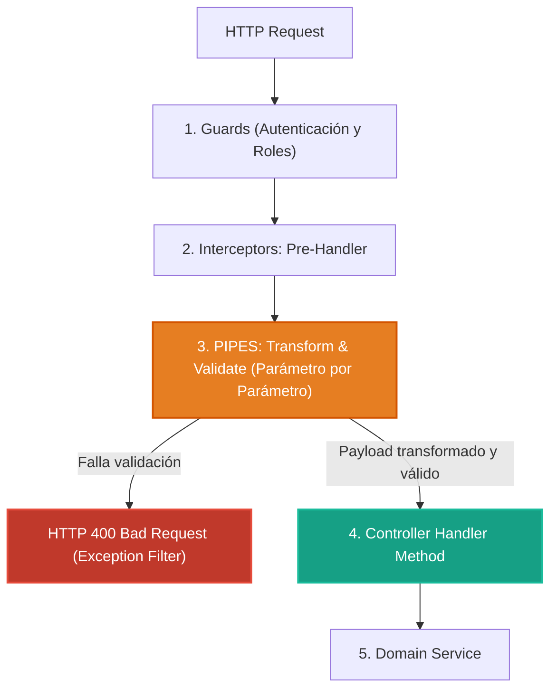

# 2.2 - Pipes: Transformación y Validación de Datos

> **Objetivo del módulo:** Dominar la frontera previa a los controladores: el rol dual de los Pipes (transformación y validación), por qué los DTOs **deben ser clases y jamás interfaces**, el funcionamiento de `ValidationPipe` (`class-transformer` + `class-validator`), y el encadenamiento de pipes por parámetro.

---

## 🧭 1. Posición en el Request Lifecycle

Los pipes se ejecutan en la **frontera de parámetros**, inmediatamente antes de invocar el handler:



- **Frontera de ejecución**: Parámetro por parámetro (`@Body()`, `@Param()`, `@Query()`). No envuelve la función entera como un Guard o Interceptor.
- **Defensa anti-DoS**: Los Guards corren antes que los Pipes; las peticiones no autenticadas nunca consumen CPU deserializando payloads pesados.

---

## 📜 2. El Contrato Esencial

```typescript
// Contrato base para un Pipe personalizado
export interface PipeTransform<T = any, R = any> {
  transform(value: T, metadata: ArgumentMetadata): R | Promise<R>;
}

// Encadenamiento secuencial en parámetros (de izquierda a derecha)
@Get(':id')
findOne(
  @Param('id', TrimPipe, new ParseUUIDPipe({ version: '4' })) id: string
) {
  return this.tasksService.findOne(id);
}

// DTO con validación declarativa (SIEMPRE clase)
export class CreateTaskDto {
  @IsString()
  @IsNotEmpty()
  title: string;

  @IsUUID('4')
  userId: string;
}
```

- **Mapeo mental rápido**: Equivalente a Model Binding & DataAnnotations en ASP.NET Core (`[Required]`, `[StringLength]`).

---

## ⚠️ 3. Top Trampas Mortales & Antipatrones

| Antipatrón / Trampa Común                                   | Causa Técnica / Under the Hood                                                                                                  | Corrección Idiomática                                                                      |
| :---------------------------------------------------------- | :------------------------------------------------------------------------------------------------------------------------------ | :----------------------------------------------------------------------------------------- |
| Declarar un DTO como `interface` en lugar de `class`        | Las interfaces sufren _type erasure_ en JS; `ValidationPipe.toValidate()` recibe `Object` y desactiva la validación en silencio | Declarar DTOs siempre como `class` de TypeScript                                           |
| Usar `@UsePipes()` a nivel de método con pipes de parámetro | Aplica el pipe a todos los argumentos del método (ej. un `ParseUUIDPipe` intentará validar el `@Body()` y fallará)              | Aplicar pipes de formato en el parámetro específico: `@Param('id', ParseUUIDPipe)`         |
| `PartialType` para endpoints `PUT`                          | `PartialType` hace todos los campos opcionales, rompiendo la semántica REST de reemplazo total                                  | Usar `PartialType` exclusivamente en `PATCH`. En `PUT`, requerir todos los campos mutables |

---

## 🎯 4. Reto Práctico (Hands-on Challenge)

### Requisitos & Contrato

1. Configurar `ValidationPipe` global con `{ whitelist: true, forbidNonWhitelisted: true, transform: true }`.
2. Crear `CreateTaskDto` con campos obligatorios (`title`, `userId` UUID v4).
3. Diseñar `UpdateTaskDto` (para `PUT`, con `completed` requerido) y `PatchTaskDto` (para `PATCH`, extendiendo `PartialType(UpdateTaskDto)`).
4. Implementar `TrimPipe` que limpie espacios en blanco de strings.
5. Aplicar validación estricta de UUID en `@Param('id', TrimPipe, ParseUUIDPipe)`.

### Pruebas de Verificación (cURL)

```bash
# 1. Payload con campos extra -> 400 Bad Request (forbidNonWhitelisted)
curl -i -X POST http://localhost:3000/api/v1/tasks \
  -H "Content-Type: application/json" \
  -d '{"title": "Test", "userId": "550e8400-e29b-41d4-a716-446655440000", "hack": true}'

# 2. UUID inválido en URL -> 400 Bad Request
curl -i http://localhost:3000/api/v1/tasks/123-not-a-uuid
```

### Criterios de Aceptación (Definition of Done - DoD)

- [ ] DTOs de creación, actualización y parcheo respetando semántica REST.
- [ ] Errores de validación devuelven `400 Bad Request` formateados.
- [ ] Tests unitarios y suites pasando (`bun test`).

---

## 🧠 5. Checklist de Active Recall

- [ ] ¿Por qué `ValidationPipe` no puede validar si el DTO es una interfaz en lugar de una clase?
- [ ] ¿Cuál es la diferencia de comportamiento entre `whitelist: true` y `forbidNonWhitelisted: true`?
- [ ] Si encadenas dos pipes en `@Param('id', PipeA, PipeB)`, ¿en qué orden se ejecutan?
