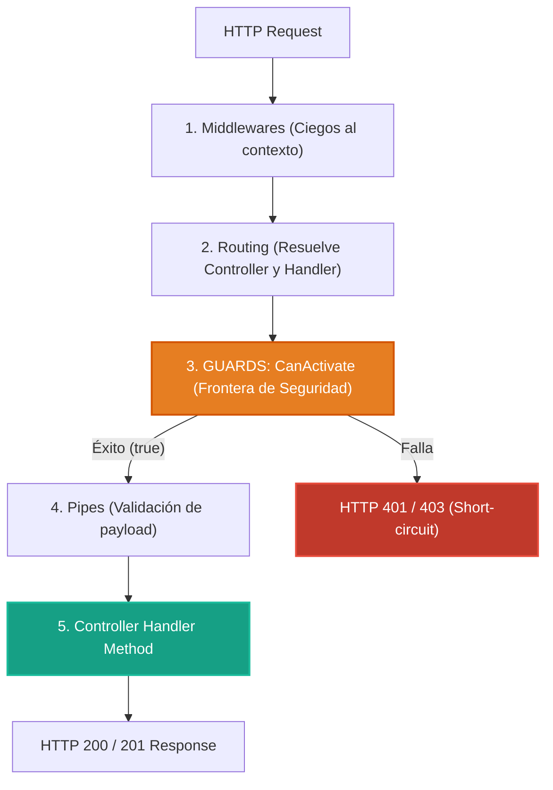

# 2.3 - Guards: Control de Acceso & Autorización

> **Objetivo del módulo:** Dominar la frontera de autorización en NestJS: implementar `CanActivate`, extraer metadata tipada con `Reflector.createDecorator`, y entender la diferencia de lifecycle entre middlewares (ciegos) y guards (context-aware).

---

## 🧭 1. Posición en el Request Lifecycle

Los guards se ejecutan **después del routing** (Nest ya sabe qué controller y método atenderán la petición) y **antes de los interceptores y pipes**:



- **Frontera de ejecución**: Defensa perimetral anti-DoS. Si un guard rechaza, `ValidationPipe` nunca corre, evitando gastar CPU deserializando payloads maliciosos.
- **Visibilidad de contexto**: Son **context-aware**. Reciben `ExecutionContext`, permitiendo inspeccionar la clase (`context.getClass()`), el método (`context.getHandler()`) y sus metadatos con `Reflector`.

---

## 📜 2. El Contrato Esencial

```typescript
// Interfaz base
export interface CanActivate {
  canActivate(
    context: ExecutionContext,
  ): boolean | Promise<boolean> | Observable<boolean>;
}

// Decorador de roles moderno y tipado
export const Roles = Reflector.createDecorator<UserRole[]>();

// Lectura con sobreescritura (método prevalece sobre controlador)
const requiredRoles = this.reflector.getAllAndOverride(Roles, [
  context.getHandler(),
  context.getClass(),
]);
```

- **Semántica HTTP**:
  - `return false` → NestJS lanza automáticamente `ForbiddenException` (`403 Forbidden`).
  - **Falta de autenticación o token inválido** → El guard debe lanzar explícitamente `throw new UnauthorizedException()` (`401 Unauthorized`).
- **Mapeo mental rápido**: Equivalente a `[Authorize(Roles = "...")]` en C# ASP.NET Core o `CanActivateFn` en Angular Router.

---

## ⚠️ 3. Top Trampas Mortales & Antipatrones

| Antipatrón / Trampa Común                                | Causa Técnica / Under the Hood                                                                         | Corrección Idiomática                                                                       |
| :------------------------------------------------------- | :----------------------------------------------------------------------------------------------------- | :------------------------------------------------------------------------------------------ |
| Retornar `false` para credenciales ausentes              | NestJS asume rechazo de permisos y emite `403 Forbidden`, violando la semántica HTTP                   | Lanzar `throw new UnauthorizedException()` explícitamente para el `401`                     |
| Invertir el orden: `@UseGuards(RolesGuard, ApiKeyGuard)` | `RolesGuard` intenta leer `req.user` antes de que `ApiKeyGuard` lo adjunte a la petición               | Ejecutar siempre autenticación antes de autorización: `@UseGuards(ApiKeyGuard, RolesGuard)` |
| Usar `reflector.get()` en lugar de `getAllAndOverride()` | Ignora la jerarquía: si el controller pide `USER` y el método pide `ADMIN`, no resuelve la combinación | Usar `getAllAndOverride` pasando `[context.getHandler(), context.getClass()]`               |

---

## 🎯 4. Reto Práctico (Hands-on Challenge)

### Requisitos de Dominio & Contrato

1. **Enum de Roles**: Crear `UserRole` en `src/common/enums/user-role.enum.ts` con `ADMIN`, `USER`, `VIEWER`.
2. **Decorador `@Roles`**: En `src/common/decorators/roles.decorator.ts` usando `Reflector.createDecorator<UserRole[]>()`.
3. **`ApiKeyGuard`**: En `src/common/guards/api-key.guard.ts`:
   - Inyectar `ConfigService` para leer `API_KEY` (configurar fallback o valor en `.env`).
   - Validar header `x-api-key`. Si no coincide o no existe: `throw new UnauthorizedException('Invalid API Key')`.
   - Extraer header `x-user-role` (default: `VIEWER`) y adjuntar a la petición: `req.user = { role: ... }`.
4. **`RolesGuard`**: En `src/common/guards/roles.guard.ts`:
   - Inyectar `Reflector`. Si la ruta no tiene `@Roles`, permitir el paso (`return true`).
   - Si tiene roles, comprobar si `req.user?.role` coincide con alguno de los roles requeridos. Si no: lanzar `ForbiddenException`.
5. **Proteger `TasksController`**:
   - Clase: `@UseGuards(ApiKeyGuard, RolesGuard)`.
   - `DELETE /tasks/:id`: exclusivo `@Roles([UserRole.ADMIN])`.
   - `POST`, `PUT`, `PATCH`: permitidos para `@Roles([UserRole.ADMIN, UserRole.USER])`.
   - `GET`: sin `@Roles` (cualquier usuario con API Key válida puede leer).

### Pruebas de Verificación (cURL)

```bash
# 1. Sin API Key -> 401 Unauthorized
curl -i -X GET http://localhost:3000/api/v1/tasks

# 2. Con API Key válida y rol VIEWER intentando POST -> 403 Forbidden
curl -i -X POST http://localhost:3000/api/v1/tasks \
  -H "Content-Type: application/json" \
  -H "x-api-key: nest-sandbox-secret-key" \
  -H "x-user-role: VIEWER" \
  -d '{"title": "Tarea No Permitida", "userId": "550e8400-e29b-41d4-a716-446655440000"}'

# 3. Rol ADMIN ejecutando DELETE -> 204 No Content
curl -i -X DELETE http://localhost:3000/api/v1/tasks/550e8400-e29b-41d4-a716-446655440000 \
  -H "x-api-key: nest-sandbox-secret-key" \
  -H "x-user-role: ADMIN"
```

### Criterios de Aceptación (Definition of Done - DoD)

- [ ] `UserRole`, `@Roles`, `ApiKeyGuard` y `RolesGuard` implementados bajo `src/common/`.
- [ ] `TasksController` protegido respetando la jerarquía de roles especificada.
- [ ] Peticiones no autenticadas rechazan con `401`; peticiones sin rol suficiente rechazan con `403`.
- [ ] Linter y tests pasando limpiamente (`bun run lint`, `bun test`).

---

## 🧠 5. Checklist de Active Recall

- [ ] ¿Por qué un Middleware tradicional no puede leer la metadata del decorador `@Roles`?
- [ ] ¿Qué ocurre si `canActivate()` retorna una promesa rechazada vs retornar `false`?
- [ ] Si un guard a nivel global bloquea la petición, ¿llega a ejecutarse el guard del controlador?
