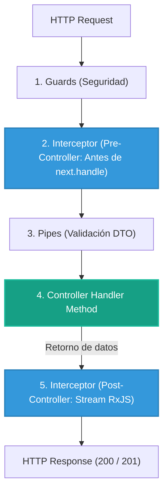

# 2.4 - Interceptors: AOP (Aspect-Oriented Programming) con RxJS

> **Objetivo del módulo:** Dominar la intercepción bidireccional del flujo de ejecución (antes y después del handler) usando `NestInterceptor`, `CallHandler` y operadores de RxJS para envolver respuestas (`Envelope pattern`), medir rendimiento y desacoplar lógica transversal sin tocar controladores.

---

## 🧭 1. Posición en el Request Lifecycle

Los Interceptors son los únicos componentes del pipeline con capacidad **bidireccional** (actúan en la entrada y en la salida):



- **Frontera de ejecución**: Envuelve tanto la llamada entrante como el stream de salida. Si ocurre un error dentro de un Guard o Pipe, el interceptor posterior nunca se ejecuta.
- **Visibilidad de contexto**: Es **context-aware**. Recibe `ExecutionContext` y `CallHandler`.

---

## 📜 2. El Contrato Esencial

```typescript
export interface NestInterceptor<T = any, R = any> {
  intercept(
    context: ExecutionContext,
    next: CallHandler<T>,
  ): Observable<R> | Promise<Observable<R>>;
}

export interface CallHandler<T = any> {
  handle(): Observable<T>;
}
```

- **Llamar a `next.handle()` es obligatorio**: Si no lo invocas o no lo retornas, el método del controlador **nunca se ejecutará**.
- **RxJS Operators indispensables**:
  - `map((data) => ({ success: true, data }))`: Muta o envuelve el body de respuesta.
  - `tap(() => { ... })`: Efectos secundarios (logs, métricas) sin mutar la respuesta.
  - `catchError((err) => ...)`: Captura y transforma errores del stream.
- **Mapeo mental rápido**: Equivalente a `ActionFilterAttribute` (`OnActionExecuting` / `OnActionExecuted`) en C# ASP.NET Core o `HttpInterceptor` en Angular.

## 💼 3. Casos de Uso del Mundo Real & Matriz de Decisión

| Escenario de Producción                        | ¿Por qué usar un Interceptor?                                                                                                        | ¿Por qué NO Middleware / Guard / Pipe?                                                                                                 |
| :--------------------------------------------- | :----------------------------------------------------------------------------------------------------------------------------------- | :------------------------------------------------------------------------------------------------------------------------------------- |
| **Estandarización de Respuestas (`Envelope`)** | Transforma la respuesta saliente (`map`) manteniendo los controladores limpios y retornando entidades puras.                         | **Middleware**: No tiene acceso a los datos devueltos por el handler.<br>**Pipe**: Solo procesa datos de _entrada_, nunca de _salida_. |
| **Caché en Memoria / Redis (`Cache-Aside`)**   | Puede cortocircuitar la llamada antes del controller (`of(cachedData)`) o guardar en Redis el resultado al salir.                    | **Guard**: Solo retorna booleanos de acceso; no puede reemplazar el cuerpo de la respuesta ni leer el retorno.                         |
| **Control de Latencia & Timeouts (`timeout`)** | Al trabajar con streams de RxJS, permite aplicar operadores reactivos (`timeout(5000)`, `retry(2)`) sobre el método del controller.  | **Middleware**: `next()` en Express es un callback síncrono que no permite cancelar ni abortar la ejecución interna del controller.    |
| **Auditoría de Mutaciones (`Audit Log`)**      | Combina la identidad del usuario (`req.user`) con el resultado real devuelto tras la persistencia (`data.id`, timestamps generados). | **Middleware**: Ciego a la identidad autenticada y a los datos generados por la base de datos tras la ejecución del handler.           |

---

## ⚠️ 4. Top Trampas Mortales & Antipatrones

| Antipatrón / Trampa Común                      | Causa Técnica / Under the Hood                                                                                     | Corrección Idiomática                                                                                             |
| :--------------------------------------------- | :----------------------------------------------------------------------------------------------------------------- | :---------------------------------------------------------------------------------------------------------------- |
| Envolver respuestas `204 No Content`           | HTTP 204 prohíbe taxativamente cuerpo de respuesta según RFC 9110; mutar la salida confunde clientes y proxies     | Inspeccionar el status code (`response.statusCode === 204`) o `data === undefined` y retornar `data` sin envelope |
| Olvidar retornar el stream de `next.handle()`  | `next.handle()` retorna un `Observable`. Si no se retorna del método `intercept()`, la petición queda colgada      | Retornar siempre `return next.handle().pipe(...)`                                                                 |
| Registrar interceptores con `new` en `main.ts` | `app.useGlobalInterceptors(new Interceptor())` vive fuera del IoC Container y no permite inyección de dependencias | Usar `{ provide: APP_INTERCEPTOR, useClass: ... }` en `AppModule`                                                 |

---

## 🎯 5. Reto Práctico (Hands-on Challenge)

### Contexto & Objetivo de Negocio

En APIs REST profesionales para clientes móviles o SPAs, los equipos de Frontend sufren cuando cada endpoint devuelve formatos distintos. Buscamos implementar el **Envelope Pattern** (Estandarización de Respuestas) de forma transversal y transparente: los controladores siguen retornando sus entidades puras (`ITask`, `ITask[]`), mientras que el interceptor se encarga de empaquetar metadatos de telemetría y auditoría sin contaminar la capa de negocio.

---

### Especificación Funcional & Contratos Detallados

#### 1. Contrato de Respuesta (`src/common/interfaces/api-response.interface.ts`)

Define la estructura genérica que envolverá todas las respuestas exitosas con payload:

```typescript
export interface ApiResponse<T> {
  success: boolean; // Siempre true en flujos exitosos que atraviesan este interceptor
  data: T; // El payload original devuelto por el controller
  timestamp: string; // Fecha ISO 8601 del momento en que se genera la respuesta
  durationMs: number; // Tiempo total de procesamiento en milisegundos (2 decimales)
}
```

#### 2. Interceptor de Transformación (`src/common/interceptors/response-transform.interceptor.ts`)

Debe implementar la interfaz `NestInterceptor<T, ApiResponse<T>>` y resolver las siguientes responsabilidades:

- **Fase Pre-Controller (Síncrona)**:
  - Capturar el timestamp de inicio de la petición utilizando la API nativa de alta precisión: `const start = performance.now();`.
- **Invocación del Handler**:
  - Invocar y retornar la ejecución del pipeline con `return next.handle().pipe(...)`.
- **Fase Post-Controller (Operador `map` de RxJS)**:
  - Recibe el `data` emitido por el método del controlador.
  - **Manejo de Casos Borde (Edge Cases)**:
    - Si el status code HTTP es `204 No Content` (como en `DELETE`) o `data === undefined`, **NO debe envolver la respuesta en un objeto**; debe retornar `data` directamente tal cual para respetar la especificación RFC 9110.
    - Si `data` es un array vacío (`[]`), un booleano (`false`) o un objeto, se considera contenido válido y **SÍ debe envolverse**.
  - **Empaquetado**:
    - Calcular `durationMs = Number((performance.now() - start).toFixed(2))`.
    - Generar `timestamp = new Date().toISOString()`.
    - Retornar el objeto con la forma de `ApiResponse<T>`.

#### 3. Registro Global en IoC (`src/app.module.ts`)

- Registrar `ResponseTransformInterceptor` como interceptor global en el arreglo `providers` de `AppModule` utilizando el token multi-provider `APP_INTERCEPTOR` de `@nestjs/core`.
- De esta manera, el interceptor cubre todos los módulos presentes y futuros del sistema de forma automática (_Zero Configuration for feature modules_).

---

### Matriz de Verificación & Pruebas (cURL / HTTP)

```bash
# 1. GET /tasks (200 OK con payload) -> Debe retornar el objeto envuelto
curl -s http://localhost:8888/api/v1/tasks -H "x-api-key: nest-sandbox-secret-key"

# Respuesta esperada (Estructura Envelope):
# {
#   "success": true,
#   "data": [ ... ],
#   "timestamp": "2026-09-30T16:00:00.000Z",
#   "durationMs": 3.45
# }

# 2. POST /tasks (201 Created con payload) -> Debe retornar la tarea recién creada envuelta
curl -s -X POST http://localhost:8888/api/v1/tasks \
  -H "Content-Type: application/json" \
  -H "x-api-key: nest-sandbox-secret-key" \
  -H "x-user-role: USER" \
  -d '{"title": "Probar Envelope", "userId": "fcea2b64-2dba-47d1-ac32-cdc13541efeb"}'

# 3. DELETE /tasks/:id (204 No Content) -> Debe retornar HTTP 204 sin cuerpo (0 bytes)
curl -i -X DELETE http://localhost:8888/api/v1/tasks/<ID> \
  -H "x-api-key: nest-sandbox-secret-key" \
  -H "x-user-role: ADMIN"
```

---

### Criterios de Aceptación (Definition of Done - DoD)

- [ ] `ApiResponse<T>` creada bajo `src/common/interfaces/api-response.interface.ts`.
- [ ] `ResponseTransformInterceptor` implementado bajo `src/common/interceptors/response-transform.interceptor.ts`.
- [ ] Todas las respuestas con código `200` o `201` retornan el envelope `{ success: true, data, timestamp, durationMs }`.
- [ ] Las respuestas `204 No Content` no retornan cuerpo ni rompen la semántica HTTP.
- [ ] Interceptor registrado globalmente en `AppModule` con `APP_INTERCEPTOR`.
- [ ] Suite de pruebas y linter ejecutando sin errores (`bun run lint && bun test`).

---

## 🧠 6. Checklist de Active Recall

- [ ] ¿Por qué un Pipe no puede transformar la respuesta saliente del controlador?
- [ ] Si un Guard rechaza con 403, ¿llega a ejecutarse la fase Post-Controller (`map`) del Interceptor?
- [ ] ¿Por qué `performance.now()` es preferible sobre `Date.now()` para telemetría de latencia?
