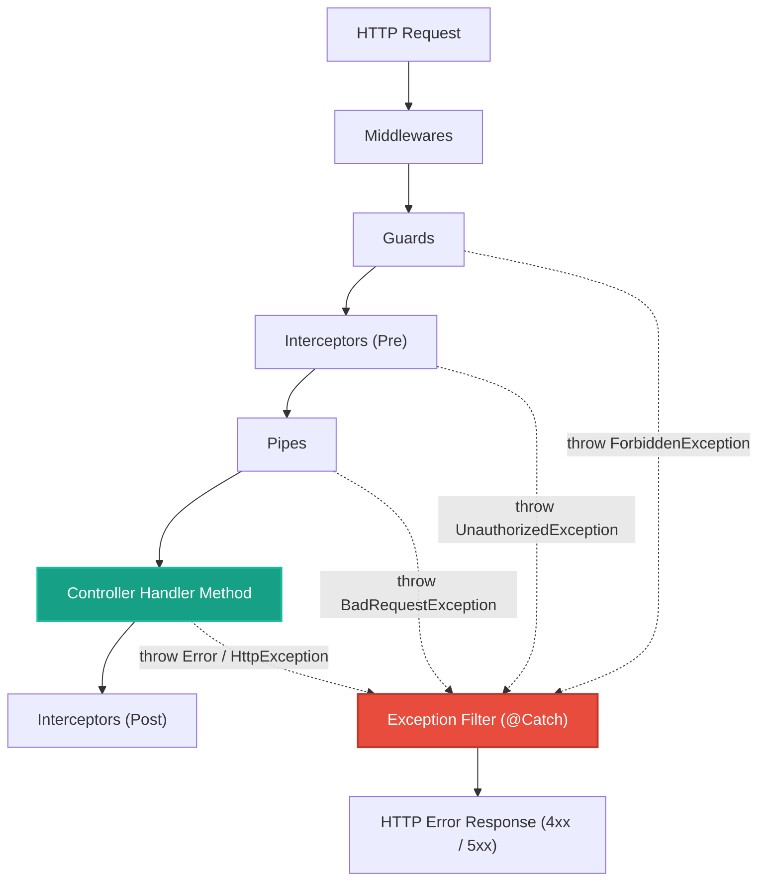

# 2.5 - Exception Filters: Manejo Global y Limpio de Errores

> **Objetivo del módulo:** Dominar la capa final de resiliencia del pipeline de NestJS utilizando `ExceptionFilter`, `@Catch()` y `ArgumentsHost` para capturar tanto excepciones HTTP controladas como errores no controlados en tiempo de ejecución, enmascarando fugas de seguridad (CWE-209) y garantizando un contrato de respuesta JSON unificado para el cliente.

---

## 🧭 1. Posición en el Request Lifecycle

Los Exception Filters constituyen la **red de seguridad final (Safety Net)** de la aplicación. Envuelven la ejecución de todo el pipeline y capturan cualquier error lanzado por Guards, Interceptors, Pipes, Controllers o Servicios:



- **Frontera de ejecución**: Se activan **únicamente** cuando ocurre una excepción no capturada en cualquier punto del pipeline de NestJS posterior a los middlewares.
- **Visibilidad de contexto**: Es **context-aware** a través de `ArgumentsHost`. Permite acceder al contexto HTTP (`Request`, `Response`), Microservicios (RPC) o WebSockets (WSS).

---

## 📜 2. El Contrato Esencial & Blueprint Idiomático

```typescript
export interface ExceptionFilter<T = any> {
  catch(exception: T, host: ArgumentsHost): void;
}
```

- **Decorador `@Catch()`**:
  - `@Catch()` (vacío): Captura **absolutamente todo** (errores no controlados `Error`, `TypeError`, bugs del runtime, y también cualquier `HttpException`).
  - `@Catch(HttpException)`: Filtra y captura únicamente instancias de `HttpException` o sus derivadas (`NotFoundException`, `BadRequestException`, etc.).
- **`ArgumentsHost` vs `ExecutionContext`**:
  - `ArgumentsHost` es la interfaz base: expone `getArgs()`, `switchToHttp()`, `switchToRpc()`, `switchToWs()`.
  - Los filtros reciben `ArgumentsHost` (en lugar de `ExecutionContext`) porque el error pudo ocurrir antes de que el router resolviera la clase y método destino.
- **`HttpAdapterHost` (Platform Agnostic)**:
  - En lugar de acoplarse al objeto `Response` de Express (`res.status().json()`), NestJS provee `HttpAdapterHost`.
  - Permite invocar `httpAdapter.reply(response, payload, statusCode)`, garantizando que el filtro funcione de manera idéntica sobre Express o Fastify.
- **Mapeo mental rápido (C# / Angular)**:
  - Equivalente directo a `IExceptionFilter` o middleware de manejo de errores global (`app.UseExceptionHandler()`) en C# ASP.NET Core, o un `ErrorHandler` centralizado en Angular.

### Blueprint Canónico (Dominio Externo: Facturación / Pagos)

> 💡 _Snippet atómico que modela la anatomía real de un Exception Filter en NestJS: decorador `@Catch()`, inyección agnóstica con `HttpAdapterHost`, bifurcación HTTP vs error no controlado y emisión con `httpAdapter.reply()`._

```typescript
import {
  ExceptionFilter,
  Catch,
  ArgumentsHost,
  HttpException,
  HttpStatus,
  Logger,
} from '@nestjs/common';
import { HttpAdapterHost } from '@nestjs/core';

@Catch() // Sin argumentos: atrapa tanto HttpException como bugs no controlados del runtime
export class PaymentExceptionFilter implements ExceptionFilter {
  private readonly logger = new Logger(PaymentExceptionFilter.name);

  // Inyección desacoplada de la plataforma subyacente (Express o Fastify)
  constructor(private readonly httpAdapterHost: HttpAdapterHost) {}

  catch(exception: unknown, host: ArgumentsHost): void {
    const { httpAdapter } = this.httpAdapterHost;
    const ctx = host.switchToHttp();

    const isHttp = exception instanceof HttpException;
    const status = isHttp ? exception.getStatus() : HttpStatus.INTERNAL_SERVER_ERROR;
    const responsePayload = isHttp ? exception.getResponse() : 'Internal payment service error';

    if (!isHttp) {
      this.logger.error(
        'Unhandled billing error',
        exception instanceof Error ? exception.stack : exception,
      );
    }

    const errorBody = {
      statusCode: status,
      timestamp: new Date().toISOString(),
      path: httpAdapter.getRequestUrl(ctx.getRequest()),
      error: responsePayload,
    };

    httpAdapter.reply(ctx.getResponse(), errorBody, status);
  }
}
```

---

## 💼 3. Casos de Uso del Mundo Real & Matriz de Decisión

| Escenario de Producción                                 | ¿Por qué usar un Exception Filter?                                                                                                                                                                    | ¿Por qué NO Middleware / Interceptor / Try-Catch en Controller?                                                                                                                     |
| :------------------------------------------------------ | :---------------------------------------------------------------------------------------------------------------------------------------------------------------------------------------------------- | :---------------------------------------------------------------------------------------------------------------------------------------------------------------------------------- |
| **Prevención de Fuga de Información (CWE-209)**         | Centraliza el enmascaramiento de errores `500`: oculta stacktraces, tablas SQL o rutas de disco a clientes externos, pero los escribe completos en el log del servidor.                               | **Try-Catch en Controller**: Viola SRP y DRY; obliga a duplicar bloques try/catch en cada endpoint.<br>**Middleware**: Ciego al contexto de NestJS y se ejecuta antes del pipeline. |
| **Normalización del Formato de Error (Error Envelope)** | Garantiza que todos los errores (`400`, `401`, `403`, `404`, `500`) compartan exactamente la misma estructura JSON predecible para el Frontend.                                                       | **Interceptor**: Si un Guard o Pipe falla antes del controller, el Interceptor nunca llega a ejecutarse ni a capturar el error en su stream RxJS.                                   |
| **Mapeo de Errores de Dominio / ORM a HTTP**            | Permite capturar errores de bajo nivel (ej. `PrismaClientKnownRequestError` con código `P2002` o `EntityNotFoundError` de TypeORM) y traducirlos a `409 Conflict` o `404 Not Found` en un solo lugar. | **Controller / Service**: Acoplaría la capa de negocio o transporte a las clases de excepción específicas de la librería de persistencia.                                           |

---

## ⚠️ 4. Top Trampas Mortales & Antipatrones

| Antipatrón / Trampa Común                                     | Causa Técnica / Under the Hood                                                                                                                                                                              | Corrección Idiomática                                                                                                   |
| :------------------------------------------------------------ | :---------------------------------------------------------------------------------------------------------------------------------------------------------------------------------------------------------- | :---------------------------------------------------------------------------------------------------------------------- |
| **Exponer `exception.message` o `stack` en errores 500**      | Exponer mensajes crudos de errores imprevistos (ej. `Error: connect ECONNREFUSED 127.0.0.1:5432`) regala detalles de infraestructura a atacantes (Information Disclosure).                                  | Enviar mensaje genérico `"Internal server error"` al cliente; loguear el stack trace internamente con `Logger.error()`. |
| **Usar `try/catch` defensivo en cada Controller**             | Tratar excepciones manualmente en los métodos del controlador infla el código, oscurece la intención y evita que el pipeline maneje la respuesta.                                                           | Dejar que las excepciones suban limpias; confiar en la red de seguridad del `ExceptionFilter`.                          |
| **Registrar filtros globales con `new` en `main.ts`**         | `app.useGlobalFilters(new GlobalFilter())` crea la instancia fuera del IoC container, impidiendo inyectar providers como `HttpAdapterHost`, `ConfigService` o `Logger`.                                     | Registrar mediante token multi-provider `{ provide: APP_FILTER, useClass: GlobalExceptionFilter }` en `AppModule`.      |
| **Asumir que `exception.getResponse()` siempre es un objeto** | Si alguien lanza `throw new BadRequestException('Dato inválido')`, `getResponse()` devuelve el string `'Dato inválido'`, mientras que `ValidationPipe` devuelve un objeto `{ statusCode, message, error }`. | Normalizar con `typeof res === 'object' ? res.message : res` para tolerar strings y objetos.                            |

---

## 🎯 5. Reto Práctico (Hands-on Challenge)

### Contexto & Objetivo de Negocio

Actualmente nuestra API normaliza las respuestas exitosas con el `ResponseTransformInterceptor` (`IApiResponse<T>`). Sin embargo, ante errores, la aplicación emite el formato por defecto de NestJS o, peor aún, ante un error imprevisto (ej. fallo de base de datos o puntero nulo), el runtime podría filtrar datos sensibles de la infraestructura.

El objetivo es construir un **Catch-All Exception Filter** global (`GlobalExceptionFilter`) que:

1. Capture **todas** las excepciones (`HttpException` y errores nativos no controlados).
2. Estandarice las respuestas de error bajo un contrato estricto `IApiErrorResponse`.
3. Enmascare errores no controlados retornando `500 Internal Server Error` sin exponer internals, mientras deja trazabilidad completa en los logs del servidor.
4. Se integre al IoC container de NestJS mediante `APP_FILTER` y utilice `HttpAdapterHost` para máxima compatibilidad agnóstica.

---

### Especificación Funcional & Contratos Detallados

#### 1. Contrato de Respuesta de Error (`src/common/interfaces/api-error-response.interface.ts`)

Define la estructura tipada que el cliente recibirá ante cualquier falla:

```typescript
export interface IApiErrorResponse {
  success: false; // Siempre false para distinguir inequívocamente de IApiResponse
  statusCode: number; // Código HTTP (400, 401, 403, 404, 500, etc.)
  error: string; // Etiqueta del error HTTP (ej. "Bad Request", "Not Found", "Internal Server Error")
  message: string | string[]; // Mensaje amigable o arreglo de fallos de validación (de ValidationPipe)
  timestamp: string; // Fecha ISO 8601 del momento de la falla
  path: string; // Ruta de la petición que disparó el error (ej. "/api/v1/tasks/123")
}
```

#### 2. Filtro Global de Excepciones (`src/common/filters/global-exception.filter.ts`)

Debe implementar `ExceptionFilter` y decorarse con `@Catch()`:

- **Inyección de Dependencias**:
  - Inyectar `HttpAdapterHost` en el constructor: `constructor(private readonly httpAdapterHost: HttpAdapterHost) {}`.
  - Instanciar un `Logger` de contexto: `private readonly logger = new Logger(GlobalExceptionFilter.name);`.
- **Lógica de Extracción y Clasificación en `catch(exception: unknown, host: ArgumentsHost)`**:
  - Obtener el contexto HTTP: `const ctx = host.switchToHttp();`.
  - Obtener `httpAdapter` de `this.httpAdapterHost`.
  - Extraer la URL de la petición: `httpAdapter.getRequestUrl(ctx.getRequest())`.
  - **Rama A: Excepción HTTP Controlada (`exception instanceof HttpException`)**:
    - `statusCode = exception.getStatus()`.
    - Obtener el contenido interno: `const exceptionResponse = exception.getResponse()`.
    - Si `exceptionResponse` es un objeto:
      - Extraer `message` (respetar si es string o string[] de validaciones).
      - Extraer `error` (o usar `exception.name` si no viene presente).
    - Si `exceptionResponse` es un string:
      - Usar ese string como `message`.
      - Usar `exception.name` o la descripción HTTP estándar como `error`.
  - **Rama B: Excepción No Controlada (`!(exception instanceof HttpException)`)**:
    - `statusCode = HttpStatus.INTERNAL_SERVER_ERROR` (500).
    - `error = 'Internal Server Error'`.
    - `message = 'Internal server error'` (enmascaramiento seguro, NUNCA propagar el mensaje interno).
    - **Observabilidad Interna Obligatoria**:
      - Registrar con `this.logger.error(...)` el mensaje real del error y su stack trace (`exception instanceof Error ? exception.stack : undefined`).
- **Construcción y Envío**:
  - Ensamblar el objeto conforme a `IApiErrorResponse`.
  - Emitir la respuesta mediante: `httpAdapter.reply(ctx.getResponse(), responseBody, statusCode);`.

#### 3. Endpoint de Verificación de Fallo Crítico (`src/modules/tasks/tasks.controller.ts`)

Para probar empíricamente que los errores no controlados se atrapan y enmascaran:

- Agregar un endpoint temporal o de diagnóstico: `GET /tasks/simulation/unhandled-error`.
- Debe lanzar un error nativo no HTTP: `throw new Error('Database disk failure or connection pool exhausted');`.

#### 4. Registro Global en IoC (`src/app.module.ts`)

- Registrar `GlobalExceptionFilter` en los `providers` de `AppModule` con el token `APP_FILTER` de `@nestjs/core`:
  ```typescript
  {
    provide: APP_FILTER,
    useClass: GlobalExceptionFilter,
  }
  ```

---

### Matriz de Verificación & Pruebas (cURL / HTTP)

```bash
# 1. Error de Validación (400 Bad Request con array de mensajes de ValidationPipe)
curl -s -X POST http://localhost:8888/api/v1/tasks \
  -H "Content-Type: application/json" \
  -H "x-api-key: nest-sandbox-secret-key" \
  -H "x-user-role: USER" \
  -d '{}'

# Respuesta esperada:
# {
#   "success": false,
#   "statusCode": 400,
#   "error": "Bad Request",
#   "message": ["title must be longer than or equal to 3 characters", ...],
#   "timestamp": "2026-09-30T...",
#   "path": "/api/v1/tasks"
# }

# 2. Error de Seguridad (401 Unauthorized por API Key inválida)
curl -s http://localhost:8888/api/v1/tasks -H "x-api-key: wrong-key"

# 3. Recurso no encontrado (404 Not Found)
curl -s http://localhost:8888/api/v1/tasks/00000000-0000-0000-0000-000000000000 \
  -H "x-api-key: nest-sandbox-secret-key"

# 4. Error No Controlado (500 Internal Server Error enmascarado)
curl -s http://localhost:8888/api/v1/tasks/simulation/unhandled-error \
  -H "x-api-key: nest-sandbox-secret-key"

# Respuesta esperada:
# {
#   "success": false,
#   "statusCode": 500,
#   "error": "Internal Server Error",
#   "message": "Internal server error",
#   "timestamp": "2026-09-30T...",
#   "path": "/api/v1/tasks/simulation/unhandled-error"
# }
# Y en la terminal del servidor debe verse el log rojo con el stacktrace original.
```

---

### Criterios de Aceptación (Definition of Done - DoD)

- [ ] `IApiErrorResponse` creada bajo `src/common/interfaces/api-error-response.interface.ts`.
- [ ] `GlobalExceptionFilter` creado bajo `src/common/filters/global-exception.filter.ts`.
- [ ] El filtro captura `HttpException` respetando códigos `4xx` y mensajes de validación detallados.
- [ ] El filtro captura errores nativos no controlados (`Error`), emitiendo `500 Internal Server Error`, mensaje seguro enmascarado y log interno con stacktrace.
- [ ] Filtro registrado globalmente vía `APP_FILTER` en `AppModule` con inyección de `HttpAdapterHost`.
- [ ] Endpoint de simulación verifica la captura de errores `500` imprevistos.
- [ ] Linter y tests pasando limpiamente (`bun run lint && bun test`).

---

## 🧠 6. Checklist de Active Recall

- [ ] ¿Por qué un Exception Filter recibe `ArgumentsHost` en vez de `ExecutionContext`?
- [ ] Si un Guard lanza un `ForbiddenException`, ¿por qué un Interceptor no puede capturarlo en su operador `catchError`?
- [ ] ¿Qué vulnerabilidad de seguridad se previene al no enviar `exception.message` al cliente en errores 500?
