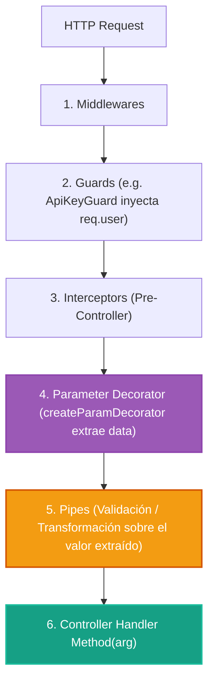

# 2.6 - Custom Parameter Decorators & ExecutionContext

> **Objetivo del módulo:** Dominar la creación de decoradores de parámetros personalizados mediante `createParamDecorator` y `ExecutionContext` para desacoplar los controladores del objeto de petición crudo (`Request`), encapsular la extracción de metadatos (identidad del usuario, IP, tenants) y garantizar firmas de métodos limpias y testables.

---

## 🧭 1. Posición en el Request Lifecycle

Los Parameter Decorators se resuelven en la frontera inmediata antes de invocar el método del controlador, operando en estrecha colaboración con los Pipes:



- **Frontera de ejecución**: Extrae datos justo antes de ejecutar los Pipes asociados a dicho parámetro.
- **Visibilidad de contexto**: Es **context-aware** a través de `ExecutionContext`. Permite acceder a cualquier transporte (`switchToHttp`, `switchToRpc`, `switchToWs`).

---

## 📜 2. El Contrato Esencial & Blueprint Idiomático

```typescript
export function createParamDecorator<TData = unknown, TOutput = unknown>(
  factory: (data: TData, ctx: ExecutionContext) => TOutput,
): ParameterDecorator;
```

- **`data`**: Argumento opcional pasado al usar el decorador (ej. `@CurrentUser('id')` $\rightarrow$ `data === 'id'`).
- **`ctx: ExecutionContext`**: Contexto de ejecución que permite extraer `req = ctx.switchToHttp().getRequest()`.
- **Integración con Pipes**: El valor retornado por el decorador pasa automáticamente por los Pipes encadenados (ej. `@CurrentUser('id', ParseUUIDPipe)`).
- **Mapeo mental rápido (C# / Angular)**: Equivalente a un `IModelBinder` o `ParameterBindingAttribute` personalizado en ASP.NET Core (`[FromRoute]`, `[FromClaim]`).

### Blueprint Canónico (Dominio Externo: Facturación / Multi-Tenant)

> 💡 _Snippet atómico que modela la extracción limpia de un TenantId o cabeceras fiscales sin contaminar el controlador con objetos Express._

```typescript
import { createParamDecorator, ExecutionContext, UnauthorizedException } from '@nestjs/common';
import type { Request } from 'express';

export interface ITenantContext {
  tenantId: string;
  currency: string;
}

export const ActiveTenant = createParamDecorator(
  (data: keyof ITenantContext | undefined, ctx: ExecutionContext): ITenantContext | string => {
    const request = ctx.switchToHttp().getRequest<Request & { tenant?: ITenantContext }>();
    const tenant = request.tenant;

    if (!tenant) {
      throw new UnauthorizedException('Tenant context is missing from request');
    }

    return data ? tenant[data] : tenant;
  },
);
```

---

## 💼 3. Casos de Uso del Mundo Real & Matriz de Decisión

| Escenario de Producción                       | ¿Por qué usar un Parameter Decorator?                                                                                                                      | ¿Por qué NO usar `@Req() req: Request` crudo?                                                                                                                 |
| :-------------------------------------------- | :--------------------------------------------------------------------------------------------------------------------------------------------------------- | :------------------------------------------------------------------------------------------------------------------------------------------------------------ |
| **Usuario Autenticado (`@CurrentUser`)**      | Expone únicamente el DTO/Interface `IUser` en la firma del método. En tests unitarios pasas un simple objeto mock sin simular 50 propiedades de `Request`. | **Leaky Abstraction**: Acopla el controlador a la librería HTTP (Express/Fastify), violando el principio de inversión de dependencias y dificultando pruebas. |
| **Extracción de IP / Geo (`@ClientIp`)**      | Centraliza la lógica de proxies (`x-forwarded-for`, `req.ip`, cloudflare `cf-connecting-ip`) en una sola función reutilizable.                             | Duplica lógica de inspección de headers en múltiples controladores o servicios.                                                                               |
| **Paginación & Ordenamiento (`@Pagination`)** | Extrae y normaliza `page`, `limit`, `sort` desde los query params devolviendo un objeto tipado `PaginationOptions`.                                        | Obliga a inyectar múltiples `@Query('page')`, `@Query('limit')` en cada endpoint.                                                                             |

---

## ⚠️ 4. Top Trampas Mortales & Antipatrones

| Antipatrón / Trampa Común                                           | Causa Técnica / Under the Hood                                                                                                                | Corrección Idiomática                                                                                                                                |
| :------------------------------------------------------------------ | :-------------------------------------------------------------------------------------------------------------------------------------------- | :--------------------------------------------------------------------------------------------------------------------------------------------------- |
| **Inyectar servicios o hacer consultas asíncronas en el decorador** | `createParamDecorator` no forma parte del IoC Container (no admite constructor DI). Su factory callback debe ser una función pura y síncrona. | Cargar entidades de base de datos en un **Guard** o **Interceptor** previo, adjuntarlas a `request`, y usar el decorador únicamente para extraerlas. |
| **Acceder a `@Req()` en el controlador para leer `req.user`**       | Viola el principio de encapsulamiento y rompe la independencia de plataforma de NestJS.                                                       | Reemplazar `@Req()` por `@CurrentUser()`.                                                                                                            |
| **Ignorar el encadenamiento de Pipes**                              | Olvidar que el valor extraído puede validarse directamente con pipes en la misma firma.                                                       | Combinar `@CurrentUser('id', ParseUUIDPipe)` para validar antes de que llegue al cuerpo del método.                                                  |

---

## 🎯 5. Reto Práctico (Hands-on Challenge)

### Contexto & Objetivo de Negocio

En el tema 2.3 implementamos el [`ApiKeyGuard`](../../src/common/guards/api-key.guard.ts), el cual valida la llave y adjunta a la request un objeto `user` con la identidad y el rol:

```typescript
request.user = {
  id: 'fcea2b64-2dba-47d1-ac32-cdc13541efeb',
  email: 'dev@sandbox.local',
  role: userRole,
};
```

Actualmente, los controladores no tienen una forma limpia de consumir este usuario sin recurrir al antipatrón `@Req() req`.

El objetivo es crear dos decoradores de parámetros reutilizables:

1. `@CurrentUser()` para extraer el usuario autenticado completo o una propiedad específica.
2. `@ClientIp()` para extraer la IP cliente resolviendo proxies de red.
3. Consumirlos en un nuevo endpoint `/tasks/me` y en el endpoint de creación de tareas.

---

### Especificación Funcional & Contratos Detallados

#### 1. Tipo de Usuario de Request (`src/common/interfaces/request-user.interface.ts`)

Define el contrato estricto de los datos que viajan en `request.user`:

```typescript
import { UserRole } from '../enums/user-role.enum';

export interface IRequestUser {
  id: string;
  email: string;
  role: UserRole;
}
```

#### 2. Decorador `@CurrentUser` (`src/common/decorators/current-user.decorator.ts`)

Debe crearse usando `createParamDecorator`:

- **Firma / Parámetro `data`**: Acepta opcionalmente `data?: keyof IRequestUser`.
- **Comportamiento**:
  - Obtener `req = ctx.switchToHttp().getRequest<Request & { user?: IRequestUser }>()`.
  - Si `data` está presente (ej. `@CurrentUser('id')` o `@CurrentUser('role')`), retorna `req.user?.[data]`.
  - Si `data` no está presente, retorna el objeto completo `req.user`.

#### 3. Decorador `@ClientIp` (`src/common/decorators/client-ip.decorator.ts`)

Debe crearse usando `createParamDecorator`:

- **Comportamiento**:
  - Obtener `req = ctx.switchToHttp().getRequest<Request>()`.
  - Extraer la IP considerando proxies: `(req.headers['x-forwarded-for'] as string)?.split(',')[0]?.trim() || req.ip || req.socket.remoteAddress || '127.0.0.1'`.
  - Retorna `string`.

#### 4. Uso en Controlador (`src/modules/tasks/tasks.controller.ts`)

Agregar un endpoint dedicado para consultar el perfil activo y la IP:

```typescript
@Get('me')
getProfile(
  @CurrentUser() user: IRequestUser,
  @CurrentUser('role') role: UserRole,
  @ClientIp() ip: string,
): { user: IRequestUser; role: UserRole; clientIp: string } {
  return { user, role, clientIp: ip };
}
```

_(Asegúrate de colocar `@Get('me')` antes de `@Get(':id')` para evitar que el router interprete `'me'` como un `:id` UUID)._

---

### Pruebas de Verificación (cURL / HTTP)

```bash
# 1. Obtener perfil e IP con token USER
curl -s http://localhost:8888/api/v1/tasks/me \
  -H "x-api-key: nest-sandbox-secret-key" \
  -H "x-user-role: USER"

# Respuesta esperada (con Envelope 2.4):
# {
#   "success": true,
#   "data": {
#     "user": {
#       "id": "fcea2b64-2dba-47d1-ac32-cdc13541efeb",
#       "email": "dev@sandbox.local",
#       "role": "USER"
#     },
#     "role": "USER",
#     "clientIp": "::1" (o 127.0.0.1)
#   },
#   "timestamp": "2026-09-30T...",
#   "durationMs": 1.23
# }

# 2. Con cabecera de proxy simulada X-Forwarded-For
curl -s http://localhost:8888/api/v1/tasks/me \
  -H "x-api-key: nest-sandbox-secret-key" \
  -H "x-user-role: ADMIN" \
  -H "x-forwarded-for: 203.0.113.195, 70.41.3.18"
# data.clientIp debe ser "203.0.113.195"
```

---

### Criterios de Aceptación (Definition of Done - DoD)

- [ ] `IRequestUser` creada bajo `src/common/interfaces/request-user.interface.ts`.
- [ ] `@CurrentUser()` implementado bajo `src/common/decorators/current-user.decorator.ts` con tipado estricto `keyof IRequestUser`.
- [ ] `@ClientIp()` implementado bajo `src/common/decorators/client-ip.decorator.ts`.
- [ ] Endpoint `GET /tasks/me` consumiendo ambos decoradores sin usar `@Req()`.
- [ ] Peticiones devuelven los datos del usuario e IP correctamente envueltos por el interceptor.
- [ ] Linter y tests pasando limpiamente (`bun run lint && bun test`).

---

## 🧠 6. Checklist de Active Recall

- [ ] ¿Por qué un Parameter Decorator no puede inyectar providers por constructor como un Service o Guard?
- [ ] Si pasas `@CurrentUser('id', ParseUUIDPipe)`, ¿en qué orden se ejecuta el decorador y el pipe?
- [ ] ¿Por qué es un antipatrón usar `@Req()` en los controladores de NestJS?
