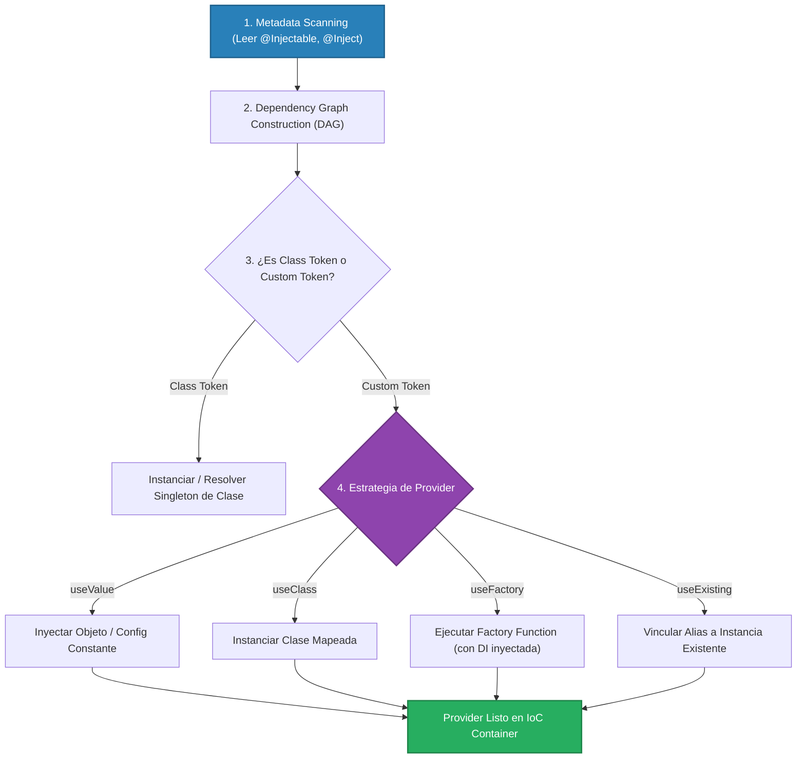

# 3.1 - Custom Providers & Injection Tokens

> **Objetivo del módulo:** Dominar la resolución avanzada de dependencias en el IoC Container de NestJS mediante interfaces y contratos abstractos (Principio de Inversión de Dependencias - DIP), superando el _Type Erasure_ de TypeScript con `Injection Tokens` (`string` / `Symbol`) y aprovechando las estrategias `useClass`, `useValue`, `useFactory` y `useExisting`.

---

## 🧭 1. Posición en la Arquitectura IoC & Bootstrap Engine

A diferencia de los componentes del request pipeline (Guards, Pipes, Interceptors), la resolución de Custom Providers opera principalmente durante la fase de **Bootstrap** y construcción del grafo de dependencias de la aplicación:



- **Frontera de ejecución**: Resolución de instancias durante el arranque (`NestFactory.create()`). Salvo que se configure `Scope.REQUEST`, todos los custom providers se inicializan como Singletons de memoria.
- **Type Erasure Under the Hood**: TypeScript elimina las interfaces al compilar a JavaScript. Si inyectas `constructor(private s: IService)`, en runtime el tipo emitido en `design:paramtypes` es `Object`, causando `UnknownDependenciesException`. El `Injection Token` proporciona una clave física en runtime (`string` o `Symbol`) para indexar la dependencia.

---

## 📜 2. El Contrato Esencial & Blueprint Idiomático

### Sintaxis Estándar vs Custom Provider

```typescript
// Azúcar sintáctico (Standard):
providers: [StripeService];
// Es exactamente equivalente a:
providers: [{ provide: StripeService, useClass: StripeService }];

// Inversión de Dependencias con Token (Custom):
providers: [
  {
    provide: PAYMENT_GATEWAY,
    useClass: StripeGatewayService,
  },
];
```

### Mapeo mental rápido (C# / Angular)

- **C#**: `services.AddSingleton<IPaymentGateway, StripeGatewayService>()` o `services.AddSingleton(sp => new Service(sp.GetRequiredService<Config>()))`.
- **Angular**: `new InjectionToken<IPaymentGateway>('PAYMENT_GATEWAY')` y `{ provide: PAYMENT_GATEWAY, useClass: StripeGatewayService }`.

---

### Blueprint Canónico (Dominio Externo: Pasarela de Pagos)

> 💡 _Snippet atómico que modela el desacoplamiento de una pasarela de pagos mediante `useFactory` y selección dinámica por entorno._

```typescript
// 1. Contrato & Token (src/billing/tokens/payment.token.ts)
export const PAYMENT_GATEWAY = Symbol('PAYMENT_GATEWAY');

export interface IPaymentGateway {
  charge(amountCents: number, currency: string): Promise<string>;
}

// 2. Registro en Módulo con useFactory (src/billing/billing.module.ts)
@Module({
  providers: [
    {
      provide: PAYMENT_GATEWAY,
      useFactory: (config: ConfigService): IPaymentGateway => {
        const isProd = config.get('NODE_ENV') === 'production';
        return isProd
          ? new StripeGateway(config.getOrThrow<string>('STRIPE_API_KEY'))
          : new MockPaymentGateway();
      },
      inject: [ConfigService],
    },
    BillingService,
  ],
  exports: [PAYMENT_GATEWAY],
})
export class BillingModule {}

// 3. Consumo en Servicio desacoplado (src/billing/billing.service.ts)
@Injectable()
export class BillingService {
  constructor(@Inject(PAYMENT_GATEWAY) private readonly gateway: IPaymentGateway) {}

  async processOrder(cents: number) {
    return this.gateway.charge(cents, 'USD');
  }
}
```

---

## 💼 3. Casos de Uso del Mundo Real & Matriz de Decisión

| Estrategia de Provider | ¿Cuándo usarla en Producción?                                                                                                                       | ¿Por qué NO usar otra alternativa?                                                                                                                |
| :--------------------- | :-------------------------------------------------------------------------------------------------------------------------------------------------- | :------------------------------------------------------------------------------------------------------------------------------------------------ |
| **`useValue`**         | Inyectar objetos literales constantes, configuraciones estáticas congeladas, o **mocks prefabricados en tests unitarios/E2E**.                      | No admite inyectar dependencias previas ni evaluar lógica condicional.                                                                            |
| **`useClass`**         | Intercambiar implementaciones polimórficas de una misma interfaz (ej. `LocalStorageService` vs `S3StorageService`).                                 | Si la clase necesita configuración que viene de variables de entorno en el constructor, `useClass` no permite pasar parámetros custom fácilmente. |
| **`useFactory`**       | Clientes SDK de terceros (Stripe, Redis, AWS SDK, Kafka), inicialización asíncrona (`async/await`), o lógica condicional basada en `ConfigService`. | Es overkill para clases simples que no dependen de configuración externa ni lógica condicional.                                                   |
| **`useExisting`**      | Crear un alias de un provider existente para un nuevo token sin duplicar la instancia en memoria ni crear dos singletons.                           | Si quieres dos instancias independientes con configuración distinta, `useExisting` apuntaría al mismo objeto.                                     |

---

## ⚠️ 4. Top Trampas Mortales & Antipatrones

| Antipatrón / Trampa Común                                  | Causa Técnica / Under the Hood                                                                                                                               | Corrección Idiomática                                                                                                          |
| :--------------------------------------------------------- | :----------------------------------------------------------------------------------------------------------------------------------------------------------- | :----------------------------------------------------------------------------------------------------------------------------- |
| **Inyectar interfaz sin decorador `@Inject(TOKEN)`**       | En runtime la interfaz no existe (_Type Erasure_). Nest busca la clase `Object` en el contenedor y falla con `UnknownDependenciesException`.                 | Usar siempre `@Inject(TOKEN)` cuando el tipo declarado en TypeScript sea una `interface`.                                      |
| **Olvidar providers en el array `inject` de `useFactory`** | La factory function recibe argumentos en el orden exacto del array `inject`. Si falta uno, llega como `undefined`.                                           | Declarar explícitamente `inject: [ConfigService, DatabaseService]` en el mismo orden que los parámetros de la función factory. |
| **Colisión de tokens con strings simples (`'CONFIG'`)**    | Si dos módulos o librerías usan el string `'CONFIG'`, uno sobreescribe al otro en el registro global de providers.                                           | Usar `Symbol('NOMBRE_UNICO')` para tokens locales o prefijar strings en namespaces (`'TASKS_CONFIG_TOKEN'`).                   |
| **Exportar la clase en lugar del token**                   | Si registras `{ provide: MY_TOKEN, useClass: MyService }` y en `exports` colocas `exports: [MyService]`, los módulos consumidores no encontrarán `MY_TOKEN`. | En `exports` debe listarse exactamente el token declarado en `provide`: `exports: [MY_TOKEN]`.                                 |

---

## 🎯 5. Reto Práctico (Hands-on Challenge)

### Contexto & Objetivo de Negocio

En el dominio de gestión de proyectos, cuando una tarea es creada en `TasksService`, queremos disparar una notificación de evento (auditoría o log) sin acoplar `TasksService` a ninguna librería concreta de correo, websocket o logger.

Debemos desacoplar la notificación mediante el principio DIP:

1. `TasksService` solo conocerá la abstracción `ITaskNotifier`.
2. El contenedor IoC inyectará la implementación concreta configurada en `TasksModule` mediante una fábrica (`useFactory`) que leerá el nombre de la app desde `ConfigService`.

---

### Especificación Funcional & Contratos Detallados

#### 1. Contrato & Token (`src/modules/tasks/interfaces/task-notifier.interface.ts`)

Define el contrato de notificación y el Injection Token único:

```typescript
import { ITaskEntity } from '../entities/task.entity';

export const TASK_NOTIFIER_TOKEN = Symbol('TASK_NOTIFIER_TOKEN');

export interface ITaskNotificationResult {
  sentAt: string;
  recipientCount: number;
}

export interface ITaskNotifier {
  notifyCreated(task: ITaskEntity): Promise<ITaskNotificationResult> | ITaskNotificationResult;
}
```

#### 2. Implementación Concreta (`src/modules/tasks/services/console-task-notifier.service.ts`)

Implementación desacoplada que simula el despacho emitiendo un log con contexto:

- Debe recibir en su constructor `private readonly appName: string`.
- No requiere `@Injectable()` obligatorio si se instancia manualmente en el factory, pero puede incluirlo.
- Implementa `ITaskNotifier`:
  - En `notifyCreated(task: ITaskEntity)`:
    - Imprime un log estructurado (vía `Logger` de NestJS con contexto `ConsoleTaskNotifier`):  
      `[AppName] Task created: "${task.title}" (ID: ${task.id}) for user ${task.userId}`
    - Retorna `{ sentAt: new Date().toISOString(), recipientCount: 1 }`.

#### 3. Registro Custom Provider con `useFactory` (`src/modules/tasks/tasks.module.ts`)

Registrar el provider en `TasksModule`:

```typescript
{
  provide: TASK_NOTIFIER_TOKEN,
  useFactory: (configService: ConfigService) => {
    const appName = configService.get<string>('APP_NAME') ?? 'TaskTracker';
    return new ConsoleTaskNotifierService(appName);
  },
  inject: [ConfigService],
}
```

#### 4. Inyección en el Servicio de Dominio (`src/modules/tasks/tasks.service.ts`)

- Inyectar el token en el constructor:
  ```typescript
  constructor(
    private readonly usersService: UsersService,
    @Inject(TASK_NOTIFIER_TOKEN)
    private readonly taskNotifier: ITaskNotifier,
  ) {}
  ```
- En el método `create(dto: CreateTaskDto)`:
  - Tras crear y almacenar `newTask`, invocar `this.taskNotifier.notifyCreated(newTask)`.
  - Retornar `newTask`.

---

### Pruebas de Verificación (cURL / HTTP)

Crear una tarea para verificar que el log de notificación se dispara con el nombre configurado de la app (`nest-sandbox-api` o el valor de `.env`):

```bash
curl -X POST http://localhost:8888/api/v1/tasks \
  -H "Content-Type: application/json" \
  -H "x-api-key: nest-sandbox-secret-key" \
  -H "x-user-role: USER" \
  -d '{
    "title": "Aprender Custom Providers",
    "description": "Dominando useFactory e Injection Tokens",
    "userId": "fcea2b64-2dba-47d1-ac32-cdc13541efeb"
  }'
```

_Verificación esperada en terminal_:

```text
[Nest] ... [ConsoleTaskNotifier] [nest-sandbox-api] Task created: "Aprender Custom Providers" (ID: ...) for user fcea2b64-...
```

---

### Criterios de Aceptación (Definition of Done - DoD)

- [ ] Contrato `ITaskNotifier` y token `TASK_NOTIFIER_TOKEN` creados bajo `src/modules/tasks/interfaces/task-notifier.interface.ts`.
- [ ] `ConsoleTaskNotifierService` implementado bajo `src/modules/tasks/services/console-task-notifier.service.ts`.
- [ ] Provider registrado en `TasksModule` con `provide: TASK_NOTIFIER_TOKEN`, `useFactory` y `inject: [ConfigService]`.
- [ ] `TasksService` inyecta `@Inject(TASK_NOTIFIER_TOKEN)` tipado con la interfaz `ITaskNotifier` (sin acoplarse a `ConsoleTaskNotifierService`).
- [ ] Ejecución de `POST /tasks` dispara la notificación en consola.
- [ ] Linter y tests unitarios pasando limpiamente (`bun run lint && bun test`).

---

## 🧠 6. Checklist de Active Recall

- [ ] ¿Por qué falla la inyección si colocas `constructor(private notifier: ITaskNotifier)` sin `@Inject(TOKEN)`?
- [ ] ¿Cuál es la diferencia crítica entre `useClass` y `useExisting`?
- [ ] ¿Por qué se prefiere `Symbol` en lugar de strings simples para nombrar tokens de inyección?
